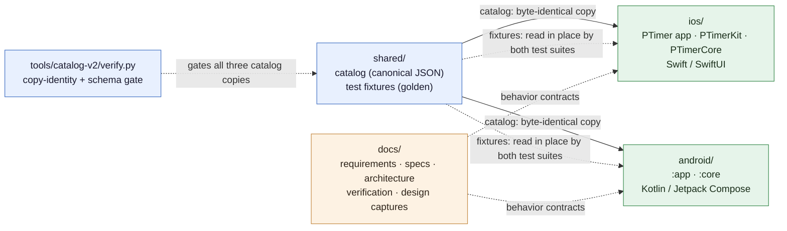
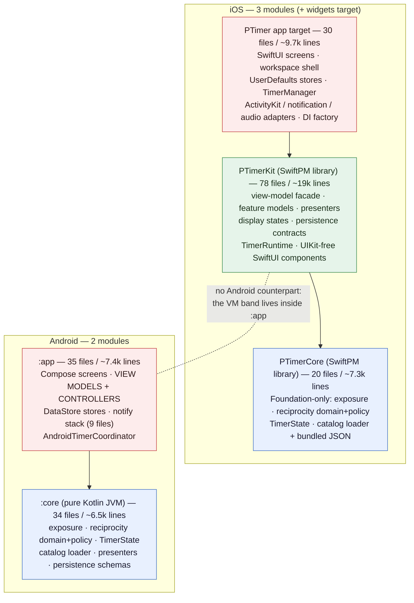
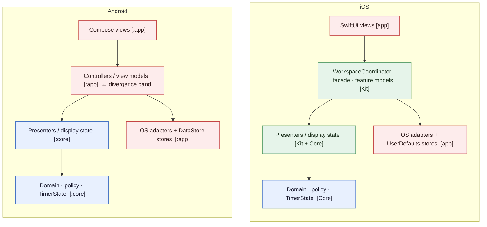
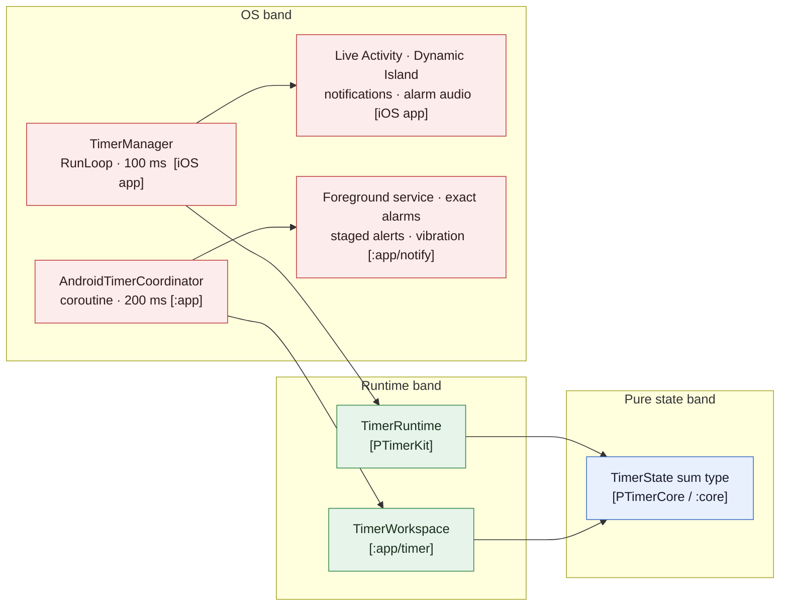
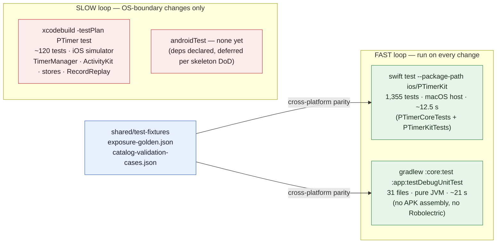
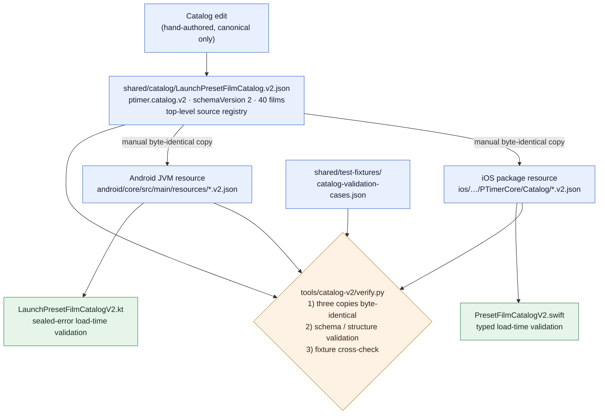
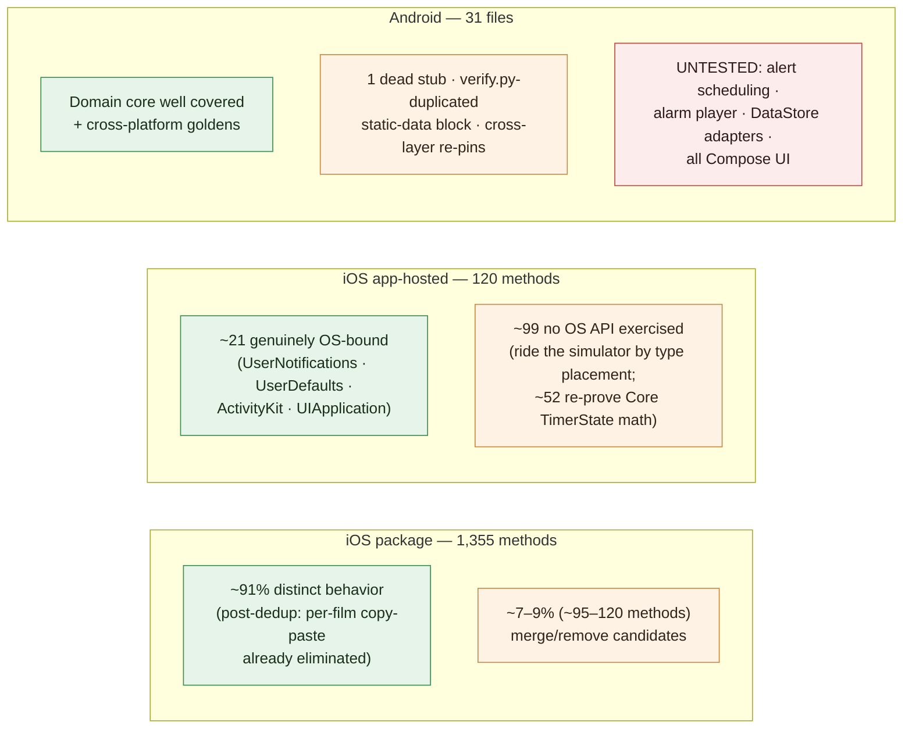

# Cross-Platform Architecture Review

Revision 4 — 2026-07-06. Revision 1 covered structure, test
architecture, and the shared-data pipeline (§1–§8, Appendix A);
Revision 2 added a holistic assessment across function, performance,
extensibility, and usability (§10–§15); Revision 3 added the
test-suite utility audit (§16) and the required/possible improvement
appendix (Appendix B); Revision 4 re-verified claims against source
and corrected §1, §6.3, §10.1, §15, §16, and Appendix B (verification
notes in Appendix C).

Evidence classes used in this document: **measured** (command run
during the review, output recorded in Appendix C), **source-verified**
(file read directly during the review), **reported** (collected by a
sub-audit, cited with file:line, spot-checked but not exhaustively
re-verified), and **inferred** (risk reasoning from verified facts).
Appendix C lists which class each major claim falls into and what was
not verified.

This document reviews the current iOS and Android source structure of
Photography timer against four stated goals:

- **G1 — Short development cycle.** Keep the app modules thin and push
  logic into kit/core modules so that a full unit + integration test
  run per feature change stays fast.
- **G2 — Feature parity with platform divergence.** Both platforms
  provide the same features by default, but platform-appropriate
  divergence is allowed.
- **G3 — Shared data managed separately.** Platform-common data is
  owned in one canonical place; when data is added or transformed it
  is split (mirrored) per platform by policy.
- **G4 — Intent continuity.** The structure should serve the direction
  visible in the ticket history (test-suite scalability work
  PTIMER-174..177, catalog schema v2 PTIMER-186, and the open shared
  Core investigation epic PTIMER-195 with KMP / Rust UniFFI
  experiments PTIMER-196 / PTIMER-197).

Related canonical docs: [`Architecture.md`](Architecture.md) (iOS
structure), `docs/specs/*` (behavior contracts),
[`../verification/Strategy.md`](../verification/Strategy.md)
(five-layer verification).

Diagrams are provided as Mermaid blocks (rendered by VS Code's
Markdown preview with Mermaid support and by GitHub) with ASCII
variants retained where they carry extra detail.

---

## 1. Summary verdict

The repository is already close to the target shape, with one
structural asymmetry and a handful of cheap gaps.

| Goal | Verdict |
| --- | --- |
| G1 iOS | **Met.** App target is a thin OS shell (30 files / ~9.7k lines). ~92% of test methods (~1,355 of ~1,475) run off-simulator via `swift test`. |
| G1 Android | **Met today, at risk structurally.** `:core` is a pure-JVM module and all unit tests are JVM-only (no APK assembly, no Robolectric). But there is no kit-equivalent module: view models, presenter glue, and platform adapters all live in `:app`, with no compiler-enforced boundary between them. |
| G2 | **Met, with two known divergences.** Domain/policy layers are line-faithful ports (verified by side-by-side source reading, §10.1); shared golden fixtures enforce parity for exposure calculation and catalog shape only — the reciprocity band has no shared numeric fixture (§10.3). Two live divergences exist in the target-shutter presentation band (§10.1). UI diverges deliberately (Material 3, `BottomSheetScaffold`, staged-alert notification stack vs Live Activity). |
| G3 | **Met with manual seams.** Canonical catalog at `shared/catalog/`, byte-identical copies vendored per platform, gated by `tools/catalog-v2/verify.py`. The copy step is manual and the policy text is scattered across three documents. Live spec-data drift found in DomainSchema §13 — broader than a film count (§6.3). |
| G4 | **Consistent.** Current state is effectively the "partially share Core" option of PTIMER-195: shared data + shared fixtures + duplicated-but-parity-tested engines. This review's inventory (§3) can feed that epic's acceptance criteria. |

Measured full fast-loop baseline (this machine, 2026-07-06):

| Loop | Command | Wall clock |
| --- | --- | --- |
| iOS package tests (1,355 tests executed) | `swift test --package-path ios/PTimerKit` | **12.5 s** total (2.0 s test execution, rest incremental build) |
| Android unit tests (`:core:test` + `:app:testDebugUnitTest`) | `./gradlew :core:test :app:testDebugUnitTest` | **21 s** total (mostly Gradle configuration/build; test execution ~1.4 s) |
| iOS app-hosted remainder (~120 methods, simulator) | `xcodebuild … -testPlan PTimer test` | not measured here; needed only for OS-boundary changes |

**Finding while measuring: `main` is red.** The package run fails 4
snapshot tests (`DisplayStateSnapshotTests
testLaunchPresetFilmCatalogSnapshot` and three
`ViewModelDisplayStateBaselineTests` film-mode baselines). Root cause:
commit `6e04a5fb` ("Fix broken Kodak catalog reference links") changed
`sourcePageUrl` values in the catalog, and the display-state snapshot
baselines embed the full catalog provenance (including URLs), so a
data-only link fix invalidated them without re-recording
(`SNAPSHOT_RECORD=1`). Two follow-ups: (a) re-record the four
baselines; (b) the snapshots over-capture — provenance URLs are not
display behavior, and trimming them from the serialized state would
stop pure data edits from breaking UI baselines. It also indicates the
link-fix PR did not run the package suite; until CI exists, the
two-command full verification needs to stay in the PR checklist.

---

## 2. Stage 0 — Repository overall



```
ptimerv1/  (monorepo)
│
├── ios/                          Swift / SwiftUI / SwiftPM + Xcode
│   ├── PTimer.xcodeproj            app + PTimerTests + PTimerWidgets targets
│   ├── PTimer/                     app target (thin OS shell)
│   ├── PTimerTests/                app-hosted OS-boundary tests
│   ├── PTimerWidgets/              lock-screen widget target
│   └── PTimerKit/                  SwiftPM package: PTimerCore + PTimerKit
│
├── android/                      Kotlin / Jetpack Compose / Gradle
│   ├── core/                       pure-Kotlin JVM module (no Android SDK)
│   └── app/                        Compose app module
│
├── shared/                       platform-common data (canonical)
│   ├── catalog/                    LaunchPresetFilmCatalog.v2.json
│   └── test-fixtures/              exposure-golden.json,
│                                   catalog-validation-cases.json
│
├── tools/
│   └── catalog-v2/verify.py        catalog copy-identity + schema gate
│
└── docs/                         requirements / specs / architecture /
                                  verification / design captures / ko
```

Data and fixture flow (details in §6):

```
shared/catalog/*.v2.json ──byte-identical copy──▶ ios/…/PTimerCore/Catalog/
                        └─byte-identical copy──▶ android/core/src/main/resources/
shared/test-fixtures/*.json ──read at test time by BOTH platforms (no copy)
tools/catalog-v2/verify.py ──asserts the three catalog copies identical
                             + validates schema + cross-checks fixtures
```

---

## 3. Stage 1 — Module topology, iOS vs Android



Boundary enforcement is mechanical on both sides: the SwiftPM package
declares macOS so a UIKit import fails the build; `:core` has no
Android SDK on its classpath at all.

```
        iOS  (3 modules + widgets)                Android  (2 modules)
┌────────────────────────────────────┐   ┌────────────────────────────────────┐
│ PTimer (app target)                │   │ :app                               │
│ 30 files / ~9.7k lines             │   │ 35 files / ~7.4k lines             │
│  SwiftUI screens, workspace shell  │   │  Compose screens (ShootingApp/     │
│  UserDefaults*Store (4)            │   │   Screen, TimerListScreen, …)      │
│  TimerManager (RunLoop)            │   │  VIEW MODELS + CONTROLLERS         │
│  ActivityKit / UNNotification /    │   │   (CalculatorController 494 ln,    │
│   AVFoundation adapters            │   │    ShootingViewModel, …)           │
│  ViewModelDependencyFactory        │   │  DataStore*Store (4)               │
├────────────────────────────────────┤   │  notify/ stack (9 files: alarms,   │
│ PTimerKit (SwiftPM library)        │   │   foreground service, receiver)    │
│ 78 files / ~19.0k lines            │   │  AndroidTimerCoordinator           │
│  view-model facade + feature       │   │                                    │
│   models, presenters,              │   │        ── no kit module ──         │
│   display states                   │   │                                    │
│  persistence contracts +           │   ├────────────────────────────────────┤
│   Persistent* schemas              │   │ :core  (pure Kotlin JVM,           │
│  TimerRuntime (pure state machine) │   │         kotlinx-serialization only)│
│  UIKit-free SwiftUI components     │   │ 34 files / ~6.5k lines             │
├────────────────────────────────────┤   │  exposure/ reciprocity/ timer/     │
│ PTimerCore (SwiftPM library)       │   │  catalog/ customfilm/ slots/       │
│ 20 files / ~7.3k lines             │   │  target/                           │
│  Foundation-only: Exposure,        │   │  persistence/ (schemas + codecs +  │
│  Reciprocity domain + policy,      │   │   *Storing + NoOp* pairs)          │
│  PresentationSemantics,            │   │  PRESENTERS (details, graph,       │
│  TimerState, Catalog loader + JSON │   │   confidence, source refs)         │
└────────────────────────────────────┘   └────────────────────────────────────┘
 app → PTimerKit → PTimerCore, never      :app → :core, never reverse
 reverse; boundary enforced by macOS      boundary enforced by :core having
 build of the package (no UIKit)          no Android SDK on its classpath
```

Observations:

- The two platforms enforce the core boundary the same way — by
  compiler/classpath, not review. This is the strongest asset for G1
  and should be preserved in any future split.
- The mapping is Core ↔ `:core`, but iOS Kit has **no Android
  counterpart**. Android's `:core` absorbed part of Kit's role
  (presenters, persistence contracts), and `:app` absorbed the rest
  (view models, controllers, coordinators, DI wiring). So Android's
  `:core` is slightly "thicker" than PTimerCore, and `:app` carries
  logic that iOS keeps in a library.
- Naming conventions transfer cleanly: `*Presenter`, `*DisplayState`,
  `*Coordinator`, `Persistent*`, and `*Storing`/`NoOp*` pairs exist on
  both platforms (verified by grep on both trees; Android prefixes
  platform adapters with `Android*`, e.g. `AndroidTimerCoordinator`).

---

## 4. Stage 2 — Layer stack comparison

Same conceptual stack on both platforms; the table shows which module
owns each layer today. Bracketed = module.

| Layer | iOS | Android |
| --- | --- | --- |
| Screens / navigation shell | `*Screen`, `BottomSheetWorkspaceShell` [app] | `ShootingApp`, `ShootingScreen`, `TimerListScreen`, dialogs [:app] |
| Reusable UI components | `Components/`, `Theme/`, graph views [Kit] | `ui/component/` (SnapWheel, ReciprocityGraphView), `ui/theme/` [:app] |
| Composition / DI | `WorkspaceCoordinator` [Kit], `ViewModelDependencyFactory` [app] | wiring inside `ShootingApp` via `remember { … }` [:app] |
| View-model facade / feature models | `ExposureCalculatorViewModel` + six `@Observable` feature models [Kit] | `CalculatorController` (StateFlow), `ShootingViewModel` (intent + StateFlow) [:app] |
| Presenters / display state | feature-adjacent presenters [Kit], `PresentationSemantics` [Core] | reciprocity/timer/target/customfilm presenters [:core] |
| Domain + policy (protected) | `ExposureCalculator`, `ReciprocityCalculationPolicy`, `TimerState` [Core] | line-faithful ports, same names [:core] |
| Timer runtime | `TimerRuntime` pure state machine [Kit] + RunLoop `TimerManager` [app] | `TimerState` machine [:core] + 200 ms coroutine tick `AndroidTimerCoordinator` [:app] |
| Persistence contracts + schemas | `*Storing` + `Persistent*` [Kit, one in Core] | `*Storing` + `Persistent*` + codecs [:core] |
| Persistence implementations | `UserDefaults*Store` (4) [app] | `DataStore*Store` (4) [:app] |
| Completion awareness | Live Activity, `UNUserNotification`, alarm audio [app] | staged-alert notify stack, foreground service, exact-alarm policy, vibration [:app] |



The colored bands make the single structural asymmetry visible: the
controller/view-model band is library code (green) on iOS and app code
(red) on Android. Reads point downward only; writes stay in the owning
band.

The timer runtime — a protected area — crosses all bands and shows how
each platform keeps the state machine pure while owning ticks and
surfaces at the OS edge:



Deliberate platform divergences (G2, all justified):

- Dismissal/navigation, Material 3 top-bar conventions, and the
  timer-completion stack (Live Activity vs foreground service +
  staged pre-alerts + `SCHEDULE_EXACT_ALARM` fallback) follow each
  platform's system conventions.
- Android localizes core vocabulary through
  `LocalizedCoreVocabulary` + string resources; iOS uses its own
  localization path (PTIMER-183).
- Android's tick cadence is 200 ms coroutine vs iOS 100 ms RunLoop —
  both satisfy the Timer spec's display contract.

---

## 5. Stage 3 — Test-execution architecture (G1)



```
iOS                                          Android
────────────────────────────────────         ────────────────────────────────
swift test --package-path ios/PTimerKit      ./gradlew :core:test :app:testDebugUnitTest
  PTimerCoreTests     8 files  ~74 methods     :core tests   22 files / ~3.3k lines
  PTimerKitTests    143 files ~1,281 methods   :app tests     9 files / ~1.3k lines
  runs on macOS host, NO simulator             pure JVM; :app unit tests do NOT
                                               assemble an APK; no Robolectric
  wall clock: ~12.5 s (measured)               wall clock: ~21 s (measured)

xcodebuild -testPlan PTimer test             (no androidTest sources exist;
  PTimerTests 25 files ~120 methods           instrumentation deps declared
  simulator-bound; OS-boundary only:          but unused — deferred per
  TimerManager, ActivityKit, silent           skeleton DoD)
  mode, UserDefaults round-trips,
  RecordReplay
```

Assessment:

- The PTIMER-174..177 investment did its job: the slow, simulator-bound
  path is now reserved for genuinely OS-coupled behavior. A typical
  feature change (calculator, reciprocity, presenters, view models,
  persistence contracts) gets full regression coverage from the fast
  loop alone on both platforms.
- Cross-platform integration-level confidence comes from L2 golden
  fixtures (`shared/test-fixtures/`) consumed by both suites, so the
  fast loop also covers parity, not just per-platform units.
- Residual friction found:
  - Duplicated test-support files between `ios/PTimerTests` and
    `PTimerKitTests` (`SharedFixtureLocator`, `CustomFilmTestSupport`,
    `ExposureCalculatorViewModelFilmModeTestSupport`,
    `CalculatorTimerLockScreenTests` name overlap) — residue of the
    PTIMER-174 migration; consolidation would remove drift risk.
  - `ios/PTimer.xctestplan` runs only the app-hosted target; the
    canonical "full verification" is two commands by convention.
    Fine, but worth stating in the test plan name or a comment.
  - Android has no UI-regression layer at all (no display-state
    snapshot equivalent of `PTimerKitTests/Snapshots/`). Acceptable
    for MVP; becomes a gap when Android UI iterates independently.

---

## 6. Stage 4 — Shared data management (G3)

### 6.1 Current pipeline



```
                    ┌────────────────────────────────────────────┐
                    │ shared/catalog/LaunchPresetFilmCatalog.v2  │
                    │ .json  (canonical, hand-authored,          │
                    │ ptimer.catalog.v2 / schemaVersion 2,       │
                    │ catalogVersion 2026.06, 40 films,          │
                    │ top-level source registry)                 │
                    └───────────────┬────────────────────────────┘
              manual byte-identical │ copy on change
             ┌──────────────────────┴──────────────────────┐
             ▼                                             ▼
  ios/PTimerKit/Sources/PTimerCore/Catalog/     android/core/src/main/resources/
  LaunchPresetFilmCatalog.v2.json               LaunchPresetFilmCatalog.v2.json
  (SwiftPM .process resource,                   (classloader resource,
   PresetFilmCatalogV2.swift loader,             LaunchPresetFilmCatalogV2.kt loader,
   typed load-time validation)                   sealed error validation, ~18 cases)

  gate: python3 tools/catalog-v2/verify.py
        (1) three copies byte-identical  (2) schema/structure validation
        (3) cross-check against shared/test-fixtures/catalog-validation-cases.json
        (has --self-test fault-injection mode)

  shared/test-fixtures/exposure-golden.json          — read in place by both
  shared/test-fixtures/catalog-validation-cases.json — test suites (no copy)
```

This matches the stated policy: common data is owned once, and
add/transform events propagate by an explicit split step with an
identity gate. The design decision to *vendor copies* (instead of
symlinks or build-time references) keeps each platform's build
self-contained and is the right call for app-store packaging.

### 6.2 Gaps

1. **The copy step is manual and the gate is optional.** Nothing runs
   `verify.py` automatically (CI is deferred per AGENTS.md). Until CI
   lands, the cheapest mitigation is a one-line sync helper
   (`tools/catalog-v2/sync.py` or a make target that copies canonical
   over the two vendored paths and then runs `verify.py`) plus a
   required line in the PR checklist for catalog changes.
2. **The policy text is scattered.** The add/validate/split rules live
   across DomainSchema §12/§13, Strategy §2 L2(c), and `verify.py`
   itself. A short "Catalog data pipeline" section (or doc) that names
   canonical location, copy targets, gate command, and fixture
   relationship would make the policy discoverable — this review's
   §6.1 diagram can seed it.

### 6.3 Live spec-data drift (actionable finding; source-verified)

`docs/specs/DomainSchema.md` §13 has drifted from the shipped catalog
in three distinct ways, verified against
`shared/catalog/LaunchPresetFilmCatalog.v2.json` this revision:

1. **Film count and breakdown.** §13/§13.1 describe a **34-film**
   scope with a manufacturer breakdown summing to 34; the shipped
   catalog and `catalog-validation-cases.json` carry **40 films**
   (the fixture's manufacturer counts include ILFORD 14, Rollei 7,
   BERGGER 1).
2. **Official-primary-only policy is no longer true.** §13 states
   every shipped identity carries a primary profile with
   `authority = "official"`, and §13.3 confines unofficial profiles
   to secondary alternates bundled *outside* the catalog file. The
   shipped catalog contains **one film whose primary profile is
   unofficial**: `rollei-retro-400s` (primary
   `rollei-retro-400s-unofficial-practical`, source authority
   `unofficial`; the other 39 primaries are official). Either the
   policy changed deliberately when RETRO 400S was promoted — then
   §13/§13.3 must document the exception class — or the catalog
   violates the spec.
3. **The exclusion list contradicts the shipped set.** §13.2 still
   lists RETRO 400S among "classified as `NV`" exclusions and Bergger
   under "reciprocity extraction too thin", yet both now ship.

This is exactly the L5 drift class Strategy §2 defines. Because item
2 is a policy statement, the fix needs a deliberate decision (accept
and document unofficial-primary as an allowed class, or reclassify
the profile), not just a count update.

---

## 7. Ticket-history intent mapping (G4)

| Intent thread | Evidence | State |
| --- | --- | --- |
| Fast test loop | PTIMER-147/175/176 epics; PTIMER-174 (package test placement), PTIMER-151 (slow-test visibility), PTIMER-148/149/152/153 (test dedup) | Done; structure verified in §5 |
| Kit/core extraction | PTIMER-116 epic; PTIMER-142 (ios/ move), PTIMER-177 (pure timer state machine out of UIKit TimerManager), PTIMER-154..157 (splits) | Done on iOS |
| Android port | PTIMER-144 epic; PTIMER-145 (skeleton), PTIMER-146 (MVP), PTIMER-190/193 (parity follow-ups) | MVP done; epic open |
| Shared data | PTIMER-14 (reciprocity data management, open epic), PTIMER-167 (catalog inventory + migration policy), PTIMER-186 (Catalog Runtime Schema v2) | v2 shipped; pipeline per §6 |
| Shared core | PTIMER-195 (open epic: define Core boundary, no-UI/no-IO, adapters), PTIMER-196 (KMP experiment), PTIMER-197 (Rust UniFFI experiment) | Not started |
| Android debt named in tickets | PTIMER-192 (camera-slot state ownership), PTIMER-194 (timer workspace ordering source of truth) | Open — both are `:app`-layer state-ownership normalizations, consistent with §8 finding A1 |

Reading: the repository's own backlog already points at the same two
structural moves this review surfaces — normalize Android's state
ownership above `:core`, and decide the shared-Core question with
small experiments rather than a big rewrite.

---

## 8. Findings and recommendations

Ordered by cost; A-items are independent, small, and behavior-free.

### Stage A — cheap hygiene (docs-only or mechanical)

- **A1. Fix DomainSchema §13 drift** — film count 34 → 40, the
  official-primary-only policy statement vs the shipped unofficial
  primary (`rollei-retro-400s`), and the stale §13.2 exclusion list.
  Docs-only ticket, but item 2 needs a policy decision first. (§6.3)
- **A2. Consolidate the duplicated iOS test-support files** between
  `ios/PTimerTests` and `PTimerKitTests` (fixture locators, custom-film
  support). Test-only change; removes silent drift between the two
  copies. (§5)
- **A3. Add a catalog sync helper + PR-checklist line** so the
  three-copy invariant does not depend on remembering `verify.py`.
  Document the §6.1 pipeline in one place (a short section in
  DomainSchema or a `shared/catalog/README.md`). (§6.2)

### Stage B — module-boundary tightening (small code moves)

- **B1 (iOS). Move the four `UserDefaults*Store` implementations from
  the app target into PTimerKit.** They are Foundation-only; their
  contracts and `Persistent*` schemas already live in
  `Kit/Persistence/`. This moves their round-trip tests off the
  simulator and shrinks the app target to genuinely OS-exclusive code
  (ActivityKit, notifications, audio, RunLoop TimerManager, UIKit
  bridges, DI factory, screens). Counterpoint: Architecture.md
  currently assigns concrete stores to the app layer on purpose
  (composition owns concretes); if that principle is valued more than
  simulator-test reduction, keep them and mark B1 rejected — but then
  the store round-trip tests should stay small.
- **B2 (Android). Contain the platform leak in the view-model band.**
  `ShootingViewModel` already carries `android.content.Context` in a
  collaborator signature (`TimerAlarmPlayer.playAlarm(context, …)`).
  Replace the Context parameter with a platform-free interface the
  `:app/notify` layer implements, so the VM band stays JVM-pure. This
  is the cheapest way to keep the option of extracting a `:kit` module
  later without a rewrite, and it aligns with the open PTIMER-192/194
  state-ownership normalizations.
- **B3 (Android). Decide the `:kit` question explicitly — and the
  recommendation is *not yet*.** At 35 files / 7.4k lines with
  JVM-fast unit tests, a third Gradle module would add build
  configuration without measurable test-speed gain. Instead, encode
  the boundary as a fitness rule (e.g. a simple lint/grep check: files
  under `app/vm/` and `app/calc/` must not import `android.*` except
  the documented exceptions), mirroring how iOS polices Kit with the
  macOS build. Extract `:kit` only when (a) `:app` unit tests get slow
  or (b) a second Android surface (widget, Wear OS per PTIMER-207)
  needs to reuse the VM band.

### Stage C — strategic (feeds PTIMER-195)

- **C1. Treat today's state as the "partially shared Core" baseline.**
  What is already shared: catalog data (one canonical + identity
  gate), golden fixtures (consumed by both suites), schema/validation
  rules (mirrored loaders), naming conventions and layer contracts.
  What is duplicated: ~6.5–7.3k lines of engine code per platform,
  kept in parity by protected-area discipline + fixtures. The
  duplication cost is currently bounded and the parity mechanism has
  caught up with every catalog change so far.
- **C2. Sequence the PTIMER-196/197 experiments against a concrete
  trigger, not in the abstract.** The strongest near-term forcing
  functions in the backlog are custom-profile import/export payload
  validation (PTIMER-195 lists it as a Core responsibility) and the
  shooting-record system (PTIMER-13/16/106..108) — both add new
  platform-common data-processing rules that would otherwise be
  written twice. Recommendation: run the KMP experiment (PTIMER-196)
  scoped to exactly one such rule set, measure the toolchain cost on
  the iOS side (binary size, build time, debugging), and only then
  compare with UniFFI. Until an experiment wins, keep writing new
  Core-band logic twice *with a shared fixture authored first* — the
  fixture-first habit is what keeps later extraction mechanical.
- **C3. Add an Android display-state regression layer when Android UI
  starts diverging on its own** (Material-driven changes without an
  iOS counterpart). The iOS approach — deterministic serialization of
  Equatable display state, not pixel snapshots — ports directly to
  `:core`/`:app` presenter outputs and stays JVM-fast. (§5)

---

## 10. Function — feature and calculation parity

### 10.1 Calculation parity: line-faithful port with two known divergences

Parity here was established by **side-by-side source reading**
(reported, spot-checked), not by shared numeric fixtures — §10.3
covers what that distinction means for future drift. Within the
exposure/reciprocity calculation core, the reading found matching
implementations for every checked contract: `stabilityEpsilon`
(1e-6), the 19-entry
full-stop shutter list, snap-to-full-stop with the 30 s/64 s boundary
branches, ND range [0, 30], one-third-stop scale (including the
55-entry camera label table), reciprocity evaluation order
(formula → table → threshold → limited guidance → unsupported),
Modified-Schwarzschild formula evaluation with the 1e-6 unsafe clamp,
table log-log interpolation (knee point, extrapolation,
`max(corrected, metered)`), the 0.10 no-correction relative tolerance,
the OLS formula fitter, the custom-film analytic guard (all 1e-9/1e-6
slack constants), the warning-level matrix, all alternate-model
constants, and ND notation formatting (OD ×0.3, K/M/G tiers). Android
reproduces Swift's rounding via a dedicated `swiftRounded()` helper.

The claim of parity is therefore strong for the exposure/reciprocity
core but must not be read as "no divergence anywhere": two live
divergences exist in the target-shutter presentation band (below),
one of them numeric.

Concrete divergences found (complete list from the comparison):

1. **Target-shutter stop-difference text** — iOS renders U+2212 minus
   and vulgar fractions (`−⅔ stops`,
   `TargetShutterPresenter.swift:168,199`); Android deliberately
   renders ASCII (`-2/3 stops`, `TargetShutter.kt`) citing
   inconsistent Unicode rendering on Android. Intentional; should be
   recorded as an accepted divergence in the UI spec.
2. **Thirds rounding mode** — iOS `(abs(stops)*3).rounded()` is
   half-away-from-zero; Android uses `kotlin.math.round` (half-even)
   despite its own doc comment saying half-away and despite
   `swiftRounded()` existing for exactly this purpose. Only exact
   `x.5` boundaries diverge (measure-zero in practice), but it is a
   genuine mismatch — one-line fix on the Android side.
3. **`formatCoarse`** duration formatter exists only on Android
   (`ExposureCalculator.kt:182-201`); iOS carries an unused
   `roundedTenthsText`. Cosmetic asymmetry, no shared contract.

PTIMER-209 (ND100k fractional preset) and PTIMER-199 (ND stack) are
implemented on neither platform — open on both, no divergence.

### 10.2 Feature inventory: effectively at parity

Camera slots (4, rename/reset), Target Shutter, custom film editor
(fitted formula, table anchors, live check), reciprocity details
(graph, source references, legend), film picker, pause/resume/restart,
staged pre-alerts (identical duration buckets and lead times),
reset confirmation (both platforms, PTIMER-208), ND notation toggle,
About/legal, and en/ko localization are all present on both platforms.
Platform-idiomatic divergences: lock-screen surface (Live Activity +
Dynamic Island + widget vs foreground-service chronometer
notification) and audibility strategy (iOS `SilentModeAdvisory` mute
probe vs Android routing the completion alarm onto the alarm audio
stream — different mechanisms, same product goal). iOS keeps a more
finely decomposed presenter surface for reciprocity details; content
shown to the user is comparable.

### 10.3 The real functional risk: parity coverage, not code

Shared fixtures currently pin down only **plain exposure calculation**
(22 golden cases + formatting cases) and **catalog shape**
(count/order/ids). Everything else — reciprocity policy outputs,
formula/table evaluation numerics, custom-film fitting coefficients,
guard verdicts, ND notation strings, target-shutter stop differences —
is tested per-platform with locally recomputed expectations. The two
platforms could drift on the largest calculation surface without any
test noticing (the §10.1 rounding mismatch is exactly the class of bug
a shared fixture would have caught).

**Recommendation (high value, low cost): add
`shared/test-fixtures/reciprocity-golden.json`** — rows of
(profile id, metered seconds) → (basis, warning level, corrected
seconds) generated from the shipped catalog — plus small goldens for
custom-film fitting and target-shutter differences, consumed by both
suites like the exposure golden already is. This converts protected-
area parity from "discipline + inspection" into an executable
contract, and it is also the prerequisite that makes the PTIMER-195
shared-core extraction safely mechanical.

---

## 11. Performance

### 11.1 Verification-loop performance (developer cycle)

Measured in §1: iOS 12.5 s / Android 21 s for the full fast loop.
Test execution itself is ~2 s on both sides; the wall clock is
dominated by incremental build and Gradle configuration. No action
needed at current scale; if Gradle configuration time grows, enable
the configuration cache.

### 11.2 Android runtime performance — verdict: scroll-lag risk LOW on
the main surface; real hotspots are wheel-spin CPU and cold start

Kotlin 2.0.21's Compose strong-skipping mode (on by default) is what
keeps the 200 ms tick cheap: `ShootingApp` recomposes per tick, but
`ShootingScreen` skips on the unchanged calculator state instance.
The notification path is already well designed (chronometer-based
countdown rendered by the OS, `setOnlyAlertOnce`, tick loop stops when
no timer runs, alert sync fires only on running-set signature change).

Ranked hotspots (mechanisms verified in code):

1. **Wheel spin re-sorts the 40-film catalog many times per second on
   the main thread.** Every `SnapWheel` centered-item change calls
   `CalculatorController.compute()`, which rebuilds all slots and
   calls `filmOptions()` — which re-sorts the full film list — per
   slot per emission (`CalculatorController.kt:444,471-493`). Fix:
   memoize `filmOptions()` (invalidate in `setFilms()`). Highest ROI.
2. **History timer cards recompose at 5 Hz for no visual change.**
   `ShootingViewModel.render()` allocates fresh `TimerCardState`s for
   completed timers every tick (`ShootingViewModel.kt:128-153`),
   defeating skipping via identity change. Fix: reuse unchanged card
   instances or annotate display-state types `@Immutable` (see 4).
3. **Cold start blocks the main thread**: 84 KB catalog JSON parsed on
   first access inside `remember {}` (`ShootingApp.kt:100`), plus
   three `runBlocking` DataStore reads during composition
   (`ShootingApp.kt:96,103,157`). Fix: load on `Dispatchers.IO`
   behind the existing splash.
4. **`runBlocking` workspace write on the main thread at timer
   completion** (`ShootingViewModel.kt:132-135` →
   `DataStoreTimerWorkspaceStore.kt:38-44`) — the slot-session write
   already got the debounce + IO treatment; the workspace write did
   not. Fix: same pattern.
5. Minor: `SnapWheel` per-frame row recomposition during fling (move
   alpha into `graphicsLayer`), unmemoized film grouping in
   `FilmPicker.kt:68-71`, per-draw `Path` rebuild in
   `ReciprocityGraphView.kt:91-97`, missing `contentType` on lazy
   lists.

Display-state stability currently rests entirely on instance identity
(no `@Immutable`/`@Stable` annotations, plain `List<>` fields).
Annotating the display-state data classes is the single most robust
skipping improvement and also fixes hotspot 2.

### 11.3 iOS runtime performance

Not audited at the same depth in this revision (the platform is
mature and shipped; no lag reports). The 100 ms RunLoop tick and
computed display-state pattern match the documented frame-budget NFR.
A SwiftUI-focused pass (Instruments; observation scoping around
`ExposureCalculatorViewModel` republishing) is listed in §14 as a
candidate follow-up.

---

## 12. Extensibility — data structures and preservation

### 12.1 Bundled catalog (`ptimer.catalog.v2`) — additive-safe, model-addition-hard by design

- **Adding a film**: pure data (canonical JSON + fixture expectations
  + copy sync). No code. Safe.
- **Adding an optional profile field**: tolerated at document level on
  both platforms (Swift Codable ignores unknown keys; kotlinx
  `ignoreUnknownKeys = true`). Inside a `calculation` block, unknown
  keys are strict-rejected on both platforms *and* in `verify.py` — a
  deliberate three-way lockstep that must be updated together.
- **Adding a new model type** (beyond table/formula/limitedGuidance):
  ~6 coordinated edits; compiler-enforced exhaustive switches on iOS,
  mirrored checks on Android, hand-synced allow-lists in `verify.py`
  (runtime-only — can silently drift from the loaders).
- **`schemaVersion` is an equality gate (`== 2`) with no versioned
  dispatch or migration hook** on either platform. Acceptable while
  the catalog ships inside the binary (data and decoder always match),
  but any future out-of-band catalog delivery requires building
  version negotiation first.

### 12.2 Custom film profiles and persisted user state — the weak spot

The custom-film library persists the **full domain
`FilmIdentity`/`ReciprocityProfile` graph directly**, coupling the
on-disk format to every domain enum. Audit of all persisted schemas
(storage keys, version fields, unknown/missing-field policy, failure
behavior — full table in the audit record) yields:

- **Additive optional fields are safe both ways** on both platforms
  (`decodeIfPresent` + defaults / kotlinx defaults) — the DomainSchema
  §7 policy is followed.
- **CRITICAL — enum-case additions are a whole-library data-loss
  landmine.** Domain raw enums (`ReciprocitySourceKind`,
  `ReciprocityAuthority`, `ReciprocityConfidence`, `FormulaFamily`,
  sum-type `kind` discriminators, …) throw on unrecognized values —
  the existing `.unknown` cases are *not* wired as decode fallbacks —
  and both platforms decode the library as one atomic blob. One custom
  film written by a newer app version therefore makes an older version
  silently drop the **entire** custom library, and the next save
  overwrites the raw payload. (Android's workspace codec already does
  per-entry `mapNotNull` isolation — the pattern exists in the
  codebase; it just isn't applied to custom films, timer state, or
  timer metadata.)
- **Version-gate inconsistency**: iOS custom-film load never checks
  its own `schemaVersion` field (`CustomFilmLibrary.swift:40`) while
  Android rejects any version ≠ 1 (`CustomFilmLibraryPersistence.kt:53`).
  iOS timer-state and timer-metadata schemas carry no version field at
  all; Android's do.
- **Silent drop, no quarantine**: every store maps decode failure to
  `nil`/`null`; corrupt or forward-version data is indistinguishable
  from empty and is destroyed on next save. There is no counterpart to
  the existing `hadInvalidFilmReference` restore signal.
- **Backward-compatible status decode works** (`"stopped"` → paused on
  both platforms) but a *new* status token would drop the whole iOS
  timer collection (Android workspace survives per-entry).
- **Cross-platform interchange** (future import/export, PTIMER-195):
  shapes are ~90% aligned (same field names, enum case-name encoding,
  `{kind, payload}` sum types), but timestamp/uuid encodings differ,
  iOS lacks version gates, and no validated envelope exists.

### 12.3 Safe evolution playbook (ordered)

1. Wire `.unknown` fallbacks into every domain raw-enum decoder (iOS
   custom `init(from:)`; Kotlin `coerceInputValues = true` or raw-
   string carriage like `exposureSourceRaw` already does).
2. Decode collections per-record (`mapNotNull` pattern from
   `WorkspacePersistence.kt:89`) in custom-film, timer-state, and
   timer-metadata codecs — one poisoned record must not wipe a
   collection.
3. Unify version gating: make iOS honor `schemaVersion` on the custom
   library (matching Android and the iOS camera-slot store), add
   version fields to iOS timer-state/metadata snapshots.
4. Quarantine on decode failure (retain raw blob under a side key,
   surface a restore signal) instead of silent drop.
5. For import/export: define a versioned envelope
   (`schema`/`schemaVersion` like the catalog), normalize
   timestamp/uuid encoding, and reuse the catalog validator logic as
   the shared import gate.

Items 1–3 are cheap now and become expensive after the first schema
evolution ships. They are the highest-priority code changes in this
review.

---

## 13. Usability — Android UI/UX improvement candidates

Ranked by user impact (all verified in code; iOS reference captures in
`docs/design/ios-screens/` considered):

1. **Touch targets below Material minimum**: timer actions at 34 dp
   (`TimerListScreen.kt:823-841`) and ND notation segments ~26–30 dp
   (`ShootingScreen.kt:412-462`) vs the 48 dp guideline — primary
   controls, top accessibility fix.
2. **In-progress work lost on configuration change / process death**:
   dialog flags and the custom-film editor draft use `remember`, not
   `rememberSaveable` (`ShootingApp.kt:231-232`,
   `ShootingScreen.kt:114-123`) — a half-typed custom film is dropped
   on a theme/font-scale change.
3. **Theme**: hard-coded `darkTheme = true, dynamicColor = false`
   (`MainActivity.kt:49`) with the Compose template purple seed
   (`Color.kt:8-14`) even though `Theme.kt` fully supports
   light/dark/dynamic. Under the Material-first policy, honor system
   dark/light and pick a brand seed.
4. **iOS-transplant visuals**: hard-coded iOS system hex colors in
   `MiniProgressStack` (`TimerListScreen.kt:467-475`), hand-rolled
   segmented control where Material 3 `SegmentedButton` exists,
   three stacked `TextButton`s in the reset dialog.
5. **No haptics anywhere** — the `SnapWheel` has no detent feedback,
   unlike the iOS picker it mirrors; completion vibration exists but
   no interaction haptics (`LocalHapticFeedback` unused).
6. **Predictive back not enabled** (`enableOnBackInvokedCallback`
   absent) despite `BackHandler` usage for sheet/overlay dismissal.
7. **Hard-coded English strings** in contentDescriptions and graph
   legend/labels (`ShootingScreen.kt:202,224`,
   `ReciprocityGraphView.kt:144-150`,
   `ReciprocityDetailsScreen.kt:195,199`) and a non-locale-aware
   timestamp pattern (`TimerListScreen.kt:85-86`) — gaps in the
   PTIMER-183 localization pass.
8. **No adaptive layout** for tablets/foldables (portrait-locked, no
   window size classes; the shooting screen assumes "everything fits,
   no vertical scroll"). Lowest priority for a phone-first product.

Done well and worth preserving: `SnapWheel`'s semantics
(single adjustable control with `ProgressBarRangeInfo` +
custom accessibility actions), status icons with content descriptions
(not color-only), distinct descriptions on the three Start buttons.

---

## 14. Proposed additional review items

Items worth a dedicated pass that this review scoped out, ordered by
expected value:

1. **Restore/relaunch end-to-end verification on Android.** iOS has
   `RecordReplay` + manual procedures
   (`docs/verification/RelaunchRestore.md`); Android has unit-level
   codec tests only. A device-level relaunch-restore procedure (and
   eventually an instrumented test) would close the largest
   verification asymmetry.
2. **Background/Doze behavior audit on Android.** Exact-alarm
   fallback, foreground-service lifetime under battery optimization,
   and notification delivery timing under Doze mirror the iOS
   `BackgroundNotificationDelivery.md` procedure — no Android
   counterpart document exists.
3. **iOS SwiftUI performance pass** (Instruments): observation scoping
   around the facade republishing pattern, wheel-picker interaction,
   and Live Activity update cadence. No symptoms today; cheap to
   baseline before the codebase grows.
4. **Battery profiling of the completion-awareness stack** on both
   platforms (Live Activity refresh vs foreground service + 200 ms
   tick while running).
5. **Accessibility audit follow-up** (PTIMER-182 was iOS-scoped MVP):
   TalkBack traversal order on the shooting screen, Dynamic Type /
   font-scale stress on both platforms.
6. **Release/store readiness** items already tracked (PTIMER-203/210)
   plus: privacy manifest (iOS), data-safety form (Android), and
   reproducible version stamping across the three version locations
   (§ Version Bump Policy in AGENTS.md).
7. **Catalog authoring pipeline**: `verify.py` gates structure but
   authoring is still hand-edited 84 KB JSON ×3 copies; a small
   authoring/sync script becomes worthwhile at the next catalog
   expansion wave (PTIMER-104/105 films).

---

## 15. Consolidated priority list

This table orders work by expected value. **Appendix B is the
authoritative required/possible classification**; the Class column
maps each row to its Appendix B IDs (a value-ranked row can be
"possible" — rank expresses payoff, class expresses obligation).

| # | Item | Class (Appendix B) | Axis | Cost | Section |
| --- | --- | --- | --- | --- | --- |
| P1 | Re-record 4 stale snapshot baselines; trim provenance URLs from display-state snapshots | REQ-1 | test hygiene | XS | §5 |
| P2 | Persistence evolution safety: enum `.unknown` fallbacks, per-record decode, version-gate unification | REQ-2 | extensibility / data preservation | S–M | §12.3 |
| P3 | Shared reciprocity/fitting/target-shutter golden fixtures | POS-1 | function (parity) | S | §10.3 |
| P4 | Android main-thread blocking: off-main cold-start loads + timer-completion workspace write | REQ-7 | performance | S | §11.2 #3–4 |
| P5 | Android perf polish: memoize `filmOptions()`, stop history-card churn, `@Immutable` display state | POS-2 | performance | S | §11.2 #1–2 |
| P6 | Android accessibility/UX: 48 dp targets; `rememberSaveable` for editor draft | REQ-5, REQ-6 | usability | S | §13 |
| P7 | Fix Android thirds-rounding to `swiftRounded`; record ASCII-fraction divergence in UI spec | REQ-3 | function | XS | §10.1 |
| P8 | DomainSchema §13 drift: count, unofficial-primary policy, exclusion list | REQ-4 | docs + policy decision | XS–S | §6.3 |
| P9 | Android alarm-path tests: coordinator AlarmManager contract + concrete alarm player | REQ-9 | verification | S | §16.3 |
| P10 | Dead test artifacts: stub test, orphaned support duplicates | REQ-10 | test hygiene | XS | §16.1 |
| P11 | Catalog sync helper + pipeline doc section | POS-3 | data pipeline | XS | §6.2 |
| P12 | iOS: move `UserDefaults*Store` into Kit (or record the rejection) | POS-4 | structure | S | §8 B1 |
| P13 | Android: `Context`-free alarm-player interface; VM-band purity fitness check | POS-5 | structure | S | §8 B2/B3 |

Structural verdict for the record: **no module reshuffle is needed
now.** The iOS 3-module and Android 2-module shapes both satisfy the
fast-loop goal; the improvements that matter are inside the modules,
not between them. Revisit `:kit` extraction and the PTIMER-195
shared-core decision on the triggers named in §8.

---

## 16. Test-suite utility audit

Three questions: (a) are there unnecessary or repeated tests, (b) are
there tests that outlived their purpose but keep running, (c) which
scenarios are uncovered. Audited: iOS package suite (1,355 methods),
iOS app-hosted suite (120 methods), Android suite (31 files).



### 16.1 Unnecessary or repeated tests

**iOS package — ~7–9% (~95–120 of 1,355 methods) are merge/remove
candidates; the other ~91% earn their keep.** The PTIMER-148/149/152
dedup passes genuinely worked: per-film copy-paste classes are gone,
replaced by parametrized templates with catalog-coverage guards. The
residual redundancy is architectural, concentrated in:

- **The catalog-validation cluster (largest item, ~30 methods).** The
  single static `LaunchPresetFilmCatalog.v2.json` is re-validated by
  `verify.py` plus five Swift layers (Core structural, Core golden
  with an inline expected-rows copy, Kit golden from the shared
  fixture, Kit membership counts, Kit shape, full-catalog snapshot).
  `testBundledV2CatalogDeclaresExpectedLaunchInvariants` is nearly a
  line-for-line Swift port of `verify.py validate_films`. Keep the
  `testRejects…` malformed-input family (loader error paths verify.py
  cannot cover); move pure data assertions to the Python gate, which
  runs when the catalog changes rather than on every suite run.
- **Cross-layer re-pinning of representative films.** Tri-X appears in
  35 test files; its corrected-exposure value is independently pinned
  in ~6 layers (Core anchors, Core golden, policy snapshot, two
  view-model baselines, full-catalog dump). Deliberate fence-posting,
  but one Tri-X data fix touches ~6 baselines — the exact churn class
  that broke `main` (§5). Merge the policy-level snapshot overlap
  (~5–8 methods).
- **Trivia** (~12 methods): pure encode/decode-equals round-trips and
  theme-constant assertions. Keep the legacy-decode-to-nil cases —
  those are real contracts.

**iOS app-hosted — only ~21 of 120 methods exercise a real OS API**
(UserNotifications staged scheduling, concrete UserDefaults stores,
ActivityKit ContentState, UIApplication/UIHostingController). ~52
methods re-prove `TimerState` state-machine math already owned by
PTimerCore tests — they stay app-hosted only because `TimerManager`
lives in the app target (per PTIMER-174), but they could be thinned
against the package coverage. Two support files are **dead
duplicates**: `Support/SharedFixtureLocator.swift` (byte-identical to
the package copy, referenced by nothing) and
`ExposureCalculator/ExposureCalculatorViewModelFilmModeTestSupport.swift`
(diverged copy, referenced by nothing) — 232 lines, delete now. A
third pair (`CustomFilmTestSupport.swift`) is byte-identical but live
on both sides — lockstep drift risk.

**Android — modest.** `ExampleUnitTest.kt` is an `assertTrue(true)`
template stub (delete). The static-data half of
`bundledV2CatalogDeclaresExpectedLaunchInvariants` duplicates
`verify.py` (keep the Kotlin `rejects*` loader-behavior family). The
same modified-Schwarzschild value (20.418) and the same table anchors
are re-declared across evaluator, policy, parity, and golden layers —
a shared parametrized fixture table would collapse them. Four
`ShootingViewModelTest` clone tests and three `ExactAlarmPolicyTest`
cases are copy-paste variants a parameterization would fold.

### 16.2 Tests that outlived their purpose

Mostly a clean bill: the PTIMER-186 v1→v2 equivalence tests were
already removed with the v1 subject (grep confirms zero remnants on
both platforms), and no `@Ignore`/skipped/fixture-missing tests exist
anywhere.

- **"Migration"-named iOS tests now guard live invariants, not
  transitions.** `OfficialTableMigrationInvariantTests` (PTIMER-168)
  and the "post table-migration" assertions verify that the 8
  migrated films *currently* default to table log-log — the
  pre-migration subject is deleted. Keep the invariant, rename the
  tests (or fold into the catalog-coverage guard) so they stop
  reading as transition checks.
- **Keep all legacy-decode and upgrade-path tests**: camera-slot
  single-context migration
  (`CameraSlotSessionPersistenceTests:236-275`), `"stopped"`→paused
  decode (both platforms), legacy payload-decodes-nil cases. These
  guard real App Store / Play users upgrading from shipped versions —
  they are the opposite of outlived.
- **RecordReplay is the one genuinely stale asset**: 7 baselines
  untouched since 2026-05-17 (only moved by the `ios/` reorg, never
  re-recorded) while the harness changed as recently as 2026-06-29;
  all replays run through fully-injected spies (no OS API) and
  duplicate the assertion-based lifecycle suites. Decide: re-record
  and own it, or retire it (549 lines + 7 baselines).
- **`.actual.txt` snapshot artifacts** (4 files) exist in the working
  tree as **untracked** local leftovers written by this review's own
  failing test run (`git ls-files` confirms none is committed). They
  are not repository debt themselves — they disappear once the
  baselines are re-recorded (REQ-1) — but they should never be
  committed if encountered.
- The catalog static-data assertions (16.1) are the "setup finished
  but still running" class in spirit: they re-verify a frozen data
  file on every suite run when a on-change gate (`verify.py`) already
  exists.

### 16.3 Uncovered scenarios (ranked per platform)

**Android (highest overall risk — the platform glue):**

The alert *policy* layers are covered: `StagedAlertPolicyTest`
(11 tests: stage buckets by duration, foreground suppression,
channel routing, alarm-play policy) and `TimerAlertPlannerTest`
(9 tests) pin Timer spec §4.1–§4.2 at the plan level. What lacks
direct tests is the layer between the plan and the OS:

1. `AndroidTimerAlertCoordinator.sync()` — the AlarmManager
   reconciliation contract: schedule per stage, cancel all stages for
   removed timers, reschedule on resume, drop already-past pre-alerts,
   exact→inexact TOCTOU fallback, foreground-service start/stop. Only
   its static `requestCode()` uniqueness is tested; the class calls
   `AlarmManager` and `System.currentTimeMillis()` directly, so
   testing it requires introducing a seam first.
2. `TimerAlarmPlayer` concrete behavior (alarm stream targeting,
   bounded auto-stop, single-alarm invariant) — only the interface is
   faked; spec §4.2.1–4.2.2 unverified at implementation level.
3. Display ordering (spec §6: active most-recent-first, completed
   most-recently-completed-first) — no test pins the ordering.
4. The four `DataStore*Store` adapters (round-trip + corrupt-blob
   fail-safe) — only the core codecs are tested.
5. All Compose UI (~5,200 lines, ui-test dependency declared but
   unused); `TimerNotifications`, `TimerCompletionReceiver`,
   `TimerForegroundService`, `AndroidTimerCoordinator`,
   `TimerWorkspace`, `CustomFilmEditingPresenter` have zero direct
   tests. First UI test worth writing: `TimerListScreen`'s
   tap-to-stop-alarm affordance (visible only while sounding).

**iOS package:**

1. NaN/infinity seconds into `ExposureCalculator.calculate` — no test
   (inputs flow from user text and persisted doubles).
2. ND = 30 upper edge driven through `calculate` (picker range is
   pinned; the calculation at the maximum is not).
3. Degenerate reciprocity tables (empty / single anchor) in the
   interpolation evaluator.
4. View-model behavior when `loadBundledCatalog()` throws (the
   empty-catalog fallback is unobserved at VM level).

**iOS app-hosted / OS boundary:**

1. `PTimerWidgets` target has no tests at all.
2. `TimerAlarmAudioPlayer` (AVFoundation session/category, 8 s
   auto-stop) tested only via spy.
3. `LockScreenTimerLiveActivity` `Activity.request/update/end` calls
   unverified (only the ContentState value type is covered).
4. Scene-phase → `reconcile()` app-lifecycle wiring untested.
5. Bottom-sheet drag-threshold tests (92 pt/64 pt, UI spec) were
   deleted in the PTIMER-126 redesign and never re-added.
6. `WheelPickerContinuousObserver` — zero references in any test.

### 16.4 Net verdict

The suites are **right-sized where the product risk is domain math**
(the hard 80% is well covered and cross-platform-pinned) and **thin
exactly where JVM/macOS-host testing is awkward** — the Android alarm
glue and both platforms' OS surfaces. Cleanup potential is real but
secondary: ~95–120 iOS package methods, ~9 dead/stale iOS app-hosted
artifacts, and a handful of Android items. The additions in 16.3
matter more than the removals in 16.1: the single highest-risk
untested scenario in the whole repository is the Android
alarm-path OS reconciliation (coordinator sync + concrete player —
the policy above it is tested), followed by the persistence fail-safe
adapters on both platforms.

---

## Appendix A — inventory numbers (2026-07-06)

| Unit | Files | Lines |
| --- | --- | --- |
| iOS app target `ios/PTimer/` | 30 | ~9,700 |
| iOS `PTimerKit` library | 78 | ~19,000 |
| iOS `PTimerCore` library | 20 | ~7,270 |
| iOS `PTimerCoreTests` | 8 | ~1,970 (~74 methods) |
| iOS `PTimerKitTests` | 143 | ~35,030 (~1,281 methods) |
| iOS app-hosted `PTimerTests` | 25 | ~4,600 (~120 methods) |
| iOS `PTimerWidgets` | 2 | ~150 |
| Android `:core` main | 34 | ~6,530 |
| Android `:app` main | 35 | ~7,380 |
| Android `:core` tests | 22 | ~3,260 |
| Android `:app` tests | 9 | ~1,310 |
| Shared catalog JSON | 1 (×3 copies) | 2,298 (84 KB, 40 films) |
| Shared fixtures | 2 | exposure-golden 9.6 KB, catalog-validation-cases 3.2 KB |

Notable large single files (complexity watch list, not defects):
`ios/…/PTimerCore/Catalog/PresetFilmCatalogV2.swift` (~55 KB),
`android/…/core/catalog/LaunchPresetFilmCatalogV2.kt` (1,078 lines),
`android/…/app/ui/TimerListScreen.kt` (926 lines),
`android/…/core/test/LaunchPresetFilmCatalogV2Test.kt` (1,139 lines).

---

## Appendix B — Improvement items: required vs possible

Split of every finding in this review into two classes. **Required**
= a defect, contract breach, or risk whose cost grows if deferred.
**Possible** = an improvement with real value but no forcing deadline;
each names its trigger. Complements
[`ImprovementBacklog.md`](ImprovementBacklog.md).

### B.1 Required improvements

| ID | Item | Why required | Ref |
| --- | --- | --- | --- |
| REQ-1 | Re-record the 4 stale snapshot baselines; run the package suite in every PR that touches catalog data | `main` fast loop is currently red; a red baseline masks real regressions | §5 |
| REQ-2 | Persistence evolution safety: `.unknown` enum decode fallbacks, per-record collection decode, iOS/Android version-gate unification | Whole-custom-library silent data loss on the first enum addition; cheap now, expensive after the first schema evolution ships | §12.2–12.3 |
| REQ-3 | Fix Android thirds rounding (`kotlin.math.round` → `swiftRounded`) and record the ASCII-fraction divergence as accepted in the UI spec | Live calculation-band divergence from iOS in a protected-adjacent surface | §10.1 |
| REQ-4 | Reconcile DomainSchema §13 with the shipped catalog: film scope 34 → 40, decide/document the unofficial-primary exception (`rollei-retro-400s`), refresh the §13.2 exclusion list | Live drift in a normative contract document, including a policy statement the data now contradicts | §6.3 |
| REQ-5 | Android touch targets to 48 dp (timer actions 34 dp, ND segments ~26–30 dp) | Below platform accessibility guideline on primary controls | §13.1 |
| REQ-6 | `rememberSaveable` for custom-film editor draft and dialog flags | User-visible data loss on configuration change / process death | §13.2 |
| REQ-7 | Move Android cold-start catalog parse + `runBlocking` DataStore reads/writes off the main thread (incl. the timer-completion workspace write) | Main-thread blocking, ANR-adjacent at startup and at timer completion | §11.2 #3–4 |
| REQ-8 | Localize hard-coded English contentDescriptions / graph labels / timestamp format on Android | Regression of the PTIMER-183 ko/en localization contract; affects TalkBack | §13.7 |
| REQ-9 | Android alarm-path tests: `AndroidTimerAlertCoordinator.sync()` AlarmManager reconciliation contract (requires a test seam first) + concrete `TimerAlarmPlayer` alarm-stream/auto-stop (spec §4.2) | The plan/policy layers are tested; the OS reconciliation layer between plan and AlarmManager is not — must precede the first Play release | §16.3 |
| REQ-10 | Delete dead test artifacts: `ExampleUnitTest.kt`, two orphaned iOS support duplicates (232 lines) | Dead duplicates carry silent drift risk | §16.1 |

### B.2 Possible improvements (with triggers)

| ID | Item | Value | Trigger / condition | Ref |
| --- | --- | --- | --- | --- |
| POS-1 | Shared `reciprocity-golden.json` (+ fitting/target-shutter goldens) consumed by both suites | Converts protected-area parity into an executable contract; prerequisite for shared-core work | Before the next reciprocity-band change, or with PTIMER-195 | §10.3 |
| POS-2 | Memoize `filmOptions()`; stop history-card churn; `@Immutable` display-state types | Removes the main avoidable CPU cost on the core interaction | Any wheel-feel complaint, or opportunistically | §11.2 #1–2 |
| POS-3 | Catalog sync helper + single pipeline doc section | Removes reliance on remembering `verify.py`; onboarding clarity | Next catalog expansion wave (PTIMER-104/105) | §6.2 |
| POS-4 | iOS: move four `UserDefaults*Store` into PTimerKit | Shrinks simulator-bound surface further | Accept or reject once; record the decision | §8 B1 |
| POS-5 | Android: `Context`-free alarm-player interface + VM-band purity fitness check | Keeps `:kit` extraction mechanical later | With PTIMER-192/194 normalization work | §8 B2–B3 |
| POS-6 | Android `:kit` module extraction | Compiler-enforced VM-band boundary | `:app` tests get slow, or a second surface (Wear OS, widget) reuses the VM band | §8 B3 |
| POS-7 | Shared Core (KMP / UniFFI) experiments | Ends double-write of core logic | First forcing feature: custom-profile import/export or shooting-record system | §8 C2 |
| POS-8 | Android theme policy: honor system light/dark, brand seed color, optional dynamic color | Material-first alignment; currently template purple, dark-only | Product decision | §13.3 |
| POS-9 | Interaction haptics (SnapWheel detents, Start) | Closes fidelity gap vs the iOS picker | With next UX pass | §13.5 |
| POS-10 | Predictive back opt-in; Material `SegmentedButton`; theme-token progress colors | Platform-current polish | With next UX pass | §13.4, §13.6 |
| POS-11 | Android display-state snapshot regression layer | UI regression safety once Android UI diverges independently | First Android-only UI iteration | §8 C3 |
| POS-12 | Android relaunch-restore + Doze/background delivery verification procedures (iOS counterparts exist) | Closes the largest verification asymmetry | Before first Play release | §14.1–14.2 |
| POS-13 | iOS Instruments performance baseline | Cheap now, harder after growth | Opportunistic | §14.3 |
| POS-14 | Adaptive layout (window size classes) | Tablet/foldable readiness | Only if large-screen demand appears | §13.8 |
| POS-15 | iOS package suite trim: move catalog static-data assertions to `verify.py`, merge policy-snapshot overlap, drop trivia (~95–120 methods) | Lower churn-per-behavior; fewer baselines broken by data-only edits | Opportunistic, or with the next catalog wave | §16.1 |
| POS-16 | RecordReplay decision: re-record the 7 stale baselines or retire the harness (549 lines) | Stale since 2026-05-17; duplicates assertion suites via spies | Next time it blocks or misleads a change | §16.2 |
| POS-17 | Thin the ~52 app-hosted TimerManager methods that re-prove Core `TimerState` math; rename "migration" invariant tests | Smaller simulator suite; honest naming | With any TimerManager-area work | §16.1–16.2 |
| POS-18 | Android additions beyond REQ-9: display-ordering test (spec §6), `DataStore*Store` corrupt-blob tests, first Compose UI test (`TimerListScreen` stop-alarm affordance) | Closes remaining spec-contract gaps; activates the unused ui-test dependency | Ordering/persistence: soon; Compose: first Android-only UI iteration | §16.3 |
| POS-19 | iOS edge-case tests: NaN/∞ into `calculate`, ND=30 through calculation, empty/1-anchor tables, catalog-load-failure at VM level | Hardens protected-area boundaries cheaply | With the next calculator-area ticket | §16.3 |
| POS-20 | OS-boundary coverage where feasible: PTimerWidgets target, `TimerAlarmAudioPlayer`, Live Activity lifecycle, scene-restore wiring, drag thresholds | Largest remaining iOS blind spots; some require design-for-test | Judgment per surface; widget + audio player first | §16.3 |

---

## Appendix C — Verification notes (Revision 4)

### C.1 Source snapshot

Review performed 2026-07-06 against branch `main` at the commit whose
subject is "Give Debug builds a distinct bundle ID and app name"
(app version 0.7.4), working tree clean apart from documentation
files under `docs/`.

### C.2 Commands and checks run (measured facts)

- `swift test --package-path ios/PTimerKit` — executed once: 1,355
  tests, **4 failures** (all snapshot diffs; §5), wall clock 12.45 s.
- `./gradlew :core:test :app:testDebugUnitTest` — executed once:
  BUILD SUCCESSFUL, wall clock 21.07 s.
- The iOS app-hosted simulator suite (`xcodebuild … -testPlan PTimer
  test`) was **not** executed in this review; app-hosted counts are
  from file inspection, not a test run.
- `git ls-files` over `__Snapshots__/` — confirmed the four
  `.actual.txt` files are untracked, not committed.
- `git log` over `ios/PTimerTests/__RecordReplay__/` — last commit
  touching the baselines is dated 2026-05-17.
- Python/`json` inspection of
  `shared/catalog/LaunchPresetFilmCatalog.v2.json` — 40 films, all
  40 profiles `role = "primary"`, 39 primaries with source authority
  `official`, 1 with `unofficial` (`rollei-retro-400s`).
- `wc -l` measurements of the files cited in Appendix A, §15, and
  `ImprovementBacklog.md` (values current as of this revision).
- `diff` of the three catalog copies (byte-identical) — performed by
  the Revision 1 sub-audit and consistent with `verify.py`'s
  `assert_copies_identical` design; not re-run in Revision 4.

### C.3 Directly inspected sources (source-verified facts)

`docs/specs/DomainSchema.md` §13–§13.4;
`AndroidTimerAlertCoordinator.kt` (full class);
`StagedAlertPolicyTest.kt` / `TimerAlertPlannerTest.kt` (test lists);
`CustomFilmLibrary.swift` (init/load path, no version gate);
`CustomFilmLibraryPersistence.kt` (codec: `ignoreUnknownKeys`,
version equality gate, catch→null); `DataStore*Store.kt`
(`runBlocking` load/save paths); `ShootingApp.kt` (store construction
inside `remember {}`); `Architecture.md` (scope);
`ImprovementBacklog.md` (all items re-checked against current file
sizes).

### C.4 Reported findings (sub-audit, spot-checked)

The per-file audits in §10–§13 and §16 (calculation line-by-line
comparison, Compose recomposition analysis, per-schema persistence
table, per-test-file verdicts) were produced by scoped sub-audits
with file:line citations. Spot checks in Revision 4 confirmed their
load-bearing claims (custom-film version-gate asymmetry, `runBlocking`
paths, alarm-test scope, `.actual.txt` status — one correction made:
the files are untracked, not committed). Individual file:line
citations were not exhaustively re-verified.

### C.5 Known limitations

- No device or emulator execution: Android runtime performance
  (§11.2) and alarm delivery behavior are code-level analysis, not
  profiling; the scroll-lag verdict is inferred from recomposition
  mechanics, not measured frame times.
- The iOS simulator suite and `verify.py` were not executed in this
  review; their described behavior is from source reading.
- Percentage estimates in §16 (redundancy share, method counts) are
  categorized judgments from file reading, not tool-computed
  coverage data.
- Feature-parity inventory (§10.2) is based on source presence of
  the features, not on-device behavioral comparison.
