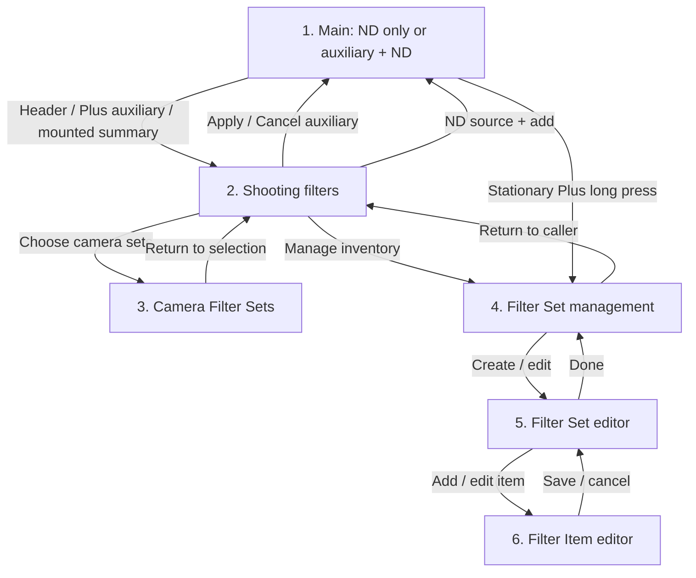

<!-- Copyright © 2026 Sangwook Han -->
<!-- SPDX-License-Identifier: Apache-2.0 -->

# Filter Sets and Shooting Filter Stack

| Prefix | Owns |
| --- | --- |
| FILTER-SET | Filter-set identity, ordering, color, and management |
| FILTER-ITEM | Physical filter inventory and value conversion |
| FILTER-CPL | CPL exposure-loss choices |
| FILTER-GND | GND recording and per-shot calculation mode |
| FILTER-STACK | ND wheels, combined exposure cap, and item exclusivity |
| FILTER-CAMERA | Per-camera candidate Filter Sets |
| FILTER-AUX | Mounted auxiliary filters and shooting popup |
| FILTER-COLOR | Optical color, effect identity, and visual color semantics |
| FILTER-FLOW | Main-screen and setup navigation |
| FILTER-PLUS | Filter-source selection and wheel creation |
| FILTER-PERSIST | Persistence, restoration, and captured snapshots |
| FILTER-A11Y | Accessibility and localized presentation |

## Purpose

A photographer can describe the physical filters they own, organize them into
recognizable filter sets, and combine those filters with the existing Standard
ladder in one exposure stack. The calculator records which physical items are
mounted, prevents one item from being used twice on the same camera, and
applies only the exposure loss selected for the current shot.

## Terminology

- A **Filter Set** is a user-owned, ordered group with a stable id, name, and
  color. It is distinct from a Shooting Collection.
- A **Filter Stack** is the active camera's ND wheels together with its
  mounted auxiliary filters. Wheel count is not physical filter count.
- **Auxiliary filters** are mounted CPL, GND, Color, or Effect items. They
  share one summary space; they are not scrolling wheels.
- **Candidate Filter Sets** are the user-selected sets available for a camera.
  Availability does not mean mounted, and does not certify compatibility.
- A **Filter Source** is either Standard or one Filter Set and determines what
  a newly added ND wheel can select. Only its ND items appear in that wheel.
- A **Filter Item** is one physical filter with a stable id. Equal names and
  equal exposure values do not make two physical items the same item.

User-facing copy shall use the complete terms **Filter Set** and **Shooting
Collection**; it shall not use the unqualified word “Set” where the two domains
could be confused.

## Requirements

### Filter-set management

- **FILTER-SET-001** — The user shall be able to create, rename, reorder, edit,
  and delete Filter Sets in one management surface. The persistent ND-header
  entry shall open the shooting popup, with management reachable from there
  even at the maximum wheel count. Long-pressing visible Plus shall open
  management directly. The Filter Set editor shall separate auxiliary and ND
  items into tabs without splitting the physical set or duplicating items.
  The list's reorder/delete edit-mode exit shall remain directly visible and
  distinct from closing management. A delete confirmation shall name the
  targeted set and remain bound to its stable id.

- **FILTER-SET-002** — Each Filter Set shall have a stable id, a non-empty
  user-defined name, a required color, and a user-defined display position.
  Renaming, recoloring, or reordering a Filter Set shall not change its id.
- **FILTER-SET-003** — Opening creation shall preselect a random suggested
  color different from the color suggested on the immediately preceding
  creation opening. The user may accept or change it. Two or more Filter Sets
  may use the same color; color uniqueness shall not be required.
- **FILTER-SET-004** — Standard is a fixed built-in Filter Source. It shall
  appear before all Filter Sets; Filter Sets shall then appear in their
  user-defined display order. A newly created Filter Set shall be appended to
  that order until the user reorders it.
- **FILTER-SET-005** — Filter-set names and colors are presentation and
  navigation metadata. Calculation and item identity shall never depend on
  either value, and color shall never be the only means of identification.

### Physical filter inventory and conversion

- **FILTER-ITEM-001** — A Filter Set shall contain zero or more physical Filter
  Items. The user shall be able to add, edit, reorder, and delete them.
- **FILTER-ITEM-002** — Every Filter Item shall have a stable item id and a
  non-empty user-defined name. Multiple items may have the same name, kind,
  unit, and value so that two equal physical filters can be mounted together.
- **FILTER-ITEM-003** — The user shall explicitly identify ND, CPL, GND, Color,
  or Effect behavior; the app shall not infer behavior from a name. Existing
  Fixed items retain their ND behavior and identity. Color and Effect items
  belong to the auxiliary selection surface, not the ND wheels. The internal
  representation of these kinds is not a cross-platform requirement.

- **FILTER-ITEM-004** — Fixed and GND items shall accept a decimal value in
  Stops, OD, or ND factor and preserve the original value and unit as equipment
  reference metadata. Conversion to canonical stops shall use Stops unchanged
  and `OD / 0.3`. An ND factor that exactly matches a commercial label emitted
  by the shared Standard formatter in `nd-filters.md` shall use that label's
  canonical ladder value; therefore ND1000 is exactly 10 stops, not
  `log2(1000)`. Other positive ND factors shall use `log2(ND factor)` without
  snapping. The result shall be finite, greater than 0, and no greater than
  30 stops.
- **FILTER-ITEM-005** — Editing an item shall update every active camera stack
  that references that stable item id. A save that would make any affected
  stack invalid, exceed 30 stops, or remove a CPL exposure-loss choice currently
  selected on an affected camera shall show the affected cameras and remain
  uncommitted until the conflict is resolved. The system shall not silently
  replace a selected CPL choice with another configured value.
- **FILTER-ITEM-006** — Deleting an item shall first identify affected cameras.
  After confirmation, each referencing ND wheel shall become Empty and each
  referencing mounted auxiliary item shall be removed. Deleting a Filter Set
  shall remove its ND wheels, mounted auxiliary items, and camera candidate
  references. A camera left with no ND wheel shall receive one Standard 0-stop
  wheel. A deleted last-used source shall fall back to Standard. Removing the
  last auxiliary item shall hide the summary. Previously captured timer or
  shooting snapshots shall not change. This is inventory deletion, not merely
  excluding an existing set from a camera's candidates.

- **FILTER-ITEM-007** — During one open New/Edit Filter Set session,
  successfully saving a newly created Fixed or GND item shall remember the
  registered-value notation selected in that item editor (Stops, OD, or ND).
  Opening the next new Filter Item from the same Filter Set editor shall
  initialize its notation from that remembered choice instead of resetting to
  Stops. Editing an existing item, saving a new CPL item, canceling, or a failed
  save shall not change the remembered notation. This memory is editor-session
  state only: closing the Filter Set editor or restarting the app shall reset
  the initial notation to Stops. It shall not affect item behavior kind; every
  newly created item shall continue to start as Fixed even when the preceding
  successfully saved new item was GND.

### CPL exposure-loss choices

- **FILTER-CPL-001** — A CPL item shall expose three decimal input fields for
  the exposure-loss choices available while shooting. New CPL items shall
  initialize them to 1, 1.5, and 2 stops.
- **FILTER-CPL-002** — Each non-empty field shall accept one integer digit and
  at most one fractional digit, in the closed range 0.1–9.9 stops. At least one
  field shall be valid. Empty fields omit a choice, and duplicate values shall
  appear only once in the shooting popup.
- **FILTER-CPL-003** — Focusing any CPL choice field shall request a
  decimal-capable numeric keyboard on iOS and Android. Locale decimal
  separators, pasted text, and hardware-keyboard input shall be normalized and
  validated by the same rules; an integer-only or general alphabetic keyboard
  does not satisfy this requirement.
- **FILTER-CPL-004** — The editor shall explain that these are “Exposure loss
  choices (stops) available in the filter selection popup while shooting.” The English and
  Korean copy shall communicate the same meaning.
- **FILTER-CPL-005** — A CPL item shall offer its distinct configured exposure-loss
  choices in the auxiliary popup. It shall be mounted once with exactly one
  selected choice; changing that choice shall update the same mounted item.
  Its current contribution shall remain immediately readable on the main
  summary without opening the popup.

### GND recording and calculation

- **FILTER-GND-001** — A GND item shall preserve its registered full-density
  value while offering two shooting modes in the auxiliary popup: Record only, contributing 0 stops,
  and Apply full value, contributing the registered canonical stops.
- **FILTER-GND-002** — Record only shall be the default when a GND is first
  selected. Switching modes shall affect only that mounted item in the active camera;
  it shall not change the inventory default, another camera, or a timer already
  started.
- **FILTER-GND-003** — Applying the full value is intended for a composition in
  which the GND's dark region covers nearly the entire metered frame. The UI
  shall warn that a base shutter metered through the mounted GND may already
  include its attenuation.
- **FILTER-GND-004** — Partial-density estimation is out of scope. GND
  calculation contributes either zero or the complete registered value.

### Mixed stack and filter wheels

- **FILTER-STACK-001** — The main row shall contain Base Shutter, then the
  auxiliary summary when any auxiliary item is mounted, then ND-only wheels,
  then Plus when another ND wheel can fit. With no mounted auxiliary items,
  one to four ND wheels are allowed. With any mounted auxiliary item, one to
  three ND wheels are allowed. The summary occupies one space regardless of
  its item count. Base Shutter and Plus do not count toward these limits.
  A mounted Record-only GND counts as auxiliary presence even at zero stops.

- **FILTER-STACK-002** — Standard wheels may repeat equal values. One physical
  Filter Item id may appear only once in a camera's stack, although the same
  inventory item may be selected independently by another camera.
- **FILTER-STACK-003** — A Filter Set ND wheel shall include Empty plus only that
  set's ND items. CPL, GND, Color, and Effect shall never appear as ND-wheel
  candidates. Empty means no physical item and contributes zero stops; a
  Record-only GND is mounted in the auxiliary summary and also contributes
  zero. These states shall remain visually and semantically distinct.

- **FILTER-STACK-004** — The effective filter value shall equal the sum of all
  ND-wheel and mounted auxiliary-item canonical contributions. It shall remain finite, greater than
  or equal to 0, and no greater than 30 stops. A choice or mode change that
  would exceed 30 shall be rejected with its reason; it shall never be clamped.
  When a sighted touch gesture on a Filter Set wheel settles with an unavailable
  row at the touch center, that unavailable row shall never commit. Instead,
  the wheel shall scan back through the rows the gesture just traversed, from
  the unavailable final row toward the previously committed row, and commit the
  first selectable row it encounters. It shall not search beyond the attempted
  final row or wrap around the wheel. If no selectable row exists on that
  traversed interval, the previously committed selection shall remain and the
  actual rejection reason shall be shown. When a fallback row is committed, the
  status region shall present that committed row and updated Total rather than
  leaving the rejected candidate's reason as the settled state.
- **FILTER-STACK-005** — After all moving wheels settle, actual wheels from
  the same source shall remain contiguous and source groups shall sort by
  registered subtotal descending. A source group's registered subtotal is the
  sum of its ND rows' sort values: a Standard row's selected stops, an ND
  item's registered canonical stops, and zero for Empty. Auxiliary contributions
  shall not participate in ND source-group sorting. Within each source group, non-empty rows shall sort
  by the same row value descending and Empty shall sort last. Ties between
  source groups shall put Standard first and then follow Filter Set
  user-defined order; row ties shall retain stable order. Sorting shall occur
  only after every moving wheel settles, preserve wheel identity and effective
  sum. The auxiliary summary shall stay immediately after Base Shutter;
  changing a GND mode or CPL choice shall not reorder ND wheels. When a committed change alters the settled order,
  every wheel shall remain visible and each stable wheel identity shall animate
  directly from its current position to its new position. Its numeric value,
  type or mode label, source cue, and accessibility identity shall remain
  attached to that wheel throughout the movement. This presentation movement
  shall not change a committed selection, effective sum, persisted order, or
  accessibility focus. If another committed order arrives before movement
  completes, the row may retarget the same stable identities to the newest
  arrangement; only that newest arrangement shall become settled.
  FILTER-SET-004 continues to govern
  management and Plus source-browsing order; it does not govern the settled
  stack order. FILTER-A11Y-006 suspends this automatic value-based ordering
  while platform screen-reader touch exploration is active and reconciles to
  this order after that mode is disabled.
- **FILTER-STACK-006** — Standard 0 and Filter Set Empty ND wheels in a multi-wheel
  stack shall follow the idle-cleanup contract in `nd-filters.md`, including
  immediate cleanup when the combined 30-stop cap leaves no usable non-zero
  ND choice. Cleanup shall retain at least one ND wheel. Mounted auxiliary
  items, including Record-only GNDs, shall never be removed by wheel cleanup.
  Automatic cleanup does not require a separate assistive-technology Remove
  action. An actual removal during screen-reader use shall be announced once
  as removal of an empty ND wheel, not of a zero-contribution mounted item.

- **FILTER-STACK-007** — Every ND wheel shall keep numeric-only scrolling rows,
  a persistent ND or EMPTY label, and its source identity. ND values shall
  remain readable at rest and while moving; auxiliary detail shall not take
  over or hide ND numeric values. ND values shall follow the app-global
  Stops / OD / ND formatter: 10 stops renders 10 / 3.0 / 1000; 3 stops
  renders 3 / 0.9 / 8. Empty renders canonical zero (0 / 0.0 / 1) while
  retaining its distinct no-mounted-item meaning.

  Source cues and the auxiliary summary shall not reduce the established
  numeric-value hierarchy used before this capability for the same density
  tier and occupied filter-space count (ND wheels plus the auxiliary summary). On iOS, a single occupied filter space keeps the full-width
  reference size of 32 / 26 / 19 points in Regular / Compact / Dense. For
  two / three / four occupied filter spaces, the reference sizes are Regular
  28 / 24 / 20 points, Compact 23 / 20 / 17 points, and Dense
  18 / 16 / 14 points. Base Shutter and every ND wheel in the row shall
  use the same numeric size. In particular, four wheels in Dense shall use
  14-point values. These sizes are tier references, not permission to select a
  denser tier from an obsolete content-height budget. The density decision
  shall be derived from the geometry actually rendered after FILTER-STACK-008
  reduces the status region to one row. On an iPhone 17 Pro at the default
  content size, the worst supported film-result and active-Target-Shutter
  composition shall fit the Compact tier after that reclaimed height; it shall
  not remain Dense solely because the removed second status line is still
  counted. Thus a one-filter row on that device uses the Compact 26-point
  reference rather than the Dense 19-point reference, and the same tier's
  references apply as wheels are added.

  The Base Shutter column shall reserve the same persistent-label-row height
  as the filter columns, even though that reserved label row is visually
  empty. Its picker viewport top and bottom, selected-row band, selected-value
  baseline, and vertical touch center shall align with those of every filter
  wheel in the row. Adding or removing wheels, changing notation, moving a
  wheel, settling a reorder, or changing status content shall not break that
  shared vertical axis.

  Source cues shall fit the existing wheel geometry without moving the touch
  center, clipping numeric values, expanding a foreground card, or dimming
  siblings. During movement, the centered candidate and status detail shall
  identify the same item. The status region shall expose its full item name,
  original registered representation, and contribution in stops. Long visual
  detail may truncate at the trailing edge; full detail remains accessible.

- **FILTER-STACK-008** — The mixed-stack interaction shall use one stable
  status region for source identity, the current item or source, rejection
  reason, and live total required by `nd-filters.md` ND-INTERACT-020. For a
  stack containing any Filter Set ND wheel or mounted auxiliary item, the idle region shall persistently
  show a visually secondary source summary and the current total rather than
  becoming empty. Idle content shall always use exactly one visual row at every
  supported text size: the source summary aligned to the leading side and the
  localized total aligned to the trailing side. Total is a primary reading,
  not secondary caption text: its numeric stops value shall be at least the
  size of the selected ND numeric values in the same layout, with sufficient
  emphasis to read directly in the field. The layout shall provide that space
  without reducing the established ND numeric size, forcing a denser tier, or
  clipping the existing results and controls. The total shall remain visible
  and untruncated. When both cannot fit, the leading source summary shall yield
  space first and truncate at its trailing edge; it shall not wrap or move the
  total to a second line. The complete source summary shall remain available to
  accessibility. The region shall reserve only the height required for one
  visual row plus its normal vertical padding. It shall not retain capacity for
  the removed second line. This reclaimed height shall be returned to the wheel
  row and included in the density-tier fit calculation. Status-state changes
  shall remain geometry-stable within that one-row region.

  The source summary shall list each source once in main-row order (auxiliary
  sources first, then settled ND groups), append an ND-wheel count when a source owns
  more than one actual wheel (for example
  `NiSi kit · Lee holder ×2 · Standard`), and identify sources by text rather
  than color alone. Each Filter Set name shall also carry its user-selected
  source-color cue so the summary maps names back to the source cues above the
  wheels. Standard remains explicitly identified by text and does not acquire
  a user-selected color.

  While a wheel or Plus is moving, the region shall replace the idle content
  with exactly one visual row: current item or source detail aligned to the
  leading side and the current live total aligned to the trailing side. A
  rejection shall use the same row for its reason and unchanged total. In every
  state the total shall remain visible and untruncated; leading detail or reason
  shall yield space first and truncate at its trailing edge without wrapping.
  The complete item detail, source name, contribution, and rejection reason
  shall remain available to accessibility. After the existing transient
  interval following settlement or rejection, the persistent idle source
  summary and total shall return. These states shall replace or combine content
  within the one region rather than stack separate bubbles. The region shall
  reserve stable layout geometry so content changes never move a picker or its
  touch center. A Standard-only stack retains the existing status behavior in
  `nd-filters.md`.

### Plus wheel and per-camera source memory

- **FILTER-PLUS-001** — Plus shall remain at the right end while the applicable
  ND-wheel limit permits another wheel: four without auxiliary items, three
  with them. Its vertical choices shall be Standard, the active camera's
  candidate Filter Sets containing ND items in FILTER-SET-004 order, and an
  Auxiliary filters action. That action is not a source or a filter value.
  The persistent ND-header entry shall still reach auxiliary selection when
  Plus is absent. A management long press succeeds only within stationary
  tolerance; crossing the drag threshold cancels it for that gesture.

- **FILTER-PLUS-002** — While the Plus wheel moves, an expanded, non-blocking
  label shall display the complete candidate source name. At rest the compact
  Plus control shall show the candidate source's color as a secondary cue.
- **FILTER-PLUS-003** — Plus shall create a wheel with one direct gesture.
  With an ND source displayed, tapping Plus shall add a Standard 0-stop wheel or a Filter Set Empty wheel
  for the currently displayed source exactly once. When a drag or fling crosses
  the source-browsing threshold and finally snaps to a different source, the
  system shall wait for deceleration, final snap, and the existing commit
  barrier, then add exactly one ND wheel from that final source without requiring
  another tap. Passing intermediate sources shall never create wheels. If the
  gesture settles back on its starting source, it shall create no wheel; the
  ordinary tap remains the explicit add gesture for that source. Once browsing
  wins, the pending management long press shall remain cancelled for the rest
  of that gesture.
  Settling on the Auxiliary filters action shall instead open the shooting
  popup after the same gesture barrier, without creating an ND wheel. Tapping
  that action, when presented as a selectable control, shall do the same.
  Closing the popup shall return Plus to its preceding ND source; auxiliary
  selection shall not change last-successful-ND-source memory.
- **FILTER-PLUS-004** — Each camera shall remember the Filter Source of its
  last successful Plus addition across camera switches and app restarts. A
  rejected or unavailable addition shall not change the remembered source. A
  fresh camera and a camera whose remembered source no longer exists shall use
  Standard.
  Adding from the popup's ND tab shall use the same rules and source memory.
- **FILTER-PLUS-005** — When an ND source cannot add a usable row, browsing and
  the Auxiliary filters action shall remain available while Plus is present;
  adding an ND wheel shall be disabled with a reason. At a 30-stop total,
  mounting a Record-only GND shall remain possible within the composition
  limits, while a change to non-zero contribution that exceeds 30 is rejected.
  Neither a rejection nor cancellation shall remove an existing ND selection.

### Camera candidates and shooting workflow

- **FILTER-CAMERA-001** — A camera may have multiple candidate Filter Sets.
  They shall be explicitly assigned by the user and remembered per camera.
  The same physical set may be assigned to multiple cameras. Diameter,
  holder, body name, and adapter compatibility shall not be inferred.
- **FILTER-CAMERA-002** — Standard shall always remain available without
  creating or assigning a Filter Set. Camera selection shall restore that
  camera's context, not force a setup wizard. Creating or assigning a set
  shall not mount its items. Film selection and filter-source selection are
  independent; neither custom inventory nor auxiliary filters are prerequisites
  for film reciprocity calculation.
- **FILTER-CAMERA-003** — Both auxiliary and ND tabs shall provide an explicit
  route to choose this camera's candidate Filter Sets and to manage inventory.
  The popup shall browse assigned sets, filtering their items by tab, without
  requiring separate inventory sets for ND and auxiliary use. Selection from
  one set shall remain visible when browsing another set.

- **FILTER-FLOW-001** — Main shall retain the existing camera/film controls,
  Target Shutter, wheel region, result rows, camera paging, and timers. The
  new interaction shall use the existing wheel region and popups, not a new
  permanent vertical panel. No empty auxiliary placeholder shall consume space.
- **FILTER-FLOW-002** — From initial Main, either the persistent ND-header
  entry or the Auxiliary filters action in Plus shall open shooting selection
  on the auxiliary tab. Once mounted, tapping the summary shall open the same
  popup showing this camera's current selections. It shall not open inventory
  editing in place of current-shot selection.
- **FILTER-FLOW-003** — Shooting selection shall have Auxiliary and ND tabs.
  Auxiliary contains mounting controls, CPL choices, and GND modes; ND contains
  Standard and eligible set sources with an explicit add-ND-wheel action.
  Editing stored item definitions shall use the separate inventory editor.
  Returning from setup shall allow selection without automatically mounting
  newly created filters. One-time inventory setup and repeated shot adjustment
  shall remain separate tasks.

- **FILTER-FLOW-004** — When the inventory contains no user Filter Set, the
  Auxiliary tab shall make the first setup action explicit. The Camera Filter
  Sets entry remains visible but disabled because there is nothing to assign.
  In place of the ordinary Filter Set management entry, show one enabled
  **Add Filter Set** action. It opens Filter Set creation; after saving, open
  that new set's editor so the user can register the first physical filter.
  Once at least one Filter Set exists, the ordinary Camera Filter Sets and
  Filter Set management routes resume. This empty-inventory treatment shall
  match on iOS and Android.

### Mounted auxiliary filters

- **FILTER-AUX-001** — A non-scrolling summary shall appear immediately after
  Base Shutter only while at least one auxiliary item is mounted. Removing the
  last item shall hide it and return that space to ND use. A Record-only GND
  shall keep it visible. Its position shall not change with exposure value.
- **FILTER-AUX-002** — Main shall show every mounted auxiliary item's identity
  and current contribution in stops, without requiring a tap or cycling through
  items. A combined total, count, color dot, or generic GND label alone is
  insufficient. Registered GND density shall be explicitly distinguished from
  its current contribution and Record only / Apply full value mode. Equal-value
  Hard, Soft, and Reverse GNDs shall be distinguishable by their registered
  names in both selection and the summary. CPL choice and Color/Effect loss
  shall be immediately readable. The summary shall not replace ND numeric
  values or increase the main screen's vertical content budget.
- **FILTER-AUX-003** — Opening auxiliary selection shall initialize a working
  selection from this camera's mounted items. Apply shall atomically validate
  and commit mounting, CPL choices, and GND modes; Cancel shall preserve the
  prior mounted state, calculation, and summary visibility. An invalid Apply
  shall explain the constraint and leave the committed state unchanged.
  Mounting shall never silently delete or combine existing ND wheels.
- **FILTER-AUX-004** — Physical-item exclusivity and the 30-stop cap shall cover
  ND and auxiliary selections together. A zero-contribution mounted item is
  still present and cannot be mounted twice. The wheel limit shall not be
  interpreted as a maximum count of physical auxiliary items.

### Color and effect filters

- **FILTER-COLOR-001** — A Color item shall record an optical color separately
  from its user-defined name and exposure loss. Red, Orange, Yellow, Green, and
  Yellow-green shall be representable without pretending they are ND, CPL, or
  GND. For example, a named red filter with registered loss 2 stops shall show
  both its Red identity and 2-stop contribution. No exposure loss shall be
  inferred from the optical color, product name, or camera.
- **FILTER-COLOR-002** — Effect items, including a night light-pollution filter,
  shall be usable as mounted auxiliary filters on digital and film cameras.
  Their exposure contribution shall be explicitly user-supplied, not an
  app-estimated correction. Color and Effect inventory shall participate in
  item identity, per-camera state, total validation, and captured context.
- **FILTER-COLOR-003** — Source-set color, filter behavior type, and a Color
  filter's optical color are different information. Each shall be identifiable
  by text and shall not overwrite the other. Color-code presentation shall
  preserve these meanings across iOS and Android, light and dark appearances.
  Source recoloring shall not change a filter's optical color or calculation.

### Approved field-feedback revision (2026-10-01)

The following requirements supersede conflicting earlier text in this document.

- **FILTER-AUX-005** — There is no maximum count of mounted auxiliary items. The three visible Main lines are a presentation guarantee, not a selection limit. Main shall show the first three mounted items, distributing one, two, or three compact rows through the available summary height rather than packing them at its top, and then `+ N more` when further items are mounted. Main shall not scroll or fade; tapping its summary opens the complete scrollable list.
- **FILTER-AUX-006** — Main and the shooting popup shall use the fixed auxiliary order Color → Effect → CPL → GND, independent of selection order. Within a kind, preserve the active camera's candidate Filter Set display order, then each set's item order. On Main each visible item uses one concise identity-plus-contribution line: Color uses its optical-color swatch, short name, and loss; Effect uses name and loss; CPL uses `CPL` and its chosen loss; GND uses its distinguishing name and contribution.
- **FILTER-AUX-007** — The Auxiliary tab shall not show the whole-stack Total because its ND configuration is not fully visible there. It may show only the subtotal of selected auxiliary filters. The combined ND-plus-auxiliary 30-stop cap remains mandatory regardless of which side is selected first. A change that would exceed 30 shall be rejected without removing an existing selection.
- **FILTER-ITEM-008** — All user-facing instances of `Fixed` shall be renamed `ND`. Existing persisted Fixed items retain their stable identities and ND behavior. An item editor shall permit correction between ND and Color even when mounted, preserving the committed camera selection only if the resulting stack is valid.
- **FILTER-COLOR-004** — The shared selectable optical-color palette shall be ordered Red, Orange, Yellow, Yellow-green, Green, Teal, Blue, Purple, Pink. Each option shall render as its actual color in light and dark appearance. Yellow-green and the Yellow–Green transition are required; duplicate blue-family options are not. A Color item uses this common palette and must not render its choices as black or generic markers.
### Persistence and captured context

- **FILTER-PERSIST-001** — The inventory, Filter Set order and colors, every
  camera's ND wheels, candidate Filter Sets, mounted auxiliary items and
  per-item calculation mode, and every camera's last ND Filter Source shall survive app restart through backward-compatible additive
  persistence. A legacy Standard-only snapshot shall continue to restore. When
  writing a mixed stack, the additive mixed-stack field is authoritative for
  new builds; pre-Filter-Set stack and scalar fields shall describe only its
  Standard wheels, using one Standard 0 wheel when none exist, so older builds
  restore a valid Standard-only projection.
- **FILTER-PERSIST-002** — Inventory records shall decode independently under
  `cross-cutting/persistence.md`. An unresolved Filter Set or item reference in
  a camera stack shall be skipped safely; a CPL selection whose configured
  exposure-loss choice no longer exists shall restore that wheel as Empty
  rather than selecting another choice. For an auxiliary CPL reference, the
  invalid selection shall be unmounted rather than substituted. The restored
  state shall respect the conditional ND-wheel limits and contain at least one
  ND wheel, falling back to Standard 0 when necessary. Legacy mixed-stack
  migration shall preserve physical identities, CPL choices, GND modes, and
  effective total: its ND rows become ND wheels and its CPL/GND rows become
  auxiliary selections. Candidate sets shall include the referenced legacy
  sets so restored mounted items remain reachable. A legacy stack containing
  only auxiliary items shall receive one Standard 0 ND wheel. Existing timer
  records shall not be rewritten.
- **FILTER-PERSIST-003** — Starting a timer shall capture an immutable
  calculation record containing the effective canonical total in stops and
  each ND wheel's and mounted auxiliary item's actual contributed stops and selected calculation mode. The Timer
  list shall present that canonical total as its primary filter value and a
  human-readable reference string generated at start time from the Filter Set
  and Filter Item names, registered representations, and modes. The reference
  string is descriptive only: Filter Set identity, color, later inventory
  lookup, rename, reorder, edit, or deletion shall not drive calculation or
  rewrite an already captured Timer list entry.
- **FILTER-PERSIST-004** — A broader Shooting Collection or record-management
  workflow is outside this capability. It may consume the same immutable
  summary later but shall not redefine Filter Set behavior.

### Accessibility and localization

- **FILTER-A11Y-001** — Every wheel shall be one adjustable accessibility
  element with a stable label that identifies its position and source, separate
  from a concise dynamic value that identifies the current item or Empty, type
  or calculation mode, and current canonical value or contribution. Moving
  focus to another wheel may announce that wheel's label and value, but changing
  a selection shall not repeat the stable label or an app-authored usage hint.
  The complete registered representation and calculation detail shall remain
  reachable through the status region. Add, source selection, and Filter Set
  management shall have explicit assistive-technology actions on the focusable
  Plus control, including a distinct Open auxiliary filters action. The summary
  shall be a button that exposes all mounted identities, modes, and contributions
  and opens the shooting popup; it shall not pretend to be an adjustable ND
  wheel. Automatic cleanup governed by FILTER-STACK-006 need not expose
  a separate Remove action.
- **FILTER-A11Y-002** — Color shall be redundant with accessible text and
  state. Required controls, persistent labels, and type cues shall remain
  reachable and readable under the large-text and constrained-height rules in
  `cross-cutting/presentation.md`.
- **FILTER-A11Y-003** — English and Korean shall expose equivalent terminology,
  validation, calculation modes, and disabled reasons on iOS and Android.
- **FILTER-A11Y-004** — An assistive-technology increment or decrement on a
  Filter Set wheel shall scan the wheel's existing row order in the requested
  direction and skip candidates that are unavailable because the same physical
  item is mounted in another wheel, the 30-stop cap would be exceeded, or
  another selection rule rejects the candidate. It shall commit and announce
  the first available candidate exactly once instead of stopping at the first
  unavailable adjacent row. The scan shall not wrap past the end of the wheel.
  If no available candidate exists before that boundary, the current selection
  shall remain unchanged. The announcement shall identify the actual rejected
  candidate when one or more unavailable candidates prevented progress; when
  the current row is simply at the end, it shall instead announce a localized
  boundary reason.
- **FILTER-A11Y-005** — A successful wheel increment or decrement shall update
  the element's dynamic accessibility value and announce the newly committed
  value exactly once. If adjustment begins while VoiceOver is still speaking
  the wheel label, value, trait, or system guidance, that speech shall yield to
  the changed value. Rapid consecutive adjustments may interrupt intermediate
  speech, but after adjustment stops the final committed value shall be heard.
  A rejected or boundary adjustment shall announce only its localized reason
  and shall not re-announce the unchanged value. Filter wheels shall provide no
  app-authored usage hint; platform guidance for the adjustable trait remains
  under the user's assistive-technology verbosity settings. After a successful
  wheel adjustment, the spoken dynamic value shall identify the newly committed
  item or Empty, its type or calculation mode, its current canonical value or
  contribution, and the current complete Total in that order. For example, an
  ND 3 item at a 21.6-stop combined total may be announced as
  "ND, 3 stops, Total 21.6 stops". Rapid consecutive
  adjustments may interrupt intermediate speech, but after adjustment stops the
  final committed value and current Total shall be heard exactly once. Rejected
  or boundary adjustments shall continue to announce only their localized
  reason. The complete Total shall also remain a separate focusable
  accessibility target in the status region, reachable directly without first
  listening through the source summary or item-detail text.
- **FILTER-A11Y-006** — While the platform screen reader or touch-exploration
  mode is active (VoiceOver on iOS; touch exploration used by TalkBack or
  another Android screen reader), the Filter Stack shall freeze its current
  complete wheel order. Selection and mode changes shall continue to update
  values, contributions, and totals, but shall not run the automatic
  value-based ordering in FILTER-STACK-005 or move accessibility focus to a
  different wheel position. Enabling the mode shall preserve the complete
  order currently shown and cancel any pending reorder without exposing a
  partial arrangement. If the app starts with the mode active, it shall restore
  the persisted wheel order without an automatic value-based reorder.
  Explicit wheel addition or removal may still change membership and the
  unavoidable positions around that change; it shall not trigger an additional
  subtotal-based reorder.

  When the mode becomes inactive, the stack shall reconcile exactly once to
  the current FILTER-STACK-005 order after all wheel movement and the current
  commit barrier have settled. The reconciliation may change positions but
  shall preserve every wheel's stable identity, committed selection, effective
  total, and per-camera persistence. Implementations shall detect the platform
  capability rather than a particular Android accessibility-service package,
  so compatible screen readers receive the same behavior. Ordinary touch and
  ordering behavior while the mode is inactive remain unchanged.

## Screens and navigation

The numbered screens describe roles within the existing main-screen structure;
they do not prescribe native navigation components or a new app shell.

| Screen | Contents and primary task |
| --- | --- |
| 1. Main | Existing camera/film and Target controls; Base Shutter → optional auxiliary summary → ND wheels → Plus; one status row with prominent Total; existing results and timers. |
| 2. Shooting filters | Auxiliary / ND tabs; current mounted choices; candidate-set and management entries. Auxiliary Apply/Cancel; ND add action. |
| 3. Camera Filter Sets | Choose multiple available inventory sets for the active camera; Standard remains available. Assignment does not mount filters. |
| 4. Filter Set management | Existing set list and create/edit/reorder/delete actions. |
| 5. Filter Set editor | Name and source color; Auxiliary / ND tabs; physical item list. |
| 6. Filter Item editor | Name, explicit kind, registered exposure metadata; optical color for Color, CPL choices, or GND full density as applicable. |

When management was opened directly from Main, closing it returns to Main.
Popup structure and system dismissal gestures may follow each platform; the
committed behavior and availability of these paths shall match.

## Verification examples

| Scenario | Actions and expected main-screen result |
| --- | --- |
| Digital, Standard only | Start from a fresh digital camera, set Base Shutter and Standard ND, add another ND with Plus. No inventory setup or auxiliary placeholder; calculated exposure remains available. |
| Film, Standard only | Select film and Standard ND directly. Film/model and corrected result remain in their existing positions; custom inventory is not required. |
| Inventory preparation | Create a 52 mm Color/CPL set, a 67/72 mm Color/CPL set, an 82 mm ND/CPL set, and a shared ND set. Assign appropriate multiple sets to cameras without automatic compatibility inference or mounting. Mixed sets do not need splitting. |
| Digital with auxiliary | From initial Main open header or Plus auxiliary action; mount CPL and Record-only GND, Apply, then add/select ND. Summary appears left of ND and shows both contributions; Total includes CPL and zero GND. Repeat without a custom ND source, using Standard. |
| Film with auxiliary | Select film, mount Red from the camera's Color set, select ND from a separate shared set. Main retains film results, individual auxiliary loss, and ND values. |
| Field maximum | Register and mount Red plus ND400, ND4, and ND16. Main shows one auxiliary summary and all three ND wheels. The ND400 conversion follows FILTER-ITEM-004 rather than a fabricated Standard preset. A fourth ND cannot be added until auxiliary items are removed. |
| Four ND without auxiliary | Reach four ND wheels. The persistent header still opens auxiliary selection; no ND is silently removed to accommodate it. Return with Cancel and verify unchanged values. |
| GND identity and mode | Register Hard 2, Soft 2, Soft 3, and Reverse 3 with distinguishing names. Select the intended item, then switch Record only / Apply full value. Both registered density and current contribution remain distinguishable on Main. Mount two distinct GND items and verify both identities and contributions are readable. |
| Removal and cancellation | Remove all auxiliary selections and Cancel: Main is unchanged. Repeat and Apply: the summary disappears and capacity returns to four ND. A sole Record-only GND still keeps the summary visible. |
| Camera and restart | Use different candidate sets, mounted items, and last ND sources on two cameras; switch and restart. Each restores independently. Assigning the same physical set to both is allowed. |
| Combined cap | At 30 total stops with no more than three ND wheels, mount Record-only GND. Enabling its non-zero contribution is rejected; Cancel or rejected Apply cannot change the committed stack. CPL/Color/Effect all share the same total budget. |

Additional regression checks:

1. Two distinct equal-strength ND items may both be selected; the same item id
   cannot. A sighted unavailable-row fallback uses only the traversed interval.
   Screen-reader adjustment skips unavailable candidates without wrapping.
2. ND source groups sort by ND subtotal, preserving identity and effective total.
   Auxiliary changes do not move them. Screen-reader mode freezes ND order;
   disabling it reconciles once after settlement. Reorders animate stable items.
3. Tap Plus adds its displayed ND source once. A changed final ND source adds
   once after settling; intermediate sources or returning to the starting source
   add nothing. The auxiliary action only opens the popup. Drag cancels long
   press; a stationary long press opens management. Failed additions do not
   change source memory. Verify header entry with Plus absent.
4. CPL decimal input supports locale separators and rejects 0, 10, and 1.25.
   Editing away a choice mounted on any camera is blocked with affected cameras
   identified. Consecutive new Fixed/GND items retain session notation; cancel,
   edits, and CPL creation do not change that memory.
5. Switch global notation: ND1000 uses 10 / 3.0 / 1000 and exactly 10 canonical
   stops; Empty uses 0 / 0.0 / 1. Auxiliary current contributions remain labeled
   stops and distinguishable from original registered metadata.
6. At the most constrained supported film/Target layout, verify ND-only four
   spaces and auxiliary-plus-three-ND. Summary, Base Shutter, numeric ND values,
   labels, Total, existing results, and controls remain readable without adding
   a vertical panel. Total yields no space to a long source caption. Repeat in
   light/dark, Korean/English, and supported text sizes on both platforms.
7. Exercise inventory rename, recolor, reorder, item edit, and targeted deletion.
   Stable identity and camera state stay correct; captured timer names, modes,
   contributions, and totals remain immutable. Source color never changes an
   optical color. Management edit-mode exit stays directly visible.
8. Restore legacy Standard and legacy mixed snapshots, including CPL/GND-only
   stacks and unresolved item references. Verify the new presentation retains
   valid committed contributions and does not reinterpret GND recording as loss.
9. Verify actual empty-wheel cleanup announces once, never removes mounted
   Record-only GND, and keeps one ND wheel. Auxiliary summary and popup controls
   remain accessible with their current state and explicit actions.

## Non-goals

- Automatic compatibility checks between holders, filter sizes, lenses, or
  Filter Sets, and recommendations about which physical filters to combine.
- Inferring filter behavior, optical color, or exposure loss from a product name.
- A separate memo feature or additional permanent main-screen information panel.
- Estimating a CPL's current loss from rotation angle or a GND's partial-frame
  coverage.
- Cross-device inventory synchronization, import, export, and purchase advice.
- A Shooting Collection editor or general photographic-equipment inventory.
