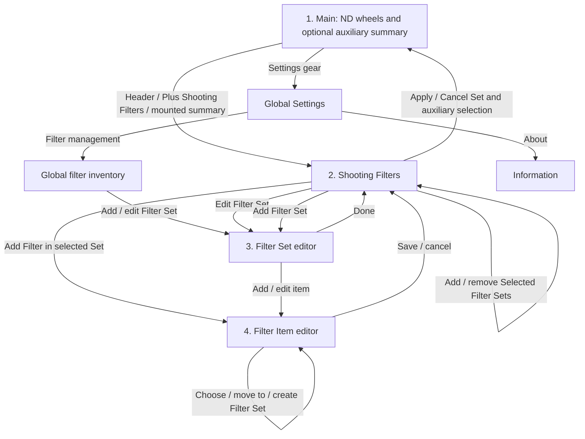

<!-- Copyright © 2026 Sangwook Han -->
<!-- SPDX-License-Identifier: Apache-2.0 -->

# Filter Sets and Shooting Filter Stack

| Prefix | Owns |
| --- | --- |
| FILTER-SET | Filter-set identity, ordering, color, and management |
| FILTER-ITEM | Physical filter inventory and value conversion |
| FILTER-CPL | CPL exposure-loss choices |
| FILTER-GND | GND recording and per-shot calculation mode |
| FILTER-STACK | ND wheels, combined exposure cap, and item exclusivity |
| FILTER-CAMERA | Per-camera candidate Filter Sets |
| FILTER-AUX | Mounted auxiliary filters and shooting popup |
| FILTER-COLOR | Display color, effect identity, and visual color semantics |
| FILTER-FLOW | Main-screen and setup navigation |
| FILTER-PLUS | Filter-source selection and wheel creation |
| FILTER-PERSIST | Persistence, restoration, and captured snapshots |
| FILTER-A11Y | Accessibility and localized presentation |

## Purpose

A photographer can describe the physical filters they own, organize them into
recognizable filter sets, and combine those filters with the existing Standard
ladder in one exposure stack. The calculator records which physical items are
mounted, prevents one item from being used twice on the same camera, and
applies only the exposure loss selected for the current shot.

## Terminology

- A **Filter Set** is a user-owned, ordered group of physically compatible
  filters for one mounting arrangement, with a stable id, name, and color.
  It is distinct from a Shooting Collection. A Filter Set can later be made
  available to another camera explicitly; the app does not infer compatibility.
- A **Filter Stack** is the active camera's ND wheels together with its
  mounted auxiliary filters. Wheel count is not physical filter count.
- **Auxiliary filters** are mounted CPL, GND, Color, or Effect items. They
  share one summary space; they are not scrolling wheels.
- **Candidate Filter Sets** are the Filter Sets explicitly selected for a camera.
  A camera may select more than one. Selected Filter Sets with ND items supply ND
  sources on Main; their auxiliary items are offered in Shooting Filters.
  Availability does not mean mounted and does not certify compatibility.
- A **Filter Source** is either Standard or one Filter Set and determines what
  a newly added ND wheel can select. Only its ND items appear in that wheel.
- A **Filter Item** is one physical filter with a stable id. Equal names and
  equal exposure values do not make two physical items the same item.

User-facing copy shall use the complete terms **Filter Set** and **Shooting
Collection**; it shall not use the unqualified word “Set” where the two domains
could be confused.

## Requirements

### Filter-set management

- **FILTER-SET-001** — Shooting Filters shall present Filter Sets in two
  sections: **Selected Filter Sets** and **Available Filter Sets**. A selected Set shall use
  one compact header row: a leading remove control, its color and name as the
  central edit target, and, when the Set contains at least one Filter Item, a
  trailing add-filter control that creates a new Filter Item directly in that
  Set. The header may show the Set's auxiliary-item count inline, but shall not
  add a second inventory-detail line. If a selected Set contains no Filter
  Items, the trailing add-filter control shall be omitted and one compact
  full-width **Add Filter** row shall appear beneath the header instead. A
  selected Set containing at least one auxiliary Filter Item shall present those items in one horizontally
  scrollable strip of equal-width controls directly beneath the header. On the
  iPhone shooting surface at default text size, the strip shall size ordinary
  item controls so at least three complete item controls are visible at once.
  An item's name may wrap to at most two lines inside its control; its item type
  remains independently visible. The strip shall be visually indented from the
  Set header so Set ownership is immediately clear. An available Set shall use
  one compact row: its color/name as the edit target and one trailing add
  control that moves it into working Selected Filter Sets. Within that same
  compact row, a passive inventory hint shall show every kind present and its
  item count in fixed order ND, Color, Effect, CPL, GND; for example
  **ND ×3 · Color ×2 · CPL**. A count of one may omit ×1; absent kinds shall
  be omitted. An empty Set shall show **Empty** (Korean **비어 있음**).
  Counts describe registered Filter Items, not mounts, stops or choices, and
  shall update after inventory edits. Localized type/count text is preferred
  to an unexplained overlapping-box icon. The hint shall not add individual
  item rows or a second selection path. Selected and Available sections shall
  be clearly distinct grouped regions with visible headings and spacing;
  internal separators between Selected Sets shall remain subordinate to the
  section boundary. Android shall use native grouped surfaces to make that
  hierarchy as clear as the iOS grouped sections. Removing a selected Set
  moves it into Available Filter Sets without committing camera state until Apply.
  Shooting Filters shall not expose Filter Set reorder handles. A separate
  pencil-style edit icon shall not be required. The final inventory action shall
  remain **Add Filter Set**. A delete confirmation shall name the targeted set
  and remain bound to its stable id. Removing all working selected Sets or
  auxiliary picks, applying/cancelling, and deleting user inventory shall
  remain responsive; reconciliation shall settle without a hang or repeated
  update loop. Working selection removal and global inventory deletion remain
  separate operations. Standard is governed by FILTER-SET-007.

- **FILTER-SET-002** — **RETIRED** — A protected built-in Default inventory Set is no longer provided.

- **FILTER-SET-003** — Each user-created Filter Set shall have a stable id, a
  non-empty user-defined name, and a required color. Opening creation shall
  preselect a random suggested color different from the color suggested on the
  immediately preceding creation opening. The user may accept or change it.
  Two or more Filter Sets may use the same color; color uniqueness shall not be
  required. Renaming or recoloring a Filter Set shall not change its id.
- **FILTER-SET-004** — Standard is a fixed built-in Filter Source for ND wheels
  and is not a user inventory Filter Set. It is presented under FILTER-SET-007.
  Shooting Filters shall not provide manual Filter Set
  reordering. Only the displayed **Selected Filter Sets** order shall group a
  Set by its current physical inventory: ND-only Sets first (one or more ND
  items and no auxiliary item), then mixed Sets (both ND and auxiliary items),
  then auxiliary-only Sets (one or more auxiliary items and no ND item), then
  empty Sets last. Within each group, relative order shall retain working
  selection/addition order. Adding or removing a Set changes its group
  membership immediately; editing, moving, or deleting an item shall re-group
  its containing Set immediately without changing the relative order of other
  Sets. Available Filter Sets remain sorted by display name using the
  platform's ordinary locale-aware alphabetical order. In Main's ND source
  browsing, Standard shall appear before eligible selected Filter Sets and
  retain its existing source-browsing order.
- **FILTER-SET-005** — Filter-set names and colors are presentation and
  navigation metadata. Calculation and item identity shall never depend on
  either value, and color shall never be the only means of identification.
- **FILTER-SET-006** — Every user-created Filter Set editor shall expose a
  destructive **Delete Filter Set** action, including Sample Sets and migrated
  former Default Sets. Standard shall not expose this action. Delete shall require confirmation that names the
  Filter Set and makes the global scope clear: the Set and its Filter Items are
  removed from inventory, and references to that Set are reconciled across all
  cameras under FILTER-ITEM-006. Cancel or dismiss shall preserve the Set and
  all camera state. The delete action belongs to the Filter Set editor; Shooting
  Filters shall not add a destructive delete affordance directly to a Set row.

- **FILTER-SET-007** — Standard shall remain a separate built-in ND source,
  not a user inventory Set or physical Filter Item collection. Filter management
  and Shooting Filters shall nevertheless present it as a Set-like row at the
  top, before user Sets. In Shooting Filters it always appears in Selected
  Filter Sets, never Available, with a non-removable selected cue and lock cue.
  The row shall show **Built-in · Always available** (Korean **기본 제공 · 항상
  사용 가능**). Activating it opens a read-only list of the Standard ND entries
  owned by ND-001. No rename, recolor, add, edit, move, delete or selection-removal
  action shall be offered. It has no auxiliary strip. Presentation shall not
  create a duplicate Main source or physical-item identity and shall preserve
  repeated equal Standard values across wheels.

- **FILTER-SET-008** — When no filter inventory has ever been saved, on fresh
  installation or upgrade, provide editable, deletable user inventory examples: **Sample ND** with 3, 6 and 10-stop ND items;
  **Sample ND — Extended** (Korean **샘플 ND — 확장**) with ND100, ND200,
  ND400 and ND100k registered in ND-factor notation; and **Sample Aux Filter Set**
  with CPL, **B+W 091 Red Dark** (3 stops), **B+W 040 Orange** (2 stops),
  **B+W 022 Yellow** (1 stop), and 2-stop GND. These Sample Color values are
  the manufacturer's documented stop compensations for those named models;
  they are editable sample metadata, not inferred defaults for every filter
  of a similar color. Use explicit Color display
  swatches and registered metadata, never infer loss from a name or swatch.
  CPL choices follow FILTER-CPL-001; GND's initial mounted mode follows
  FILTER-GND-002. Extended ND conversion follows FILTER-ITEM-004 and ND-011.
  Samples shall initially be unselected, with no mounted items. Sample seeding
  shall occur once; deleting or editing a Sample shall survive restart without
  recreation or overwrite. A saved empty inventory counts as previously saved;
  malformed, unsupported or failed reads shall not count as an absent inventory
  and shall not trigger Sample seeding. Sample Sets have ordinary stable inventory identity.

- **FILTER-SET-009** — Removing Default's special status shall preserve existing
  inventory and camera references. An existing former Default Set shall become
  an ordinary editable/deletable user Set retaining its id, name, color, items
  and camera selections. Upgrade shall not reset existing cameras, create new
  item identities, overwrite inventory, or alter captured timer snapshots.
  Fresh-install initial selections shall not be reapplied on upgrade.

### Physical filter inventory and conversion

- **FILTER-ITEM-001** — A Filter Set shall contain zero or more physical Filter
  Items. The user shall be able to add, edit, move between Filter Sets, and
  delete them. Manual Filter Item reordering shall not be provided. Lists shall
  use the fixed kind order ND, Color, Effect, CPL, GND and sort items
  alphabetically by display name within each kind using the platform's ordinary
  locale-aware ordering. The Filter Set editor shall offer one Add Filter action
  rather than separate add actions by kind.
- **FILTER-ITEM-002** — Every Filter Item shall have a stable item id and a
  non-empty user-defined name. Multiple items may have the same name, kind,
  unit, and value so that two equal physical filters can be mounted together.
- **FILTER-ITEM-003** — The user shall explicitly identify ND, CPL, GND, Color,
  or Effect behavior; the app shall not infer behavior from a name. New Filter
  shall open one editor with ND preselected, and the user may change its type
  inside that editor before entering the type-specific fields. Existing Fixed
  items retain their ND behavior and identity. Color and Effect items belong
  to Shooting Filters, not the ND wheels. The internal representation of these
  kinds is not a cross-platform requirement.
- **FILTER-ITEM-009** — New Filter shall show an enabled destination Filter Set field.
  From a writable Filter Set, that Set is initially selected. From a general
  Add Filter entry, the user may choose an existing writable Set or create one
  inline; Standard shall never be a destination. With no writable inventory
  Set, the field shall propose **New Filter Set** (Korean **새 필터셋**) with an
  editable name and a suggested source color under FILTER-SET-003. A valid
  Filter Item Save shall create the proposed Set and item together; Cancel or
  failed validation shall create neither. This shall not automatically select
  the Set for a camera or mount the item. Independent Set creation remains
  available. Inline creation shall return with the destination selected and
  all entered item values preserved. Existing items retain the enabled field
  for movement between writable Sets. Saving a destination change commits the
  inventory move immediately; Shooting Filters Apply/Cancel neither commits nor
  rolls it back. Moving preserves the physical item identity. For auxiliary
  selections, evaluate the destination against each camera's committed Selected
  Filter Sets and each open session's working Selected Filter Sets respectively.
  If the destination is selected, retain the valid choice under the new Set.
  If it is Available, treat the moved auxiliary item as unchecked: clear its
  corresponding selection and do not automatically select the destination Set.
  An open session shall not Apply the stale source-Set reference or retain a
  hidden pick that reappears merely when the destination is selected later.
  Preserve unrelated selections and explicit unmounts; do not mount an item
  that was not selected. Cancel discards remaining session edits while the
  inventory move and required committed-camera reconciliation remain in effect.
  Existing ND-wheel movement and kind-correction rules remain governed by
  FILTER-ITEM-005; this auxiliary rule shall not add or select an ND wheel.

- **FILTER-ITEM-004** — Fixed and GND items shall accept a decimal value in
  Stops, OD, or ND factor and preserve the original value and unit as equipment
  reference metadata. Conversion to canonical stops shall use Stops unchanged
  and `OD / 0.3`. An ND factor that exactly matches a commercial label emitted
  by the shared commercial formatter in `nd-filters.md` shall use that label's
  canonical ladder value; therefore ND1000 is exactly 10 stops, not
  `log2(1000)`. Other positive ND factors shall use `log2(ND factor)` without
  snapping. The result shall be finite, greater than 0, and no greater than
  30 stops.
- **FILTER-ITEM-005** — Editing an item shall update every active camera stack
  that references that stable item id. A save that would make any affected
  stack invalid, exceed 30 stops, or remove a CPL exposure-loss choice currently
  selected on an affected camera shall show the affected cameras and remain
  uncommitted until the conflict is resolved. The system shall not silently
  replace a selected CPL choice with another configured value.
- **FILTER-ITEM-006** — Deleting an item shall first identify affected cameras.
  After confirmation, each referencing ND wheel shall become Empty and each
  referencing mounted auxiliary item shall be removed. Deleting a Filter Set
  shall remove its ND wheels, mounted auxiliary items, and camera candidate
  references. A camera left with no ND wheel shall receive one Standard 0-stop
  wheel. A deleted last-used source shall fall back to Standard. Removing the
  last auxiliary item shall hide the summary. Previously captured timer or
  shooting snapshots shall not change. This is inventory deletion, not merely
  excluding an existing set from a camera's candidates.

- **FILTER-ITEM-007** — During one open New/Edit Filter Set session,
  successfully saving a newly created Fixed or GND item shall remember the
  registered-value notation selected in that item editor (Stops, OD, or ND).
  Opening the next new Filter Item from the same Filter Set editor shall
  initialize its notation from that remembered choice instead of resetting to
  Stops. Editing an existing item, saving a new CPL item, canceling, or a failed
  save shall not change the remembered notation. This memory is editor-session
  state only: closing the Filter Set editor or restarting the app shall reset
  the initial notation to Stops. It shall not affect item behavior kind; every
  newly created item shall continue to start as Fixed even when the preceding
  successfully saved new item was GND.

- **FILTER-ITEM-008** — All user-facing instances of `Fixed` shall be renamed `ND`. Existing persisted Fixed items retain their stable identities and ND behavior. An item editor shall permit correction between ND and Color even when mounted, preserving the committed camera selection only if the resulting stack is valid.

- **FILTER-ITEM-010** — New and Edit Filter Item, New Filter Set (including
  inline creation), and Filter Set name/color editing shall use a compact,
  keyboard-aware input layout. At default text size on iPhone 17, the ordinary
  required controls for the active item kind — name, explicit kind, destination
  Filter Set and inline creation entry, registered value and notation or CPL
  choices or display color and loss — and Save/Cancel shall remain visible and
  operable with the applicable software keyboard open, without a manual content
  scroll to complete an ordinary valid create/edit. New Filter Set name, color
  choices, and Save/Cancel shall meet the same condition. For Filter Set editing,
  this guarantee concerns name/color editing controls, not the unbounded
  inventory list. Android shall satisfy the equivalent input flow on its review
  emulator with the software keyboard open. Editors shall use available height
  and compact spacing rather than shrink established text/touch targets,
  overlap the keyboard, or drop required controls. Android New Filter shall
  match the iOS editor's compact visual hierarchy and relative vertical density:
  avoid unnecessarily tall rows, section gaps, padding or unused surface height.
  Compare equivalent kind, language, keyboard state and ordinary text size in
  logical units; adapt to native insets and keyboard geometry rather than copy
  raw screenshot pixels. Existing minimum interaction targets remain required.
  The Filter Set selection field shall show the selected Set's saved source-color
  swatch alongside its name on both platforms, including iOS. Show the same
  source-color cue in destination choices; do not substitute the Filter Item's
  display color. Name remains visible and color is supplementary.
  Static explanatory copy
  shall be limited to the following short sentences, beside the relevant inputs
  and readable with the ordinary keyboard-open layout:
  - ND: no static explanatory paragraph; retain value, notation and live conversion.
  - Color and Effect: **The entered exposure loss is added to the exposure
    calculation.** / **입력한 감광량을 노출 계산에 더합니다.**
  - CPL: **Register up to three exposure-loss values to choose from while
    shooting.** / **촬영 중 선택할 감광량을 최대 3개 등록하세요.**
  - GND: **While shooting, Record only uses 0 stops; Apply to exposure uses
    the registered value.** / **촬영 중 ‘기록만’은 0스톱, ‘노출에 적용’은
    등록값을 사용합니다.**
  These sentences describe a mounted item's contribution according to its
  selected choice; registration alone shall not mount it. New and Edit paths
  shall use the same copy. The editor shall omit beginner text about choosing
  kinds or not guessing from names, conversion-formula/Standard-ladder
  paragraphs, CPL empty/duplicate handling paragraphs, repeated color/loss
  explanations, and metering-through-filter warnings. Removing these
  paragraphs shall not change validation or calculation. In particular,
  commercial ND conversion remains governed by FILTER-ITEM-004;

  input units, item/source display-color distinction, GND mode meaning, conversion
  and validation feedback shall remain understandable. Focused fields and
  invalid-field feedback shall remain reachable, with scrolling retained as
  fallback for constrained sizes, longer localized feedback, and larger text.
  Opening inline Filter Set creation and returning shall preserve the entered
  Filter Item values and selected destination; creation and Cancel semantics
  are unchanged.

### CPL exposure-loss choices

- **FILTER-CPL-001** — A CPL item shall expose three decimal input fields for
  the exposure-loss choices available while shooting. New CPL items shall
  initialize them to 1, 1.5, and 2 stops.
- **FILTER-CPL-002** — Each non-empty field shall accept one integer digit and
  at most one fractional digit, in the closed range 0.1–9.9 stops. At least one
  field shall be valid. Empty fields omit a choice, and duplicate values shall
  appear only once in the shooting popup.
- **FILTER-CPL-003** — Focusing any CPL choice field shall request a
  decimal-capable numeric keyboard on iOS and Android. Locale decimal
  separators, pasted text, and hardware-keyboard input shall be normalized and
  validated by the same rules; an integer-only or general alphabetic keyboard
  does not satisfy this requirement.
- **FILTER-CPL-004** — The editor shall explain that these are “Exposure loss
  choices (stops) available in the filter selection popup while shooting.” The English and
  Korean copy shall communicate the same meaning.
- **FILTER-CPL-005** — A CPL item shall offer its distinct configured exposure-loss
  choices in the auxiliary popup. It shall be mounted once with exactly one
  selected choice; changing that choice shall update the same mounted item.
  Its current contribution shall be readable on Main when included among
  the visible rows under FILTER-AUX-005, and in the complete Selected filters
  panel otherwise.

### GND recording and calculation

- **FILTER-GND-001** — A GND item shall preserve its registered full-density
  value while offering two shooting modes in the auxiliary popup: Record only, contributing 0 stops,
  and Apply to exposure, contributing the registered canonical stops.
- **FILTER-GND-002** — Record only shall be the default when a GND is first
  selected. Switching modes shall affect only that mounted item in the active camera;
  it shall not change the inventory default, another camera, or a timer already
  started.
- **FILTER-GND-003** — Applying the GND's registered value is intended for a
  composition in which the dark region covers nearly the entire metered frame.
  Shooting Filters shall distinguish the two modes by their effect rather than
  by ambiguous short labels: **Record only** contributes 0 stops, while
  **Apply to exposure** contributes the complete registered value. Choosing
  either mode is an immediate reversible working-state change and shall not
  require an additional confirmation popup. The current mode and resulting
  contribution shall remain visible in the Selected filters panel.
- **FILTER-GND-004** — Partial-density estimation is out of scope. GND
  calculation contributes either zero or the complete registered value.

### Mixed stack and filter wheels

- **FILTER-STACK-001** — The main row shall contain Base Shutter, then the
  auxiliary summary when any auxiliary item is mounted, then ND-only wheels,
  then Plus when another ND wheel can fit. With no mounted auxiliary items,
  one to four ND wheels are allowed. With any mounted auxiliary item, one to
  three ND wheels are allowed. The summary occupies one space regardless of
  its item count. Base Shutter and Plus do not count toward these limits.
  A mounted Record-only GND counts as auxiliary presence even at zero stops.

- **FILTER-STACK-002** — Standard wheels may repeat equal values. One physical
  Filter Item id may appear only once in a camera's stack, although the same
  inventory item may be selected independently by another camera.
- **FILTER-STACK-003** — A Filter Set ND wheel shall include Empty plus only that
  set's ND items. CPL, GND, Color, and Effect shall never appear as ND-wheel
  candidates. Empty means no physical item and contributes zero stops; a
  Record-only GND is mounted in the auxiliary summary and also contributes
  zero. These states shall remain visually and semantically distinct.

- **FILTER-STACK-004** — The effective filter value shall equal the sum of all
  ND-wheel and mounted auxiliary-item canonical contributions. It shall remain finite, greater than
  or equal to 0, and no greater than 30 stops. A choice or mode change that
  would exceed 30 shall be rejected with its reason; it shall never be clamped.
  When a sighted touch gesture on a Filter Set wheel settles with an unavailable
  row at the touch center, that unavailable row shall never commit. Instead,
  the wheel shall scan back through the rows the gesture just traversed, from
  the unavailable final row toward the previously committed row, and commit the
  first selectable row it encounters. It shall not search beyond the attempted
  final row or wrap around the wheel. If no selectable row exists on that
  traversed interval, the previously committed selection shall remain and the
  actual rejection reason shall be shown. When a fallback row is committed, the
  status region shall present that committed row and updated Total rather than
  leaving the rejected candidate's reason as the settled state.
- **FILTER-STACK-005** — After all moving wheels settle, actual wheels from
  the same source shall remain contiguous and source groups shall sort by
  registered subtotal descending. A source group's registered subtotal is the
  sum of its ND rows' sort values: a Standard row's selected stops, an ND
  item's registered canonical stops, and zero for Empty. Auxiliary contributions
  shall not participate in ND source-group sorting. Within each source group, non-empty rows shall sort
  by the same row value descending and Empty shall sort last. Ties between
  source groups shall put Standard first and then follow Filter Set
  user-defined order; row ties shall retain stable order. Sorting shall occur
  only after every moving wheel settles, preserve wheel identity and effective
  sum. The auxiliary summary shall stay immediately after Base Shutter;
  changing a GND mode or CPL choice shall not reorder ND wheels. When a committed change alters the settled order,
  every wheel shall remain visible and each stable wheel identity shall animate
  directly from its current position to its new position. Its numeric value,
  type or mode label, source cue, and accessibility identity shall remain
  attached to that wheel throughout the movement. This presentation movement
  shall not change a committed selection, effective sum, persisted order, or
  accessibility focus. If another committed order arrives before movement
  completes, the row may retarget the same stable identities to the newest
  arrangement; only that newest arrangement shall become settled.
  FILTER-SET-004 continues to govern
  management and Plus source-browsing order; it does not govern the settled
  stack order. FILTER-A11Y-006 suspends this automatic value-based ordering
  while platform screen-reader touch exploration is active and reconciles to
  this order after that mode is disabled.
- **FILTER-STACK-006** — Standard 0 and Filter Set Empty ND wheels in a multi-wheel
  stack shall follow the idle-cleanup contract in `nd-filters.md`, including
  immediate cleanup when the combined 30-stop cap leaves no usable non-zero
  ND choice. Cleanup shall retain at least one ND wheel. Mounted auxiliary
  items, including Record-only GNDs, shall never be removed by wheel cleanup.
  Automatic cleanup does not require a separate assistive-technology Remove
  action. An actual removal during screen-reader use shall be announced once
  as removal of an empty ND wheel, not of a zero-contribution mounted item.

- **FILTER-STACK-007** — Every ND wheel shall keep numeric-only scrolling rows,
  a persistent ND or EMPTY label, and its source identity. ND values shall
  remain readable at rest and while moving; auxiliary detail shall not take
  over or hide ND numeric values. ND values shall follow the app-global
  Stops / OD / ND formatter: 10 stops renders 10 / 3.0 / 1000; 3 stops
  renders 3 / 0.9 / 8. Empty renders canonical zero (0 / 0.0 / 1) while
  retaining its distinct no-mounted-item meaning.

  Source cues and the auxiliary summary shall not reduce the established
  numeric-value hierarchy used before this capability for the same density
  tier and occupied filter-space count (ND wheels plus the auxiliary summary). On iOS, a single occupied filter space keeps the full-width
  reference size of 32 / 26 / 19 points in Regular / Compact / Dense. For
  two / three / four occupied filter spaces, the reference sizes are Regular
  28 / 24 / 20 points, Compact 23 / 20 / 17 points, and Dense
  18 / 16 / 14 points. Base Shutter and every ND wheel in the row shall
  use the same numeric size. In particular, four wheels in Dense shall use
  14-point values. These sizes are tier references, not permission to select a
  denser tier from an obsolete content-height budget. The density decision
  shall be derived from the geometry actually rendered after FILTER-STACK-008
  reduces the status region to one row. On an iPhone 17 Pro at the default
  content size, the worst supported film-result and active-Target-Shutter
  composition shall fit the Compact tier after that reclaimed height; it shall
  not remain Dense solely because the removed second status line is still
  counted. Thus a one-filter row on that device uses the Compact 26-point
  reference rather than the Dense 19-point reference, and the same tier's
  references apply as wheels are added.

  The Base Shutter column shall reserve the same persistent-label-row height
  as the filter columns, even though that reserved label row is visually
  empty. Its picker viewport top and bottom, selected-row band, selected-value
  baseline, and vertical touch center shall align with those of every filter
  wheel in the row. Adding or removing wheels, changing notation, moving a
  wheel, settling a reorder, or changing status content shall not break that
  shared vertical axis.

  Source cues shall fit the existing wheel geometry without moving the touch
  center, clipping numeric values, expanding a foreground card, or dimming
  siblings. During movement, the centered candidate and status detail shall
  identify the same item. The status region shall expose its full item name,
  original registered representation, and contribution in stops. Long visual
  detail may truncate at the trailing edge; full detail remains accessible.

- **FILTER-STACK-008** — The mixed-stack interaction shall use one stable
  status region for source identity, the current item or source, rejection
  reason, and live total required by `nd-filters.md` ND-INTERACT-020. For a
  stack containing any Filter Set ND wheel or mounted auxiliary item, the idle region shall persistently
  show a visually secondary source summary and the current total rather than
  becoming empty. Idle content shall always use exactly one visual row at every
  supported text size: the source summary aligned to the leading side and the
  localized total aligned to the trailing side. Total is a primary reading,
  not secondary caption text: its numeric stops value shall be at least the
  size of the selected ND numeric values in the same layout, with sufficient
  emphasis to read directly in the field. The layout shall provide that space
  without reducing the established ND numeric size, forcing a denser tier, or
  clipping the existing results and controls. The total shall remain visible
  and untruncated. When both cannot fit, the leading source summary shall yield
  space first and truncate at its trailing edge; it shall not wrap or move the
  total to a second line. The complete source summary shall remain available to
  accessibility. The region shall reserve only the height required for one
  visual row plus its normal vertical padding. It shall not retain capacity for
  the removed second line. This reclaimed height shall be returned to the wheel
  row and included in the density-tier fit calculation. Status-state changes
  shall remain geometry-stable within that one-row region.

  The source summary shall list each source once in main-row order (auxiliary
  sources first, then settled ND groups), append an ND-wheel count when a source owns
  more than one actual wheel (for example
  `NiSi kit · Lee holder ×2 · Standard`), and identify sources by text rather
  than color alone. Each Filter Set name shall also carry its user-selected
  source-color cue so the summary maps names back to the source cues above the
  wheels. Standard remains explicitly identified by text and does not acquire
  a user-selected color.

  While a wheel or Plus is moving, the region shall replace the idle content
  with exactly one visual row: current item or source detail aligned to the
  leading side and the current live total aligned to the trailing side. A
  rejection shall use the same row for its reason and unchanged total. In every
  state the total shall remain visible and untruncated; leading detail or reason
  shall yield space first and truncate at its trailing edge without wrapping.
  The complete item detail, source name, contribution, and rejection reason
  shall remain available to accessibility. After the existing transient
  interval following settlement or rejection, the persistent idle source
  summary and total shall return. These states shall replace or combine content
  within the one region rather than stack separate bubbles. The region shall
  reserve stable layout geometry so content changes never move a picker or its
  touch center. A Standard-only stack retains the existing status behavior in
  `nd-filters.md`.

### Plus wheel and per-camera source memory

- **FILTER-PLUS-001** — Plus shall remain at the right end while the applicable
  ND-wheel limit permits another wheel: four without auxiliary items, three
  with them. Its vertical choices shall be Standard, the active camera's
  candidate Filter Sets containing ND items in FILTER-SET-004 order, and an
  Shooting Filters action. That action is not a source or a filter value.
  The persistent ND-header entry shall still reach Shooting Filters when
  Plus is absent. Plus shall not expose a management long-press route.
  Whenever committed stack capacity permits another ND wheel, Plus visibility
  shall update after selection Apply, removal or inventory reconciliation
  without requiring a subsequent wheel gesture, navigation or restart.
  Zero selected Filter Sets and zero auxiliary mounts shall not suppress
  Standard's Plus entry.

- **FILTER-PLUS-002** — While the Plus wheel moves, an expanded, non-blocking
  label shall display the complete candidate source name. At rest the compact
  Plus control shall show the candidate source's color as a secondary cue.
- **FILTER-PLUS-003** — Plus shall create a wheel with one direct gesture.
  With an ND source displayed, tapping Plus shall add a Standard 0-stop wheel or a Filter Set Empty wheel
  for the currently displayed source exactly once. When a drag or fling crosses
  the source-browsing threshold and finally snaps to a different source, the
  system shall wait for deceleration, final snap, and the existing commit
  barrier, then add exactly one ND wheel from that final source without requiring
  another tap. Passing intermediate sources shall never create wheels. If the
  gesture settles back on its starting source, it shall create no wheel; the
  ordinary tap remains the explicit add gesture for that source. Browsing shall not expose a management long-press route.
  Settling on the Shooting Filters action shall instead open the shooting
  popup after the same gesture barrier, without creating an ND wheel. Tapping
  that action, when presented as a selectable control, shall do the same.
  Closing the popup shall return Plus to its preceding ND source except for
  the committed Filter Set selection rule in FILTER-PLUS-006. Auxiliary-only
  selection changes shall not change source memory.
- **FILTER-PLUS-004** — Each camera shall remember the Filter Source of its
  last successful Plus addition across camera switches and app restarts. A
  rejected or unavailable addition shall not change the remembered source. A
  fresh camera and a camera whose remembered source no longer exists shall use
  Standard, subject to FILTER-PLUS-006 after a committed Filter Set addition.
  Shooting Filters shall not mount ND items or add ND wheels.
- **FILTER-PLUS-005** — When an ND source cannot add a usable row, browsing and
  the Shooting Filters action shall remain available while Plus is present;
  adding an ND wheel shall be disabled with a reason. At a 30-stop total,
  mounting a Record-only GND shall remain possible within the composition
  limits, while a change to non-zero contribution that exceeds 30 is rejected.
  Neither a rejection nor cancellation shall remove an existing ND selection.

- **FILTER-PLUS-006** — When Apply commits one or more newly selected Filter
  Sets and the preceding Plus ND source is Standard, choose a preferred source
  from the resulting selected user inventory Filter Sets containing at least one ND item.
  Standard's display row is excluded from the ranking and ND-item counts.
  Rank by registered ND item count descending, then ND-only before mixed,
  then display name in ordinary locale-aware alphabetical order. Equal names
  shall retain selected-set order as a stable final tie-breaker. Counts describe
  inventory ND items, not currently available unmounted choices.
  Set Plus's per-camera remembered source to that winner without adding a wheel.
  In the same atomic Apply, convert each retained Standard 0-stop ND wheel to
  an Empty wheel from that source, preserving wheel identity and zero
  contribution. Include a Standard 0 fallback created by that Apply when needed.
  Do not choose or mount a physical ND item, change a non-zero Standard wheel,
  or replace any existing Filter Set wheel. If Plus already names a Filter Set,
  preserve it under the existing eligibility rules. With no eligible ND Set,
  retain Standard. Cancel, merely opening the screen, auxiliary-only changes,
  inventory edits, camera switching and restart shall not trigger this ranking.
  Restore its committed source normally; Standard remains explicitly selectable.
  Source-browsing order and Selected Filter Sets display order remain unchanged.

### Camera candidates and shooting workflow

- **FILTER-CAMERA-001** — A camera may have multiple selected user inventory Filter Sets
  and shall remember that selection per camera. The same physical Set may be
  selected for multiple cameras. Selection states availability, not inferred
  compatibility. A fresh/new camera has no selected user inventory Set or
  mounted auxiliary item; Standard is always available and displayed as
  selected under FILTER-SET-007. Sample Sets initially remain unselected.

- **FILTER-CAMERA-002** — Standard shall always remain available for ND without
  selecting a Filter Set. Filter Set selection shall not mount any item.
  Camera selection shall restore that camera's context, not force a setup
  wizard. Film selection and Filter Set selection are independent; neither
  custom inventory nor auxiliary filters are prerequisites for film reciprocity
  calculation.
- **FILTER-CAMERA-003** — Shooting Filters shall keep both Selected Filter Sets and
  Available Filter Sets visible while choosing auxiliary filters. Multiple Filter Sets
  may be selected simultaneously. Adding or removing a Set changes working
  state only until Apply. Removing a Set moves it to Available Filter Sets and hides
  its auxiliary rows without immediately changing the camera's committed
  candidate Sets, mounted auxiliary filters, ND wheels, calculation, or Main
  summary. Auxiliary working selections belonging to a removed Set shall be
  retained for the lifetime of that Shooting Filters session so adding the Set
  again restores the same working selections. Apply commits the resulting Set
  selection and auxiliary selection together and removes any committed
  auxiliary references and ND wheels whose Set is no longer selected,
  preserving a valid ND stack with Standard 0 as the fallback when necessary.
  Apply shall not ask for an additional confirmation. Cancel or dismissing
  Shooting Filters shall discard session selection changes. Explicit inventory
  edits and their required camera-reference reconciliation remain in effect;
  Cancel shall not undo them. This camera-only selection is distinct from global
  inventory deletion under FILTER-ITEM-006.

- **FILTER-FLOW-001** — Main shall retain the existing camera/film controls,
  Target Shutter, wheel region, result rows, camera paging, and timers. The
  new interaction shall use the existing wheel region and Shooting Filters,
  not a new permanent vertical panel. No empty auxiliary placeholder shall
  consume space.
- **FILTER-FLOW-002** — ND selection and ND-wheel creation shall remain on
  Main. Shooting Filters shall not present an ND tab, ND-source browser, or
  add-ND-wheel action. The persistent ND-header entry, the Shooting Filters
  action in Plus, and tapping a mounted auxiliary summary may open Shooting
  Filters; each route opens the same camera Filter Set and auxiliary-selection surface.
  The Plus entry and its accessibility action shall use **Shooting Filters**
  (Korean **촬영 필터**), rather than name the destination Auxiliary filters. The compact
  Main's wheel-title row shall have a leading passive **Base Shutter**
  (**기본 셔터**) label and a trailing group consisting of one **Select Filters**
  (**필터 선택**) button followed by the **Stops / OD / ND** notation selector.
  The exact order is **Base Shutter — flexible central space —
  [Select Filters] — [notation selector]**. Base Shutter is leading-aligned;
  the complete two-part trailing group is trailing-aligned. The Select Filters
  button replaces the separate Aux Filter button and passive ND Filter title;
  do not retain either as an additional title-row element. Preserve the ND
  labels above individual ND wheels.
  Reserve flexible separation between Base Shutter and the trailing group,
  with at least 12 logical points/dp of visible gap at ordinary text size.
  Keep a distinct visible gap between the button and notation selector.
  The button's complete label and downward chevron form one target, with
  button background/border. Base Shutter shall have no button surface,
  action chevron or click handler. Both platforms shall use these same
  localized roles. Select Filters opens the current camera's Shooting Filters
  for Filter Set selection, auxiliary-filter selection and existing filter
  editing under the existing working-session contract; actual ND values are
  selected only on Main. The destination shall retain the direct instruction
  **Select ND filters on the main screen.** / **ND 필터는 메인화면에서 선택하세요.**
  Global Filter Set management remains available from Settings under
  FILTER-FLOW-006.
  The notation selector is the last element and remains independently
  operable and visually distinct from the Select Filters button. Preserve
  readable fonts, distinct non-overlapping interaction targets and wheel
  viewport/value alignment. Android and iOS shall share title grouping and
  relative spacing using logical units, not raw screenshot pixels.
  Keep notation compact without shrinking Base Shutter to force a fit.
  No persistent explanatory line shall be added to Main. The button's
  accessible description identifies Filter Set selection, auxiliary-filter
  selection and filter editing.
- **FILTER-FLOW-003** — Shooting Filters shall use a dense shooting-oriented
  layout with two stable information zones. At the top, a fixed-height
  **Selected filters** panel shall show the working selected auxiliary-filter
  count, explicitly identified as auxiliary filters — for example Korean
  **선택된 보조 필터 N개** and English **N auxiliary filters** — and current
  auxiliary exposure reduction prominently, followed by a vertically
  scrollable list containing every working selected auxiliary Filter Item; no
  selected item may be replaced by ellipsis-only summary or a **+N more**
  placeholder. Each selected-item row shall keep the user-defined item name
  (one line, ellipsized only when necessary), item type, and current
  contribution or mode visible. The panel's outer height shall not change as
  selections change. With no working selected auxiliary Filter Item, the
  panel shall make that zero state explicit — for example Korean **선택된 보조
  필터 없음** and English **No auxiliary filters selected** — rather than
  looking empty or erroneous. Below it, each Selected Set uses one compact
  header
  followed by one indented horizontal Filter Item strip only when it contains
  auxiliary items; a Set shall not consume
  one vertical row per Filter Item. Horizontal overflow is local to that Set's
  strip, uses free scrolling without snapping item names or recentering after a
  selection, and shall preserve scroll position across selection and choice
  changes. Selecting an item shall not insert or remove a per-Set explanatory
  row or otherwise change that Set's vertical footprint. Explanatory footer
  paragraphs shall not occupy the shooting surface. Available Filter Sets and Add
  Filter Set follow in compact rows. Auxiliary selection is multi-select:
  the user may mount more than one auxiliary Filter Item, including items from
  different selected Filter Sets. Apply/Cancel governs the complete
  camera-specific Shooting Filters working state: selected Filter Sets and
  mounted auxiliary choices. Apply is enabled when either part differs from the
  committed camera state and commits them together. Cancel or dismissal
  discards both kinds of working changes. Inventory edits such as creating,
  editing, moving, or globally deleting Filter Sets / Filter Items remain
  explicit inventory operations and are not rolled back by Shooting Filters
  Cancel. Directly below the **Selected Filter Sets** section title, one
  passive instruction shall read **Select ND filters on the main screen.**
  (Korean **ND 필터는 메인화면에서 선택하세요.**), to identify where actual
  ND values are selected. It shall remain readable rather than use an arrow
  abbreviation, and shall not imply that every selected Set contains ND items.
  The instruction is not an action, shall not be repeated in individual Set
  rows, and shall not require tapping an ND control or showing a toast. A Selected Filter Set containing one or more ND Filter Items, including a
  mixed ND-plus-auxiliary Set, shall show one passive inline **ND** cue in its compact header, without adding a second row or implying
  that an ND value is selected there. An ND-only Set has no auxiliary strip. This keeps it from reading
  as empty; the section instruction identifies where to choose its ND value
  on Main. With no selected user inventory Set, the permanent selected Standard
  row remains visible. This is a normal shooting state and shall not require
  adding a Set or show a contradictory “No Filter Set selected” message.
- **FILTER-FLOW-004** — First-time registration shall remain filter-first. A general
  **Add Filter** action shall remain reachable from Shooting Filters and global
  Filter management even when Standard is the only displayed Set. It shall not
  be attached to Standard as an add-to-Standard action. A writable selected Set
  retains its contextual Add Filter controls under FILTER-SET-001. Both paths
  open New Filter with FILTER-ITEM-009 destination behavior; no inventory setup
  wizard or pre-created protected Default Set is required.

- **FILTER-FLOW-005** — Selected Filter Sets and Available Filter Sets shall remain visible
  regardless of how many Sets are selected or how many auxiliary filters are
  mounted. Set names open the Set editor. The leading remove control on a
  Selected Set moves it to Available Filter Sets; the trailing add control on an
  Available Set appends it to Selected Filter Sets. Shooting Filters shall not provide
  Filter Set reorder or a hidden Plus/long-press management route. Global
  inventory management is available separately through Settings under
  FILTER-FLOW-006; it does not replace this camera-specific shooting surface. **Add Filter Set** remains available after
  the Set sections. Creating a Filter Set adds it to inventory and returns to
  Shooting Filters; it does not mount a filter. Global deletion remains an
  explicit destructive inventory action inside the Filter Set editor and shall
  not be conflated with removing that Set from the active camera.

- **FILTER-FLOW-006** — Replace Main's information (i) entry beside Reset with
  a visible gear button opening global **Settings** (Korean **설정**). Its menu
  shall contain **Filter management** (**필터 관리**) and **About** (**정보**).
  About opens the existing information surface. Filter management lists global
  Filter Sets and provides their existing add/edit/delete and Filter Item
  add/edit/move/delete operations, preserving Standard read-only presentation and existing
  affected-camera validation/reconciliation. It shall not contain camera
  candidate checkboxes, auxiliary mount controls, per-shot CPL/GND choices or
  the camera-specific Shooting Filters entry. Opening/closing Settings or
  management alone shall not change any camera selection. Inventory edits
  remain global and immediate under the existing inventory contract.
  Shooting Filters remains reachable from the wheel header, Plus and summary.

- **FILTER-FLOW-007** — In Shooting Filters' item selection controls, CPL, GND
  and Effect shall have consistent supplementary type icons beside their
  explicit type text: a circular filter/ring cue for CPL, a graduated
  light-to-dark filter cue for GND, and a sparkle cue for Effect. Use the same
  visual meaning on both platforms. These are type identifiers, not optical
  simulations, selected-state cues, or new buttons. Keep the type text,
  user-defined item name, check/plus selection cue and direct CPL/GND choices.
  Icons shall not reduce the three-complete-controls guarantee, change Set
  height, or imply a particular Effect subtype. Screen readers announce the
  type once without redundantly reading the decorative icon.

### Mounted auxiliary filters

- **FILTER-AUX-001** — A non-scrolling summary shall appear immediately after
  Base Shutter only while at least one auxiliary item is mounted. Removing the
  last item shall hide it and return that space to ND use. A Record-only GND
  shall keep it visible. Its position shall not change with exposure value.
- **FILTER-AUX-002** — For each auxiliary item visible under FILTER-AUX-005,
  Main shall show its identity and current contribution in stops. A combined
  total, count, color dot, or generic GND label alone is insufficient for a
  visible item. The complete selected list is reachable by tapping the summary. Registered GND density shall be explicitly distinguished from
  its current contribution and Record only / Apply to exposure mode. Equal-value
  Hard, Soft, and Reverse GNDs shall be distinguishable by their registered
  names in both selection and the summary. CPL choice and Color/Effect loss
  shall be immediately readable. The summary shall not replace ND numeric
  values or increase the main screen's vertical content budget.
- **FILTER-AUX-003** — Opening Shooting Filters shall initialize its working
  auxiliary selection and working Filter Set selection from this camera's
  committed state. Apply shall atomically validate and commit the working
  Filter Set selection, auxiliary mounting, CPL choices, and GND modes,
  including removal of ND wheels that belong to Filter Sets excluded by the
  applied working selection. Cancel or surface dismissal shall discard session changes and preserve
  committed state, including any explicit inventory edits and their required
  camera-reference reconciliation made while the surface was open. An invalid Apply shall explain the constraint and leave
  the committed state unchanged. Rechecking a Set within the same session shall
  restore that Set's retained auxiliary working selections.
- **FILTER-AUX-004** — Physical-item exclusivity and the 30-stop cap shall cover
  ND and auxiliary selections together. A zero-contribution mounted item is
  still present and cannot be mounted twice. The wheel limit shall not be
  interpreted as a maximum count of physical auxiliary items.

- **FILTER-AUX-005** — The Main auxiliary summary box shall align its visible
  top and bottom with the adjacent wheel picker viewports, including Base
  Shutter; it shall not extend upward into the persistent wheel-label band or
  grow taller than the wheel boxes. Its title/action cue and item rows shall
  fit inside this shared height. Align the surrounding frame as well as the
  visual background and hit region, without moving wheel selection bands or
  reducing established ND numeral sizes. There is no maximum count of mounted auxiliary items. The three visible Main lines are a presentation guarantee, not a selection limit. Main shall show the first three mounted items, distributing one, two, or three compact rows through the available summary height rather than packing them at its top, and then `+ N more` when further items are mounted. Main shall not scroll or fade; tapping its summary opens the complete scrollable list.
- **FILTER-AUX-006** — Shooting Filters shall group offered auxiliary items by
  selected Filter Set, in Selected Set order. Within each Set, items shall
  follow Color → Effect → CPL → GND and alphabetical order within kind. The
  Filter Set name belongs to the compact Set header and shall not be repeated on
  Filter Item controls. Each item in the horizontal strip shall be an
  equal-width selectable control whose whole primary surface toggles
  mounted/unmounted state; selected state shall be obvious without relying on
  color alone. The item control shall show the user-defined item name and its
  type separately, because names such as **72mm** do not imply CPL, GND, Color,
  or Effect. The name may use at most two lines in the selection control. The
  strip shall not create a post-selection detail row. For a selected CPL or GND,
  the compact item control shall provide a distinct, directly reachable
  secondary choice affordance so changing CPL loss or GND mode does not require
  unmounting the item first. Main retains its existing fixed auxiliary summary
  order and concise identity-plus-contribution presentation.
- **FILTER-AUX-007** — Shooting Filters shall not show the whole-stack Total
  because ND configuration remains on Main. It shall show the selected
  auxiliary filters' exposure contribution as **Exposure reduction** (localized
  equivalently, e.g. Korean **노출 감소량**) in stops. The combined
  ND-plus-auxiliary 30-stop cap remains mandatory. Mounting or changing a contribution that would exceed 30 shall be refused
  immediately with a visible reason, retaining the previous valid working
  selection. This refusal shall not replace the auxiliary count or exposure
  reduction. With four retained ND wheels, an auxiliary mount shall similarly
  be refused with a reason identifying the three-ND-wheel limit; removing a
  Set in the working session may release its ND wheels for Apply. The system
  shall not automatically remove a committed ND wheel to fit an auxiliary item.

### Color and effect filters

- **FILTER-COLOR-001** — A Color item shall record a user-selected display
  color separately from its user-defined name and exposure loss. The color is
  a visual identification reference, not a claim about the physical filter's
  actual color or optical transmission. The user-defined name identifies the
  physical filter. Red, Orange, Yellow, Green, and Yellow-green shall remain
  available as display colors without pretending the item is ND, CPL, or GND.
  No exposure loss shall be inferred from display color, product name, or camera.
  The editor shall label the palette **Display color** (Korean **표시 색상**).
  It shall not show **Optical color** / **광학 색상**, a separate visible selected
  hue name such as Red / 빨강, or a redundant color dot beside the loss input.
  The palette's selected cue and the independently labelled exposure-loss
  input shall remain visible. Accessible palette-option names may identify
  their displayed hue without claiming it is the physical filter's color.
- **FILTER-COLOR-002** — Effect items, including a night light-pollution filter,
  shall be usable as mounted auxiliary filters on digital and film cameras.
  Their exposure contribution shall be explicitly user-supplied, not an
  app-estimated correction. Color and Effect inventory shall participate in
  item identity, per-camera state, total validation, and captured context.
- **FILTER-COLOR-003** — Source-set color, filter behavior type, and a Color
  item's display color are different information and shall not overwrite each
  other. Behaviour type shall remain independently visible as text; source and
  item colors shall retain their distinct visual roles across iOS and Android,
  light and dark appearances. Source recoloring shall not change an item's
  display color or calculation. Existing saved colors, stable identities and
  captured color values shall be preserved without a storage-token migration
  merely to change user-facing terminology.

- **FILTER-COLOR-004** — The shared selectable display-color palette shall be ordered Red, Red-orange, Orange, Yellow-orange, Yellow, Yellow-green, Green, Teal, Blue, Purple, Pink. This keeps the existing intermediate hues while adding the common photographic Red↔Orange↔Yellow transitions. Each option shall render as a clear recognizable hue in light and dark appearance: Yellow shall be a bright photographic yellow rather than a muted mustard/brown; Yellow-green shall remain visibly between Yellow and Green; Red-orange and Yellow-orange shall remain visibly between their neighbors. Duplicate blue-family options are not required. A Color item uses this common palette and must not render its choices as black or generic markers.

### Persistence and captured context

- **FILTER-PERSIST-001** — The inventory, Filter Set order and colors, every
  camera's ND wheels, candidate Filter Sets, mounted auxiliary items and
  per-item calculation mode, and every camera's last ND Filter Source shall survive app restart through backward-compatible additive
  persistence. A legacy Standard-only snapshot shall continue to restore. When
  writing a mixed stack, the additive mixed-stack field is authoritative for
  new builds; pre-Filter-Set stack and scalar fields shall describe only its
  Standard wheels, using one Standard 0 wheel when none exist, so older builds
  restore a valid Standard-only projection.
- **FILTER-PERSIST-002** — Inventory records shall decode independently under
  `cross-cutting/persistence.md`. An unresolved Filter Set or item reference in
  a camera stack shall be skipped safely; a CPL selection whose configured
  exposure-loss choice no longer exists shall restore that wheel as Empty
  rather than selecting another choice. For an auxiliary CPL reference, the
  invalid selection shall be unmounted rather than substituted. The restored
  state shall respect the conditional ND-wheel limits and contain at least one
  ND wheel, falling back to Standard 0 when necessary. Legacy mixed-stack
  migration shall preserve physical identities, CPL choices, GND modes, and
  effective total: its ND rows become ND wheels and its CPL/GND rows become
  auxiliary selections. Candidate sets shall include the referenced legacy
  sets so restored mounted items remain reachable. A legacy stack containing
  only auxiliary items shall receive one Standard 0 ND wheel. Existing timer
  records shall not be rewritten.
- **FILTER-PERSIST-003** — Starting a timer shall capture an immutable
  calculation record containing the effective canonical total in stops and
  each ND wheel's and mounted auxiliary item's actual contributed stops and selected calculation mode. The Timer
  list shall present that canonical total as its primary filter value and a
  human-readable reference string generated at start time from the Filter Set
  and Filter Item names, registered representations, and modes. The reference
  string is descriptive only: Filter Set identity, color, later inventory
  lookup, rename, reorder, edit, or deletion shall not drive calculation or
  rewrite an already captured Timer list entry.
- **FILTER-PERSIST-004** — A broader Shooting Collection or record-management
  workflow is outside this capability. It may consume the same immutable
  summary later but shall not redefine Filter Set behavior.

### Accessibility and localization

- **FILTER-A11Y-001** — Every wheel shall be one adjustable accessibility
  element with a stable label that identifies its position and source, separate
  from a concise dynamic value that identifies the current item or Empty, type
  or calculation mode, and current canonical value or contribution. Moving
  focus to another wheel may announce that wheel's label and value, but changing
  a selection shall not repeat the stable label or an app-authored usage hint.
  The complete registered representation and calculation detail shall remain
  reachable through the status region. Add and ND source selection shall have
  explicit assistive-technology actions on the focusable Plus control,
  including a distinct Open Shooting Filters action. Filter Set selection,
  editing, creation, and user-created Set deletion shall remain directly
  reachable from Shooting Filters and the Filter Set editor rather than through
  a separate Plus management action. Set and Filter Item reordering actions are
  not required because their presentation order is deterministic. The summary shall be a button
  that exposes all mounted identities, modes, and contributions
  and opens the shooting popup; it shall not pretend to be an adjustable ND
  wheel. Automatic cleanup governed by FILTER-STACK-006 need not expose
  a separate Remove action.
- **FILTER-A11Y-002** — Color shall be redundant with accessible text and
  state. Required controls, persistent labels, and type cues shall remain
  reachable and readable under the large-text and constrained-height rules in
  `cross-cutting/presentation.md`.
- **FILTER-A11Y-003** — English and Korean shall expose equivalent terminology,
  validation, calculation modes, and disabled reasons on iOS and Android.
- **FILTER-A11Y-004** — An assistive-technology increment or decrement on a
  Filter Set wheel shall scan the wheel's existing row order in the requested
  direction and skip candidates that are unavailable because the same physical
  item is mounted in another wheel, the 30-stop cap would be exceeded, or
  another selection rule rejects the candidate. It shall commit and announce
  the first available candidate exactly once instead of stopping at the first
  unavailable adjacent row. The scan shall not wrap past the end of the wheel.
  If no available candidate exists before that boundary, the current selection
  shall remain unchanged. The announcement shall identify the actual rejected
  candidate when one or more unavailable candidates prevented progress; when
  the current row is simply at the end, it shall instead announce a localized
  boundary reason.
- **FILTER-A11Y-005** — A successful wheel increment or decrement shall update
  the element's dynamic accessibility value and announce the newly committed
  value exactly once. If adjustment begins while VoiceOver is still speaking
  the wheel label, value, trait, or system guidance, that speech shall yield to
  the changed value. Rapid consecutive adjustments may interrupt intermediate
  speech, but after adjustment stops the final committed value shall be heard.
  A rejected or boundary adjustment shall announce only its localized reason
  and shall not re-announce the unchanged value. Filter wheels shall provide no
  app-authored usage hint; platform guidance for the adjustable trait remains
  under the user's assistive-technology verbosity settings. After a successful
  wheel adjustment, the spoken dynamic value shall identify the newly committed
  item or Empty, its type or calculation mode, its current canonical value or
  contribution, and the current complete Total in that order. For example, an
  ND 3 item at a 21.6-stop combined total may be announced as
  "ND, 3 stops, Total 21.6 stops". Rapid consecutive
  adjustments may interrupt intermediate speech, but after adjustment stops the
  final committed value and current Total shall be heard exactly once. Rejected
  or boundary adjustments shall continue to announce only their localized
  reason. The complete Total shall also remain a separate focusable
  accessibility target in the status region, reachable directly without first
  listening through the source summary or item-detail text.
- **FILTER-A11Y-006** — While the platform screen reader or touch-exploration
  mode is active (VoiceOver on iOS; touch exploration used by TalkBack or
  another Android screen reader), the Filter Stack shall freeze its current
  complete wheel order. Selection and mode changes shall continue to update
  values, contributions, and totals, but shall not run the automatic
  value-based ordering in FILTER-STACK-005 or move accessibility focus to a
  different wheel position. Enabling the mode shall preserve the complete
  order currently shown and cancel any pending reorder without exposing a
  partial arrangement. If the app starts with the mode active, it shall restore
  the persisted wheel order without an automatic value-based reorder.
  Explicit wheel addition or removal may still change membership and the
  unavoidable positions around that change; it shall not trigger an additional
  subtotal-based reorder.

  When the mode becomes inactive, the stack shall reconcile exactly once to
  the current FILTER-STACK-005 order after all wheel movement and the current
  commit barrier have settled. The reconciliation may change positions but
  shall preserve every wheel's stable identity, committed selection, effective
  total, and per-camera persistence. Implementations shall detect the platform
  capability rather than a particular Android accessibility-service package,
  so compatible screen readers receive the same behavior. Ordinary touch and
  ordering behavior while the mode is inactive remain unchanged.

## Screens and navigation

The numbered screens describe roles within the existing main-screen structure;
they do not prescribe native navigation components or a new app shell.

| Screen | Contents and primary task |
| --- | --- |
| 1. Main | Existing camera/film and Target controls; Base Shutter → optional auxiliary summary → ND wheels → Plus; one status row with prominent Total; existing results and timers. ND selection and ND-wheel creation stay here. |
| 2. Shooting Filters | Fixed-height Selected filters panel with selected count, exposure reduction, and a vertically scrollable complete selected-item list; Standard first, then selected user Filter Sets grouped ND-only, mixed, auxiliary-only, then empty, with one compact header per Set and an indented free-scrolling strip of equal-width controls only for Sets containing auxiliary items; inline ND on Sets with ND items; item name and type shown separately; direct CPL/GND secondary choices; Available Filter Sets alphabetically with name-to-edit and trailing add-to-selected; general Add Filter and Add Filter Set; Apply/Cancel for the whole working session. No ND tab, ND-wheel-add action, manual Set/item reorder, or separate Manage Filter Sets entry. |
| 3. Filter Set editor | Standard opens a read-only ND list. User Sets: name and source color; one physical-item list ordered ND, Color, Effect, CPL, GND and alphabetically within kind; Add Filter; delete items; destructive Delete Filter Set for user-created Sets only. |
| 5. Global Settings / Filter management | Gear beside Reset opens Filter management and About. Global inventory editing has no current-camera selection controls. |
| 4. Filter Item editor | Name, explicit kind, registered exposure metadata, and enabled Filter Set selection for both new and existing items; inline Add Filter Set; display color for Color, CPL choices, or GND full density as applicable. |

ND remains on Main throughout this flow. Selecting Filter Sets determines the eligible ND sources on Main and the
auxiliary items Shooting Filters offers; it does not mount either kind. Popup
structure and system dismissal gestures may follow each platform; the committed
behavior and availability of these paths shall match.

## Verification examples

| Scenario | Actions and expected main-screen result |
| --- | --- |
| Digital, Standard only | Start from a fresh digital camera, set Base Shutter and Standard ND, add another ND with Plus. No inventory setup or auxiliary placeholder; calculated exposure remains available. |
| Film, Standard only | Select film and Standard ND directly. Film/model and corrected result remain in their existing positions; custom inventory is not required. |
| Inventory preparation | Start with Add Filter and save the first item with the proposed New Filter Set created atomically at Save, without a separate Set setup step. Add another filter, create a 52 mm Filter Set from the Filter Set field, and return with it selected. Create additional 67/72 mm, 82 mm, and shared sets as needed. Mixed sets do not need splitting. |
| ND-only via Plus | Browse Plus to Shooting Filters, select an ND-only Filter Set, verify the zero auxiliary state, its inline ND cue, and the full ND-on-Main instruction below the section title. Apply; on Main add a wheel from that Set and select an ND value. No auxiliary registration or mounting is required. Repeat with a mixed Set without mounting its auxiliary items. |
| Standard only selected | Remove every selected user Set and Apply. Standard remains visibly selected and available, auxiliary count is zero, and restart preserves the empty user-Set selection. |
| Digital with auxiliary | From initial Main open Shooting Filters. Select two Filter Sets at once and verify the auxiliary list becomes their union. Mount CPL from one and Record-only GND from the other, Apply, then add/select ND on Main. Summary appears left of ND and shows both contributions; Total includes CPL and zero GND. |
| Film with auxiliary | Select film, mount Red from the camera's Color set, select ND from a separate shared set. Main retains film results, individual auxiliary loss, and ND values. |
| Field maximum | Register and mount Red plus ND400, ND4, and ND16. Main shows one auxiliary summary and all three ND wheels. The ND400 conversion follows FILTER-ITEM-004 rather than a fabricated Standard preset. A fourth ND cannot be added until auxiliary items are removed. |
| Four ND without auxiliary | Reach four ND wheels. The persistent header still opens auxiliary selection; no ND is silently removed to accommodate it. Return with Cancel and verify unchanged values. |
| GND identity and mode | Register Hard 2, Soft 2, Soft 3, and Reverse 3 with distinguishing names. Select the intended item, then switch Record only / Apply to exposure. Both registered density and current contribution remain distinguishable on Main. Mount two distinct GND items and verify both identities and contributions are readable. |
| Removal and cancellation | Remove all auxiliary selections and Cancel: Main is unchanged. Repeat and Apply: the summary disappears and capacity returns to four ND. A sole Record-only GND still keeps the summary visible. |
| Camera and restart | Use different candidate sets, mounted items, and last ND sources on two cameras; switch and restart. Each restores independently. Assigning the same physical set to both is allowed. |
| Combined cap | At 30 total stops with no more than three ND wheels, mount Record-only GND. Enabling its non-zero contribution is rejected; Cancel or rejected Apply cannot change the committed stack. CPL/Color/Effect all share the same total budget. |

Additional regression checks:

- With the software keyboard actually visible, exercise new and existing ND
  in Stops/OD/ND, GND, CPL, Color, and Effect; focus name and every numeric
  field, switch kind/notation, and save an ordinary valid item without manual
  content scrolling. Create a Filter Set independently and inline, cancel and
  return with the Filter Item draft intact, and edit a Set name/color. Verify
  Save/Cancel, unit/type labels and palette remain operable above the keyboard;
  check Korean/English and invalid-value feedback. Capture keyboard-open
  before/after evidence on iPhone 17 and the Android review emulator.

- On iPhone 17 at default text size, select at least five auxiliary items in
  one Set, including `MARUMI Red R2X1 72mm`, `72mm`, Color, Effect, CPL,
  and GND. Verify the fixed panel, complete internal scroll, separate type and
  contribution, three complete controls at the strip start, free intermediate
  positions, and position retention through mount/unmount and CPL/GND changes.
- Verify Selected Filter Sets grouping ND-only → mixed → auxiliary-only →
  empty, selection order within a group, and immediate regrouping after item
  edit/move/delete. Available ordering and Main source order are unchanged.
- For digital, color-film, and black-and-white-film workflows, combine the
  applicable ND and auxiliary items; verify all contributions feed Adjusted
  Shutter once, and film reciprocity consumes that adjusted result. GND
  Record only contributes zero; changing its mode updates its own contribution.
- At the 30-stop and four-ND-wheel boundaries, an invalid auxiliary action
  retains the previous working selection and shows its refusal reason. Verify
  recovery by reducing ND or removing an applicable Set, then applying valid
  working state; Cancel preserves committed state.
- Register a filter into a newly created Set, return, find it under Available
  Filter Sets, select the Set, and use the filter through its appropriate ND or
  auxiliary path. Registration alone mounts nothing.
- Change working selections, perform an inventory edit, then Cancel: only
  session changes are discarded; inventory changes and required camera-reference
  updates survive. Include ambiguous duplicate names and visually truncated
  names in the identity review; do not introduce a new editing path in selected
  rows merely to satisfy this review.

1. Two distinct equal-strength ND items may both be selected; the same item id
   cannot. A sighted unavailable-row fallback uses only the traversed interval.
   Screen-reader adjustment skips unavailable candidates without wrapping.
2. ND source groups sort by ND subtotal, preserving identity and effective total.
   Auxiliary changes do not move them. Screen-reader mode freezes ND order;
   disabling it reconciles once after settlement. Reorders animate stable items.
3. Tap Plus adds its displayed ND source once. A changed final ND source adds
   once after settling; intermediate sources or returning to the starting source
   add nothing. The Shooting Filters action only opens the popup. A stationary long press shall not open management. Failed additions do not
   change source memory. Verify header entry with Plus absent.
4. CPL decimal input supports locale separators and rejects 0, 10, and 1.25.
   Editing away a choice mounted on any camera is blocked with affected cameras
   identified. Consecutive new Fixed/GND items retain session notation; cancel,
   edits, and CPL creation do not change that memory.
5. Switch global notation: ND1000 uses 10 / 3.0 / 1000 and exactly 10 canonical
   stops; Empty uses 0 / 0.0 / 1. Auxiliary current contributions remain labeled
   stops and distinguishable from original registered metadata.
6. At the most constrained supported film/Target layout, verify ND-only four
   spaces and auxiliary-plus-three-ND. Summary, Base Shutter, numeric ND values,
   labels, Total, existing results, and controls remain readable without adding
   a vertical panel. Total yields no space to a long source caption. Repeat in
   light/dark, Korean/English, and supported text sizes on both platforms.
7. Exercise inventory rename, recolor, deterministic ordering, Filter Item
   movement between Sets, item edit, and targeted deletion. A moved item's
   stable identity and every referencing camera stay correct. An auxiliary item
   moved to an Available Set becomes unchecked without selecting that Set;
   movement between selected Sets preserves its valid choice. Captured timer
   names, modes, contributions, and totals remain immutable. Source color never
   changes an display color.
8. Restore legacy Standard and legacy mixed snapshots, including CPL/GND-only
   stacks and unresolved item references. Verify the new presentation retains
   valid committed contributions and does not reinterpret GND recording as loss.
9. Verify actual empty-wheel cleanup announces once, never removes mounted
   Record-only GND, and keeps one ND wheel. Auxiliary summary and popup controls
   remain accessible with their current state and explicit actions.

## Product research references

- [B+W Filter brochure, Filter Factor table, printed page 39](https://schneiderkreuznach.com/application/files/5016/7049/7948/Broschuere-B-W_EN_without_UV_reduced_size.pdf):
  022 Yellow 495 factor 2 / 1 stop; 040 Orange 550 factor 4 / 2 stops;
  091 Red Dark 630 factor 8 / 3 stops. This table supplies the named Sample
  Color metadata under FILTER-SET-008; it does not establish color-based
  automatic loss inference.

## Non-goals

- Automatic compatibility checks between holders, filter sizes, lenses, or
  Filter Sets, and recommendations about which physical filters to combine.
- Inferring filter behavior, display color, or exposure loss from a product name.
- A separate memo feature or additional permanent main-screen information panel.
- Estimating a CPL's current loss from rotation angle or a GND's partial-frame
  coverage.
- Cross-device inventory synchronization, import, export, and purchase advice.
- A Shooting Collection editor or general photographic-equipment inventory.

### Input copy and empty-state interaction verification

- With ordinary name and numeric software keyboards open, verify the short
  approved copy for Color, Effect, CPL and GND is readable in New/Edit without
  a manual content scroll; ND has no explanatory paragraph. Value/notation,
  live conversion, Save/Cancel and invalid-field feedback remain usable.
- Verify Display color / 표시 색상, no visible selected hue-name/loss-row dot,
  retained palette selected cue, and unchanged saved colors and explicit loss.
- Verify Available Set contents hints for ND-only, mixed, auxiliary-only,
  repeated kinds, empty Sets and after an item move/delete; counts match inventory.
- Verify Android Selected/Available section grouping remains clearly distinct
  while strips scroll and selections change, in Korean and English.
- Clear every auxiliary pick and remove every Selected Set, then Apply/Cancel.
  Main's Plus shall follow committed capacity immediately without a wheel gesture;
  Standard-only shooting remains usable. Repeat across cameras.
- On iPhone 17, separately exercise removing all working selections and globally
  deleting items/user Sets, including referenced items/Sets. Verify responsive
  return and settled reconciliation, with Standard protected and former Default treated as ordinary inventory. A screenshot alone
  shall not be treated as proof that a hang or its recovery was reproduced.

### Main header alignment verification

- At default text size on iPhone 17 and the Android review emulator, capture
  the same camera/film/ND/auxiliary state in Korean and English. Report the
  card-inner content bounds, filter-title button bounds and notation-control
  bounds in logical units and as fractions of inner width. Align Android
  with the iOS reference; do not compare raw screenshot pixels across devices.
- Verify the full Select Filters title and its chevron open the current
  camera's Shooting Filters, while Stops/OD/ND change only notation. Check
  each distinct hit target and unchanged picker selection-band alignment.
- Repeat with no auxiliary mount and with a mounted auxiliary summary, and
  allowed wheel compositions; neither title nor notation may collide or
  silently truncate at ordinary text size.

- Verify the Main auxiliary box and adjacent wheel viewport top/bottom bounds
  agree at one, two, three and more than three selected auxiliary items. Keep
  the first three identities/contributions plus count guarantee; do not raise
  the box into the ND label band to fit content. Check all allowed ND counts.

### Source preference and global navigation verification

- Verify Standard is always shown first and selected, its read-only ND list,
  no modification/removal controls, no user inventory identity and no duplicate
  Plus source. Delete all Samples/user Sets and create a filter directly:
  proposed New Filter Set persists only after successful Save; Cancel leaves
  no empty Set and does not mount or select anything. Edit the proposed name.
- Verify fresh install versus upgrade separately: unselected Samples seed once,
  deleted Samples remain absent, former Default retains ids/references as an
  ordinary Set, and existing fractional Standard selections retain their exact
  contribution through upgrade, camera switch and restart.

- Select ND Sets with different counts and Apply while Plus is Standard:
  highest ND count wins. At equal counts ND-only wins, then alphabetical name;
  verify mixed/auxiliary-only/empty Sets, equal names, existing Set source,
  non-zero Standard wheels and multiple Standard 0 wheels. The latter become
  winner-source Empty wheels with unchanged total; no wheel or item is added.
  Cancel preserves source and wheels; repeat across cameras and restart.
- Begin Main UI verification with zero mounted auxiliary filters. Verify both
  platforms show leading Base Shutter / 기본 셔터, flexible central space,
  then the right-aligned [Select Filters / 필터 선택 button] and notation
  selector. No separate Aux Filter or ND Filter title remains in this row;
  individual ND-wheel labels remain. Capture the central and button-to-notation
  gaps in logical units. Base Shutter is passive; the complete button and its
  chevron open Shooting Filters; notation changes only notation.
  Repeat Korean/English on iPhone 17 and the Android review emulator with
  Standard only, an ND-only user Set, every allowed ND-wheel count, auxiliary
  selections added, and all auxiliary selections removed. Do not wipe existing
  user data to obtain a zero-auxiliary state.
  In Shooting Filters select an ND-only Set and an auxiliary item, verify the
  ND-on-Main instruction and unchanged Apply/Cancel semantics, and edit a
  filter. Global Settings continues to open global Filter Set management.
- Open Settings from each camera: the same global inventory and About are
  available, no camera mount/candidate controls. Edit an item and verify existing
  reference reconciliation; opening/closing alone changes no shot.
- Capture CPL/GND/Effect icons beside type text in unselected and selected
  controls, without extra taps, strip-width loss or changing Set height.

### Inventory movement, Reset and Sample recovery verification

- Begin with zero auxiliary filters, then select an auxiliary item only in
  the working session and move it to an Available Set through the item editor.
  Verify immediate inventory movement, unchecked state, no stale-reference
  Apply blocker and no automatic destination selection. Selecting that Set
  later shall not resurrect the cleared pick. Repeat with a committed pick,
  with a destination already selected, with unrelated draft picks/unmounts,
  then Apply, Cancel, camera switch and restart. Other cameras reconcile
  independently against their own selected Sets; captured timers stay unchanged.
- Verify both camera Reset choices under shooting/reset.md with CPL, Color,
  Effect and GND Record only, including a zero effective total and Empty ND
  wheels. All auxiliary selections clear; selected Filter Sets remain selected.
  Inventory and other cameras remain unchanged; reset visibility includes a
  sole zero-contribution auxiliary selection.
- Verify fresh installation and upgrade with no previously saved inventory:
  Samples appear once and remain unselected. A saved empty inventory, deleted
  Samples, malformed payload or read failure shall not seed or overwrite them.
