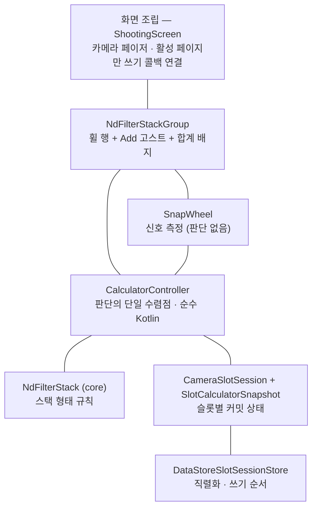
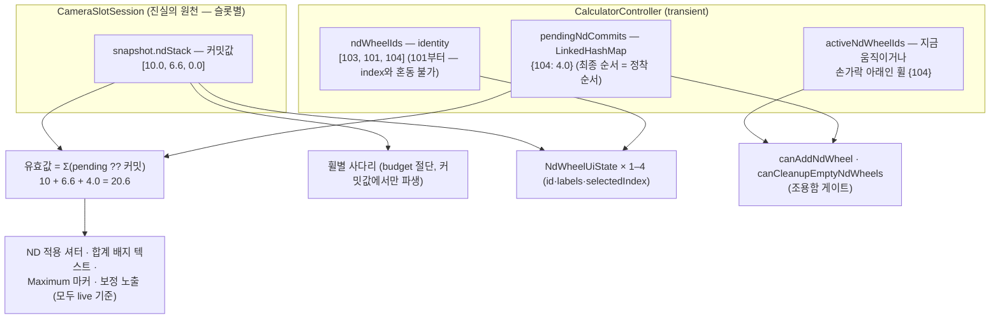
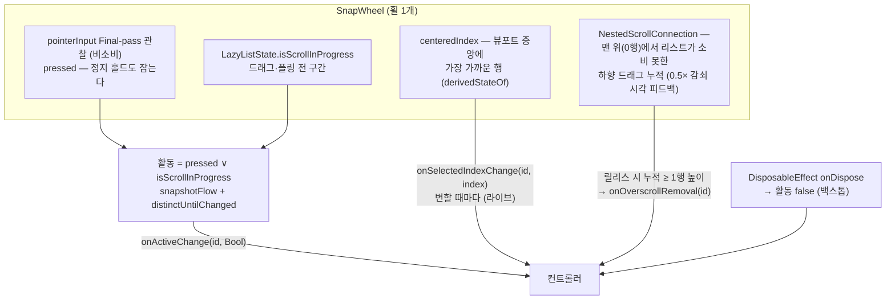
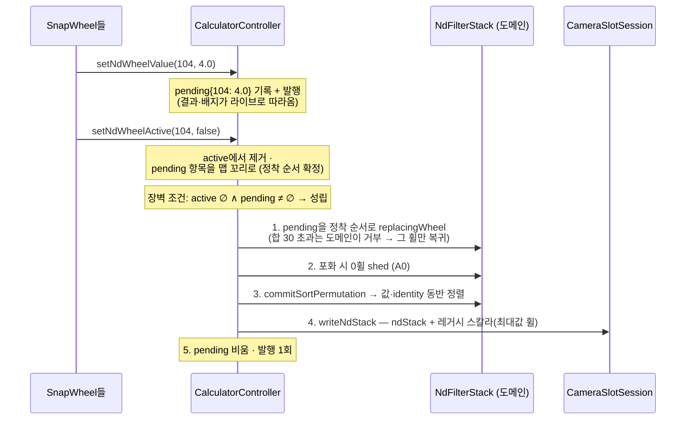
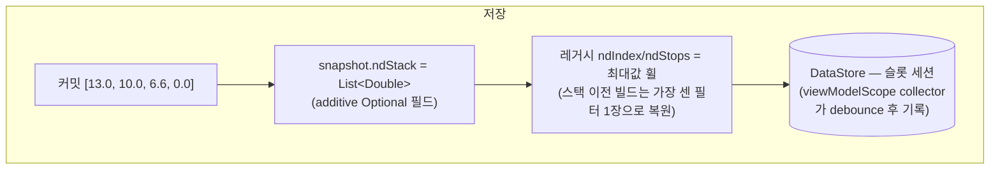
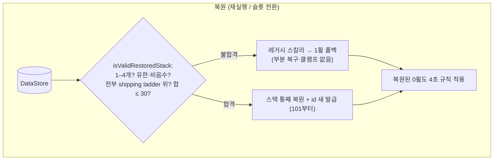

# ND Wheel Architecture — Android v1 (working note)

PTIMER-199 ticket-scoped 기록. Android 구현(M3)의 독립 정의 —
목적, 레이어, 소유권, 상태, 이벤트 흐름, 영속성, 비동기 경계,
접근성, 테스트 순서로 내려간다. 기준: AndroidX ViewModel 소유
도입(PTIMER-223) 위로 rebase되고 ND 정리 스케줄러가 ViewModel
스코프로 이관된 상태 (M3 3-커밋 + 이관 커밋). 작성일:
2026-07-17, 갱신 2026-07-20.

---

## 1. 목적

메인 촬영 화면의 ND 필터 영역은 **1–4개의 휠**을 가진다. 각 휠은
표준 ND 필터 하나의 값이고, 전체의 합(유효값)이 노출 계산에
들어간다. 사용자는:

- 휠을 돌려 값을 고르고 (돌리는 동안 결과가 실시간으로 따라온다),
- `+`로 휠을 추가하고, 0-stop 휠은 4초 방치 시 스스로 정리되며
  과회전 당김 제스처로 즉시 지울 수도 있고,
- 손을 떼면 휠들이 내림차순으로 **미끄러지며 재정렬**되고,
- 결과는 카메라 슬롯별로 저장되어 재실행 시 복원된다.

설계 원칙:

1. **판단은 컨트롤러 한 곳으로 수렴한다.** UI는 신호를 측정해
   전달하고 결정된 상태를 그린다. 수용·거부·커밋·정리의 판단은
   전부 `CalculatorController`가 한다.
2. **상태는 두 집합의 파생이다.** 명시적 상태 enum이 없다.
   조용함(quiet) = 활성 휠 집합 비어 있음 ∧ 대기 선택 비어 있음.
   구조 변이(추가·삭제·정리·정렬)는 조용함에서만 허용된다.
3. **모든 transient 상태는 wheel identity에 귀속된다.** index는
   적용 시점에만 파생하는 일시적 값이다.
4. **조용함 전이 불변식** — 조용함으로 전이할 수 있는 모든 경로는
   장벽(세트 커밋) 시도와 상태 발행을 스스로 수행한다. 나중에 올
   다른 이벤트에 flush를 미루지 않는다. (2026-07-17 필드 결함
   2건 — 릴리스 시 미발행으로 `+`가 영구 dim, 과회전 삭제가
   장벽을 시도하지 않아 pending이 열린 채 idle — 의 수정에서
   승격된 원칙이다. 이후 과회전 삭제는 validate-first로 좁혀져
   pending이 하나라도 있으면 거부되므로, 이 불변식의 대상 경로는
   휠 릴리스 하나로 줄었다.)

---

## 2. 레이어

| 레이어 | 파일 |
|---|---|
| 화면 조립 | `app/…/ui/shooting/ShootingScreen.kt` |
| 그룹 뷰 | `app/…/ui/shooting/NdFilterStackGroup.kt` |
| 휠 컴포넌트 | `app/…/ui/component/SnapWheel.kt` |
| 컨트롤러 | `app/…/vm/CalculatorController.kt` |
| 도메인 | `core/…/exposure/NdFilterStack.kt` |
| 세션·스냅샷 | `core/…/slots/CameraSlot.kt` (`SlotCalculatorSnapshot.ndStack`) |
| 스토어 | `app/…/persistence/DataStoreSlotSessionStore.kt` |

---

## 3. 소유권

| 진실 | 소유자 | 비고 |
|---|---|---|
| 커밋 스택 (`ndStack`) | `CameraSlotSession`의 슬롯 스냅샷 | 컨트롤러가 세션을 통해 읽고 쓴다 — 별도의 인메모리 모델 객체가 없다 |
| 스택 불변식 (개수·합·정렬) | `NdFilterStack` (도메인) | 생성·변이 경계에서 강제, 초과 쓰기 거부 |
| wheel identity (`ndWheelIds`) | 컨트롤러 | 101부터 단조 증가, 커밋 스택과 평행 리스트 |
| 활성 집합 · pending 맵 | 컨트롤러 | transient — 저장되지 않는다 |
| 장벽(세트 커밋)과 구조 변이 | 컨트롤러 | 조용함 전제 |
| 파생 UI 상태 (`CalculatorUiState`) | 컨트롤러가 발행 | 휠 라벨·선택 인덱스·가용성 플래그·배지 텍스트 |
| 4초 정리 타이머 (무장·발화·판단) | 컨트롤러 — 주입 스코프에서 (`ndCleanupScope` = 프로덕션에선 `viewModelScope`) | 커밋 스택 쓰기·identity 재동기화 시 기존 Job 취소 후 전체 유예 재부여 (라이브 표시·터치 신호로는 재시작하지 않음), 발화 시점 판단 `runNdCleanupIfQuiet` (§6, PTIMER-223 이관) |
| 합계 배지의 표시·fade 타이밍 | UI (`NdStackTotalBadge`) | 내용(텍스트·Maximum)은 컨트롤러가 계산 |
| DataStore 저장 **트리거** | `ShootingAppViewModel`의 viewModelScope collector (400ms debounce) | 재생성이 debounce 창을 파괴하지 않고, `onCleared`가 잔여 쓰기를 flush (PTIMER-223) |
| 신호 측정 (활동·선택·과회전) | `SnapWheel` | 판단 없음 |

---

## 4. 상태

- **커밋 / 표시의 2층 구조**: 커밋 스택은 장벽에서만 바뀌고,
  조작 중 표시·계산은 pending을 커밋 위에 겹친 값
  (`pending ?? 커밋`)을 쓴다. pending 맵 하나가 대기열과 라이브
  오버레이를 겸한다.
- **등가 규칙**: 어떤 휠의 선택값이 그 휠의 커밋값과 같아지면
  pending 항목이 스스로 지워진다. 프로그램적 재중앙 정렬, 정렬
  직후 collector 재시작으로 인한 재방출, 제자리 복귀가 전부
  자동으로 no-op이 된다. 휠별 사다리가 위에서만 절단되는
  prefix라는 성질 덕분에, 재방출된 인덱스는 언제나 커밋값 그
  자체를 가리킨다.
- **정착 순서**: pending 맵의 값은 각 휠의 마지막 선택, 순서는
  정착 순서다. 값 변경 시의 삽입 위치는 잠정이고, 휠이
  조용해지는 순간(`setNdWheelActive(id, false)`) 그 항목을 맵
  꼬리로 옮긴다.
- **가용성 플래그의 이중화**: 배치(`showsAddNdWheel`,
  `canRemoveEmptyNdWheel`)는 커밋값에서만 파생되어 조작 중
  변하지 않고, 실행 가능(`canAddNdWheel`,
  `canCleanupEmptyNdWheels`)은 조용함 게이트를 추가로 요구한다.
  활동 전이는 값 변화가 없어도 항상 발행된다 — 게이트 플래그가
  릴리스 즉시 화면에 반영되어야 하기 때문이다.

---

## 5. 이벤트 흐름

### 5.1 신호 측정 — SnapWheel

- 활동 신호는 눌림과 스크롤의 합집합이다: 플링(손은 뗐지만 아직
  회전 중)도, 정지 홀드(움직임 없이 손가락만)도 활동이다.
  손가락 아래에서 구조 변이가 실행되지 않는 근거가 이 신호다.
- 선택 신호는 커밋이 아니다 — 컨트롤러가 pending으로 기록해
  라이브 프리뷰에 쓰고, 커밋은 장벽만 한다.
- 과회전: 0행이 사다리 맨 위이므로, 리스트가 소비하지 못한 하향
  드래그 = 0을 지나 당기는 중이다. 릴리스 시 누적이 1행 높이
  이상이면 삭제를 요청한다. 컴포넌트의 게이트
  (`selectedIndex == 0 ∧ 휠 2개 이상`)는 시각용이고, 최종 판단은
  컨트롤러가 다시 한다.
- 상호작용 중 휠이 composition에서 사라지는 경우(슬롯 전환,
  삭제)에도 dispose 백스톱이 활동 false를 보장한다.
- **소진 fence**: 휠(과 그 안쪽의 과회전 계정)이 소비하지 못한
  스크롤 델타와 플링 잔여 속도는 SnapWheel 바깥 경계의 fence가
  전부 흡수한다 — 사다리 끝을 지난 플링 잔여가 중첩 스크롤
  체인을 타고 카메라 페이저나 바텀 시트로 전파되는 경로를
  원천 차단한다.

### 5.2 장벽 — 세트 커밋

- 장벽 트리거는 시간이 아니라 조건이고, 활동·값 이벤트가 들어올
  때마다 평가된다. 단일 휠 조작이면 릴리스 즉시 커밋이다
  (디바운스 없음). 30-stop 충돌은 먼저 정착한 휠이 이기고, 진
  휠은 이전 값으로 복귀한다 (클램프 없음).
- 재정렬 애니메이션은 컨트롤러 코드가 아니다: `LazyRow`가 id 키
  diffing으로 이동을 도출한다 (`Modifier.animateItem()`).

### 5.3 구조 변이 — 추가·삭제·정리

전부 조용함 전제다.

- **추가 (C1)**: 4휠 미만이고 새 휠의 사다리에 0보다 큰 값이
  존재할 때만. 판정은 커밋값에서만 — 커밋 합이 29를 넘으면 휠이
  3개여도 `+`가 사라지는 것이 정상 동작이다.
- **과회전 삭제 (validate-first)**: 모든 검증을 통과한 뒤에만
  상태를 만진다 — 다른 휠이 활동 중이거나, **pending이 하나라도
  있거나**, 당긴 휠이 없거나, 커밋값이 0이 아니거나, 마지막
  휠이면 거부하며, 거부된 요청은 transient·커밋 어느 쪽도
  변경하지 않는다. 성공 시 그 휠(identity)만 즉시 제거한다.
  pending 부재가 전제이므로 삭제가 다른 휠의 pending을 커밋하는
  경로는 존재하지 않는다.
- **4초 정리**: 실행은 0휠 전부 제거(전부 0이면 1개 유지). 발화
  시점 판단은 §6.
- **슬롯 전환·리셋**: 진행 중 선택(활성·pending)을 명시적으로
  폐기하고 identity를 재동기화한다 — 떠나는 슬롯의 transient는
  커밋되지 않는다.

---

## 6. 비동기 경계

컨트롤러가 소유하거나 의존하는 비동기 표면은 아래 셋이다.
(Compose 쪽에는 SnapWheel의 snapshotFlow collector와 수명주기
콜백이 별도로 존재하지만, 이들은 값(데이터)을 나르는 지연 콜백이
아니라 동기 신호의 전달자다.)

| 경계 | 위치 | 규칙 |
|---|---|---|
| 4초 정리 타이머 | 컨트롤러 — 주입 `ndCleanupScope`(프로덕션 = `ShootingAppViewModel.viewModelScope`)의 Job | 커밋 스택 쓰기와 identity 재동기화 시 기존 Job을 **취소하고 전체 유예를 재부여**; 라이브 표시값·터치/스크롤 신호로는 재시작하지 않는다. 4초 후 **눈먼 발화**, 실행 여부는 발화 시점 판단(`runNdCleanupIfQuiet`: 조용함 ∧ 정리 가능), 바쁘면 재무장 루프. 구성 변경을 살아남고 소유자와 함께 소멸한다 (PTIMER-223) |
| 합계 배지 fade | UI — `NdStackTotalBadge`의 `LaunchedEffect` | 순수 표시 타이밍. 상태에 영향 없음 |
| DataStore 저장 | `ShootingAppViewModel` — viewModelScope collector가 상태 스트림을 debounce(400ms)해 최신 세션을 순서 보장 writer로 기록; `onCleared`가 잔여 쓰기 flush | 컨트롤러는 인메모리 세션만 갱신. 저장은 항상 "최신 전체 세션" 스냅샷. 재생성이 debounce 창을 파괴하지 않는다 (PTIMER-223) |

컨트롤러로 들어오는 모든 호출은 메인 스레드의 동기 호출이다 —
타이머는 값을 나르지 않고, 발화가 늦거나 씹혀도 다음 무장
사이클이 수습한다. null 스코프는 타이머를 비무장 상태로 두어
순수 상태 테스트가 판단 함수를 직접 구동한다.

---

## 7. 영속성

- 복원 검증은 도메인(`isValidRestoredStack`)이 소유한다: 실패는
  통째 거부 → 레거시 스칼라 폴백. 값을 고쳐 쓰지 않는다.
- identity·활성·pending은 저장하지 않는다. 조작 중 앱이 죽으면
  그 조작의 선택은 유실된다 (정의된 동작).
- 계산 일치는 공유 골든 픽스처
  (`shared/test-fixtures/nd-stack-golden.json`)를 그대로 소비해
  보장한다 — 케이스를 이쪽에서 재유도하지 않는다.

---

## 8. 접근성

- 각 휠은 **adjustable 요소**다: 위치 라벨("ND 필터 n/m"),
  현재 값 낭독, 한 번의 스와이프 = 정확히 한 칸 이동, 이전/다음
  값 커스텀 액션.
- **필터 추가 / 빈 필터 제거**는 각 휠 노드의 커스텀 액션으로
  등록된다 — 단, **지금 실행 가능할 때만** (`canAddNdWheel`,
  `canCleanupEmptyNdWheels`). no-op이 될 명령은 노출하지 않는다.
- **합계는 배지와 독립적으로 상시 접근 가능하다**: 2휠 이상이면
  그룹 컨테이너가 자체 contentDescription("필터 n개, 합계 X 스톱",
  최대 시 "최대" 포함)을 가진 포커스 가능 노드가 된다 — 시각
  배지가 사라져도 TalkBack은 항상 총합을 읽을 수 있다. 배지
  자체는 비차단 오버레이다.
- 문자열은 영어·한국어 리소스로 제공된다.

---

## 9. 테스트

- **컨트롤러 = 순수 Kotlin** 이라 상태 동작 전체가 JVM 단위
  테스트로 결정론 검증된다 (`NdWheelStackControllerTest`,
  25 케이스): identity 규칙, 세트 커밋 연기·정착 순서(역순
  포함)·30-stop 충돌, A0 shed, C1 거부(0.4 예산 케이스 포함),
  fire-time 정리 판단, 과회전 규칙(validate-first: 거부된 당김의
  무변이 보존 포함), 영속 왕복·레거시 폴백·손상 스택 거부, 슬롯
  전환 폐기와 늦은 stale-identity 콜백의 무해성, 필드 시나리오
  2건(제자리 복귀 릴리스, 빠른 회전+과회전 삭제), 그리고 가상
  시간(TestScope)으로 구동하는 소유 타이머 3건(유예 후 정리,
  손가락 아래 연기, 커밋 쓰기 재무장).
- **도메인**은 자체 테스트(`NdFilterStackTest`) + 골든 픽스처
  테스트(`NdStackGoldenTest`)로 검증된다.
- **에뮬레이터 확인**: 추가→4휠·상한에서 `+` 소멸, 회전 커밋,
  배지 표시/fade, 단일·다중 0휠 정리, 과회전 삭제, 강제 종료
  복원(스택 이전 데이터의 레거시 폴백 포함).
- 남은 검증: TalkBack 실기 워크스루, 동시 멀티터치 겹침(adb 주입
  한계로 단위 테스트로만 증명됨), ND 표기 4휠 dense 레이아웃의
  긴 라벨("ND100k") 폭.

---

## Related documents

- `PTIMER-199-task-spec.md` — 실행 스펙 (제품 규칙의 원전)
- `PTIMER-199-nd-wheel-architecture-ios.md` — iOS v1 기록
- `PTIMER-199-nd-wheel-architecture-ios-v2.md` — iOS 현행 기록
- `PTIMER-199-nd-wheel-architecture-comparison.md` — 플랫폼 비교
- `PTIMER-223-android-viewmodel-architecture.md` — 수명주기 소유자
  마이그레이션 기록 (이 문서의 §6이 전제하는 기반)
- `docs/specs/Calculator.md` §2.6, `docs/specs/UI.md` §2.2.1,
  `docs/specs/DomainSchema.md` §7.4 — 공개 스펙 (계약의 최종 거처)
