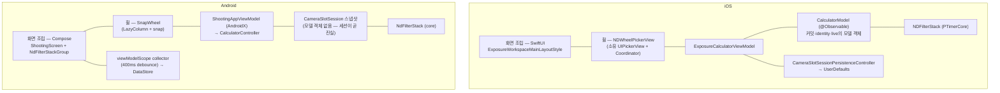
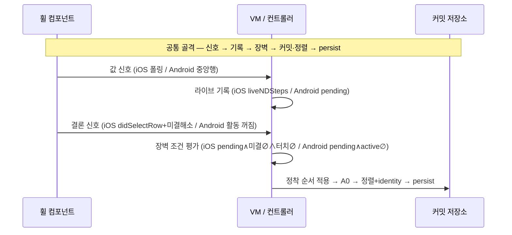

# ND Wheel Architecture — iOS · Android 비교 (working note)

PTIMER-199 ticket-scoped 기록. 두 구현을 실제 코드 기준으로
비교한다: 공유 요구사항 → 최상위 구조 → 레이어별 소유권 →
데이터 흐름·상태 전이 → 동일성 판정 → 실제 차이 목록(분류) →
위험·유지보수 비용 순서로 내려가고, **차이가 생긴 이유의 분석은
마지막 §8에만** 둔다. 작성일: 2026-07-18, 갱신 2026-07-20 (PTIMER-223 반영).

---

## 1. 공유 제품 요구사항

두 구현이 동일하게 만족해야 하는 계약 (원전:
`PTIMER-199-task-spec.md`, 공개 스펙 `docs/specs/Calculator.md`
§2.6 · `docs/specs/UI.md` §2.2.1):

- 1–4휠, 유효값 = 합, 합 ≤ 30은 구성으로 강제 (budget 절단 사다리,
  reject never clamp).
- 선택은 **세트로** 커밋된다: 모든 휠이 조용해질 때 한 번, 정착
  순서로 적용, 초과 휠만 복귀.
- 커밋 후 내림차순 정렬(0 오른쪽, 동값 안정), 휠 identity가 순열을
  따라 이동해 재정렬이 "이동"으로 보인다.
- Add는 C1(새 휠이 0보다 큰 값을 가질 수 있을 때만, 커밋값 기준
  배치 / 조용함 기준 활성). 포화 커밋은 0휠을 같은 커밋에서 shed
  (A0).
- 0-stop 휠은 4초 fire-time 정리, 과회전 당김으로 즉시 삭제.
- 슬롯별 저장·복원: 스택 통째 검증(불합격 시 레거시 스칼라 폴백),
  레거시 스칼라 = 최대값 휠, 조작 중 transient는 저장하지 않음.
- 접근성: 휠은 adjustable, 추가/제거 명령은 실행 가능할 때만 노출.
- 계산 일치는 공유 골든 픽스처로 보증, 재유도 금지.

## 2. 최상위 레이어 구조

첫눈에 보이는 구조 차이: iOS는 VM 아래에 **모델 계층**
(CalculatorModel)이 하나 더 있다. 저장 트리거와 타이머는
PTIMER-223 이후 양쪽 모두 뷰모델 계층이 소유한다. 상세는 §3·§6.

## 3. 레이어별 소유권 비교

### 3.1 Domain

| | iOS `NDFilterStack` | Android `NdFilterStack` |
|---|---|---|
| 불변식 (1–4개 · 합 ≤ 30 · 거부) | 소유 | 소유 (동일) |
| 정렬 + identity 순열 노출 | 소유 | 소유 (동일) |
| 값 표현 | `NDStep` (whole/thirds/exact identity) | `Double` stops |
| 복원 검증의 거처 | 영속 컨트롤러 측 (`validatedStackSteps`) | 도메인 측 (`isValidRestoredStack`) |

거의 1:1 포팅. 값 표현과 복원 검증의 거처만 다르다.

### 3.2 Runtime state / controller

| 진실 | iOS 소유자 | Android 소유자 |
|---|---|---|
| 커밋 스택 | `CalculatorModel.entries` (모델 객체) | 세션 스냅샷 `ndStack` (모델 객체 없음) |
| wheel identity | `CalculatorModel.ndFilterWheelIDs` | 컨트롤러 `ndWheelIds` |
| 라이브 오버레이 | `CalculatorModel.liveNDSteps` (전용 맵) | `pendingNdCommits`가 겸임 |
| 선택 대기열 (정착 순서) | VM `pending` (didSelectRow 순 적재) | 컨트롤러 `LinkedHashMap` (조용해질 때 꼬리 이동) |
| "움직이는 중" | VM 미결 집합 (didSelectRow / S ms 안정+커밋행으로 추론 해소, W 백스톱) | 컨트롤러 `activeNdWheelIds` (신호 그대로) |
| 장벽·구조 변이 판단 | VM | 컨트롤러 (동일 역할) |
| 세대 토큰 | VM (슬롯 × reshape) | 없음 |

### 3.3 Wheel component

| | iOS `NDWheelPickerView` | Android `SnapWheel` |
|---|---|---|
| 기반 | UIPickerView 직접 생성·보유 (delegate/dataSource = 우리 것) | LazyColumn + snap (처음부터 자작) |
| 스크롤 중 값 | 30fps `selectedRow` 폴링 | 중앙 행 `snapshotFlow` (프레임마다) |
| 선택 확정 | `didSelectRow` 1회 이벤트 | 확정 이벤트 없음 — 활동 꺼짐이 대신 |
| 손가락 감지 | 자체 pan recognizer | `pointerInput` Final-pass |
| 과회전 감지 | 자체 pan 당김 거리 + 햅틱 | `NestedScrollConnection` 미소비 델타 |
| 사다리 갱신 | `reload` — RESHAPING 창 + 잠금 안에서만 | recomposition (잠금 없음) |
| 이벤트 스탬프 | identity + 구성 세대 | identity만 |

측정과 판단의 분리 원칙(판단은 상위)은 양쪽 동일하다.

### 3.4 UI composition

| | iOS | Android |
|---|---|---|
| 휠 나열 | `ForEach` — id 키 | `LazyRow` — id 키 (동일 발상) |
| 재정렬 애니메이션 | VM 장벽 지점이 `withAnimation` + 완료 콜백 + 백스톱 소유 | 코드 없음 — id diffing + `animateItem()` |
| 구조 전환 창 | RESHAPING(~0.35s) 동안 입력 차단 | 없음 |
| Add 배치/활성 분리 | 있음 | 있음 (동일) |
| 합계 배지 (내용/타이밍 분담) | display state / 뷰 | 컨트롤러 / 뷰 (동일 분담) |

### 3.5 Persistence

| | iOS | Android |
|---|---|---|
| 저장 **호출자** | VM — 변이 지점에서 `persistCalculatorContext()` 직접 호출 | `ShootingAppViewModel` — viewModelScope collector가 상태 스트림을 400ms debounce해 저장, `onCleared`가 잔여 쓰기 flush (PTIMER-223) |
| 스토어 | UserDefaults | DataStore |
| ndStack 인코딩 | 휠당 구조체 (whole/thirds/exact 중 1필드) | `List<Double>` |
| 복원 실패 처리 | 통째 거부 → 레거시 → 기본값 (동일 의미) | 통째 거부 → 레거시 (동일 의미) |
| 레거시 스칼라 = 최대값 휠 | 동일 | 동일 |

### 3.6 Async / timer / callback

| | iOS | Android |
|---|---|---|
| 4초 정리 타이머 | VM이 소유·무장·발화·판단 | 컨트롤러가 소유·무장·발화·판단 (주입 스코프 = `viewModelScope`, PTIMER-223 이관) |
| 발화 시점 판단 (fire-time) | 동일 규칙 | 동일 규칙 |
| 지연 콜백 표면 | 폴링·didSelectRow·애니메이션 완료·백스톱·타이머 — 전부 세대 검증 | 타이머 하나 (값을 나르지 않음) — 검증 불요 |
| 미결 해소 지연 심 (S/W) | 존재 (테스트 심 주입) | 없음 |

### 3.7 Accessibility

| | iOS | Android |
|---|---|---|
| 휠 = adjustable | VoiceOver | TalkBack (동일) |
| 추가/제거 명령의 조건부 노출 | 그룹 액션 | 휠 노드별 커스텀 액션 (부착 위치만 다름) |
| 합계의 항시 접근성 | 그룹 accessibilityValue | 그룹 노드 contentDescription — 시각 배지와 독립 (동일 의미) |

### 3.8 Testing

| | iOS | Android |
|---|---|---|
| 상태 로직 테스트 | SwiftPM 패키지 테스트 (시뮬레이터 불필요), 지연 심(S/W/cleanup) 주입 필요 | 순수 JVM 테스트 — 시간 심 없이 이벤트 순서만으로 결정론 |
| OS 경계 테스트 | 앱 호스트 타깃 (picker 실물) | 에뮬레이터 수동 확인 (계측 테스트 미도입) |
| 계산 일치 | 골든 픽스처 생산 | 같은 픽스처 소비 |

## 4. 데이터 흐름과 상태 전이 비교

전이 골격은 동일하고, 각 화살표의 **신호가 무엇인가**와 **저장
트리거의 형태**(iOS는 변이 지점 직접 호출, Android는 뷰모델
스코프의 debounce 스트림)가 다르다. 상태 표현도 다르다: iOS는 명시적 3상
(IDLE/SCROLLING/RESHAPING) + 미결 집합, Android는 두 집합의 파생
2상(BUSY/QUIET). iOS의 "미결 ∅ ∧ 터치 ∅"과 Android의 "active ∅"
은 같은 질문("모든 휠이 결론났는가")에 대한 두 답이다.

## 5. 기본 아키텍처 동일성 판정 (코드 기준)

"같은 제품 의미론"과 별개로, 아키텍처 골격이 같은지를 항목별로
판정한다.

| 항목 | iOS | Android | 판정 |
|---|---|---|---|
| 진실의 원천이 위치한 레이어 | VM 소유의 **모델 객체** (CalculatorModel) — 영속 스냅샷과 동기화 | **세션 스냅샷** 그 자체 — 별도 모델 객체 없음 | **다름** |
| committed / live / pending 분리 | 3분리 (entries / liveNDSteps / pending) | 2분리 (committed / pending이 live 겸임) | **다름** |
| 장벽·상태 전이의 소유자 | VM | 컨트롤러 | **동일** (같은 역할 레이어) |
| 타이머의 소유자 | VM (무장·발화·판단 모두) | 컨트롤러 (무장·발화·판단; 스코프 = viewModelScope) | **동일** (PTIMER-223 이관으로 해소) |
| 구조 변이의 허용 조건 | 조용함 (IDLE ∧ 터치 0 ∧ pending·live ∅) | 조용함 (active ∅ ∧ pending ∅) | **동일** (의미 동일 — 판정 신호원만 플랫폼 차이) |
| identity의 소유와 생명주기 | 모델 객체 소유 · 101부터 단조 · 정렬 동반 · 복원 재발급 | 컨트롤러 소유 · 동일 생명주기 규칙 | **부분 동일** (생명주기 동일, 소유 레이어 다름) |
| 슬롯 전환 시 transient 폐기 책임 | VM (강제 IDLE + 초기화) | 컨트롤러 (clear + 재동기화) | **동일** |
| persistence 호출 책임 | VM — 변이 지점에서 직접 | 뷰모델 계층 — viewModelScope의 debounce collector | **동일** (소유 계층 기준; 트리거 형태는 다름) |

8항목 중 **동일 5 · 부분 동일 1 · 다름 2** (PTIMER-223과 스케줄러
이관 이후; 이전 판정은 동일 3 · 부분 1 · 다름 4였다). 남은 골격
차이는 진실의 원천이 위치한 내부 계층(모델 객체 vs 세션 스냅샷)
과 committed/live/pending 분리(3분리 vs 2분리) 두 가지다.

## 6. 실제 차이 목록 (분류)

**(A) 플랫폼 필수** — 프레임워크가 다른 것을 주기 때문에 피할 수
없는 차이:

1. 값·움직임·손가락 신호의 획득 방식 (§3.3 전체): 폴링·자체
   pan·didSelectRow ↔ 1급 상태 관찰.
2. iOS에만 있는 방어 계층: 미결 추적(S/W), 세대 토큰, reload
   잠금, RESHAPING 입력 차단. 신호를 추론으로 만들 때만 필요한
   장치들이다.
3. 재정렬 애니메이션의 수명 관리 유무 (명령형 `withAnimation`
   관리 ↔ 선언형 키 diffing).
4. 과회전 감지 수단 (pan 거리 ↔ nested scroll 미소비 델타).

**(B) 현재 구현 선택** — 플랫폼이 강제하지 않으나 현 코드가
선택한 차이:

5. **모델 계층 유무** — iOS는 CalculatorModel이 커밋·identity·
   live를 들고 불변식 방어 mutator를 제공; Android는 세션
   스냅샷이 곧 진실이고 도메인 타입이 불변식을 방어. (§5 항목
   1·6의 원인)
6. **live와 pending의 병합** — Android는 pending 맵 하나가 라이브
   오버레이를 겸한다. 등가 규칙이 있어 의미는 보존된다.
7. **저장 호출 형태** — iOS는 변이 지점 직접 호출, Android는
   debounce 스트림 collector. 소유 계층은 PTIMER-223으로 양쪽 다
   뷰모델 계층이 되었고(해소), 트리거 형태 차이만 남는다 (핫패스
   오프로딩 선택).
8. 값 표현·인코딩 — `NDStep` 구조체 항목 ↔ `Double` 리스트.
   스토어가 분리되어 상호 호환 요구가 없다.
9. 복원 검증의 거처 — iOS 영속 컨트롤러 ↔ Android 도메인.
10. 접근성 명령의 부착 위치 — 그룹 ↔ 휠 노드.

**(C) 불필요한 비대칭** — 기록 당시 존재했으나 해소된 항목:

11. **4초 타이머의 소유자** (§5 항목 4) — **해소됨**. PTIMER-223
    rebase 시점에 컨트롤러가 주입 스코프(`viewModelScope`)로
    타이머를 소유하도록 이관되어 iOS와 정렬되었다. 무장·발화·
    판단이 한 곳에 모였고 활성 페이지 게이트와의 결합도 사라졌다.

## 7. 차이가 만드는 위험과 유지보수 비용

- **(6) live/pending 병합**: 안전성이 등가 규칙 하나에 얹혀 있다.
  "커밋과 같은 값을 pending으로 유지해야 하는" 요구가 미래에
  생기면 이 병합이 깨진다. 또 두 플랫폼의 디버깅 개념어가 어긋난다
  (iOS의 live 소거는 표시 규칙, Android의 pending 소거는 커밋
  경로에도 영향).
- **(11) 타이머 소유 — 해소**: 컨트롤러 소유 이관으로 무장·재무장
  루프까지 JVM 가상 시간 테스트가 덮는다 (3건). UI 수명주기
  의존이 사라졌다.
- **(7) 저장 트리거**: 소유는 뷰모델 계층으로 이관됐지만(재생성이
  debounce 창을 파괴하지 않고 `onCleared`가 flush), 프로세스가
  400ms 창 안에서 강제 종료되면 그 변이가 유실되는 창 자체는
  남는다 (전체 세션 스냅샷 저장이라 부분 손상은 없음). iOS에는 이
  창이 없다.
- **(5) 모델 계층 부재**: Android의 커밋 변이 지점이 컨트롤러
  함수들에 분산된다. 불변식은 도메인 타입이 지키므로 정합성
  위험은 아니지만, iOS와 대칭 독해가 안 되는 비용이 있다.
- **(A)류 전반**: iOS에만 있는 방어 계층은 iOS 쪽 유지보수
  비용이다 — Android에 대응물이 없다는 사실 자체가 "이 계층은
  신호 결핍 보상"임을 알려 주는 지표로 쓸 수 있다.

## 8. 차이가 생긴 이유 — 분석

§3–§6의 차이는 두 뿌리로 정리된다.

**뿌리 1 — 플랫폼이 휠에 대해 주는 신호가 다르다.** UIPickerView는
스크롤 중 값 변화·진행 여부·손가락 접촉을 알려주지 않고, 구조
갱신(reload)이 이벤트를 만들 수 있는지 보증하지 않는다. iOS
구현의 (A)류 장치 전부 — 폴링, 자체 pan, 미결 추적, 세대 토큰,
reload 잠금, RESHAPING 차단 — 는 이 결핍을 보상해 신호를
만들거나 오염을 차단하는 계층이다. Compose LazyColumn은 같은
정보를 1급 상태로 제공하므로 Android는 그 계층 없이 같은 장벽
조건에 도달한다. 결론적으로 "Android가 단순하다"는 §3–§5의 비교
결과이지 전제가 아니며, 단순함의 대가는 §7에서 본 것처럼 "전이
지점마다 발행·장벽을 빠뜨리지 않는 규율"로 이동한다 (양 플랫폼
필드 결함이 각자의 약점 지점 — iOS는 관측 오염, Android는 전이
의무 누락 — 에서 났다는 사실이 이 분석의 실증이다).

**뿌리 2 — 두 앱의 기존 골격이 달랐다.** (B)류 차이는 ND 스택이
만든 것이 아니라 스택이 얹힌 기반의 차이다: iOS 계산기는 원래
VM + 모델 객체 + 변이 지점 persist 구조였고, Android 계산기는
원래 컨트롤러 + 세션 스냅샷 + UI 스트림 저장 구조였다
(PTIMER-146/217 계열). 스택 구현은 각자 기반의 관성을 따랐다.
그 뒤 PTIMER-223이 AndroidX ViewModel 소유자를 도입해 저장
collector와 (199 rebase 시점의 이관으로) ND 정리 타이머가 상태
소유자 스코프로 모였고, (C)의 타이머 비대칭과 (7)의 저장 소유
비대칭이 해소되었다. 남은 (B) — 모델 계층 유무, live/pending
분리 — 는 여전히 계산기 전반의 구조 결정이며 이 티켓 범위
밖이다.

---

## Related documents

- `PTIMER-199-task-spec.md` — 실행 스펙 (제품 규칙의 원전)
- `PTIMER-199-nd-wheel-architecture-ios.md` — iOS v1 기록
- `PTIMER-199-nd-wheel-architecture-ios-v2.md` — iOS 현행 기록
- `PTIMER-199-nd-wheel-architecture-android.md` — Android 현행 기록
- `docs/specs/Calculator.md` §2.6 · `docs/specs/UI.md` §2.2.1 ·
  `docs/specs/DomainSchema.md` §7.4 — 공개 스펙
