# ND Wheel Architecture v2 (working note)

PTIMER-199 ticket-scoped 기록. 재설계 아키텍처의 전체 정의 —
큰 그림에서 시작해 상태 기계, 컴포넌트, 개별 흐름의 세부로
내려간다. 현행(v1) 기록인 `PTIMER-199-nd-wheel-architecture-ios.md`와
함께 커밋되어 히스토리에 남고, 병합 전 최종 정리 커밋에서 함께
삭제된다. 작성일: 2026-07-17.

---

## 1. 무엇을 만드는가

메인 화면의 ND 필터 영역은 **1–4개의 휠**을 가진다. 각 휠은
표준 ND 필터 하나의 값이고, 전체의 합(유효값)이 노출 계산에
들어간다. 사용자는:

- 휠을 돌려 값을 고르고 (돌리는 동안 결과가 실시간으로 따라온다),
- `+`로 휠을 추가하고, 0-stop 휠은 4초 방치 시 스스로 정리되며
  과회전 제스처로 즉시 지울 수도 있고,
- 손을 떼면 휠들이 내림차순으로 **미끄러지며 재정렬**되고,
- 결과는 카메라 슬롯별로 저장되어 재실행 시 복원된다.

### 설계 원칙 (사용자 결정, 2026-07-17)

1. **수용·거부·상태 전이의 판단은 ViewModel의 상태 기계 하나로
   수렴한다.** picker Coordinator는 저수준 입력 측정(행 변화,
   터치 상태, 과회전 거리, 햅틱 임계)만 담당한다.
2. **즉시성 터치 신호에 의존하지 않는다.** 타이머류는 발화
   시점에 상태로 판단하고, 움직임은 데이터(행 변화)로 감지한다.
3. **시스템이 만든 picker 이벤트는 게이트로 거르지 않고 원천에서
   차단한다.** picker를 직접 소유하고, 구조 전환 창에서는 입력
   자체를 받지 않는다.

### 핵심 계약 (외부 리뷰 반영, 2026-07-17 — 어떤 구현도 위반 불가)

1. **미결 유지** — 움직임이 시작된 휠은 최종 선택이 결론나거나
   정착이 명시적으로 확인될 때까지 미결(unresolved)이다.
   `liveNDSteps`가 비었다는 사실은 정착을 의미하지 않는다.
2. **무음 폐기 금지** — 화면에서 휠이 사용자 입력에 반응했다면
   그 입력은 폐기될 수 없다. 입력을 받지 않는 구간(RESHAPING)
   에는 휠도 실제로 움직이지 않는다.
3. **identity 귀속** — live·pending·터치·커밋·과회전의 모든
   transient 상태와 이벤트는 처음부터 끝까지 wheel identity에
   귀속된다. index는 현재 배열에서 값을 찾기 위한 일시적
   파생값일 뿐이다.
4. **세대 검증** — 타이머와 명시적 비동기 작업은 발행 시점
   세대(슬롯 × reshape 세대)를 캡처해 검증하고, 이전 세대의
   도착분은 폐기된다. delegate 이벤트는 도착 시점 세대로
   검증되며, 극단적으로 지연된 프로그램성 delegate 콜백의
   재분류 가능성은 §3.5에 명시된 수용 잔여 위험이다.

### 레이어 스택

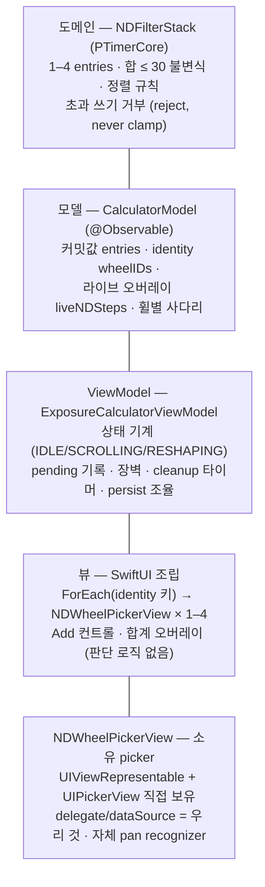

| 레이어 | 소유하는 진실 | 파일 (예정 포함) |
|---|---|---|
| 도메인 | 스택 형태 규칙 (합·정렬·불변식) | `PTimerCore/Exposure/NDFilterStack.swift` |
| 모델 | 커밋값·identity·라이브 맵·사다리 | `PTimerKit/Calculator/CalculatorModel.swift` |
| ViewModel | 상태 기계·pending·타이머·persist | `PTimerKit/Calculator/ExposureCalculatorViewModel.swift` |
| 뷰 | 없음 (배열의 순수 함수) | `PTimer/ExposureCalculator/ExposureWorkspaceMainLayoutStyle.swift` 외 |
| 소유 picker | UIPickerView 인스턴스·delegate | `PTimer/ExposureCalculator/NDWheelPickerView.swift` (신규) |
| 영속 | 슬롯 스냅샷 (ndStack) | `PTimerKit/Persistence/PersistentCameraSlotSession.swift` 외 |

---

## 2. 전체 그림

### 2.1 상태 기계와 그 입력들

전이 입력은 네 갈래다 — picker 이벤트만이 아니라 VM 내부
타이머, UI 명령, 시스템 이벤트가 모두 상태를 바꾼다:

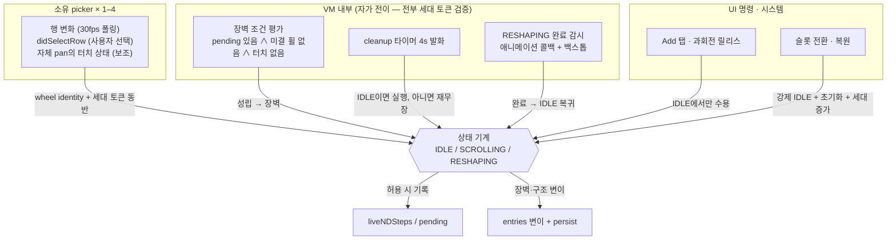

### 2.2 데이터와 파생 경로

상태 기계가 통제하는 저장소와, 거기서 파생되는 표시·계산:

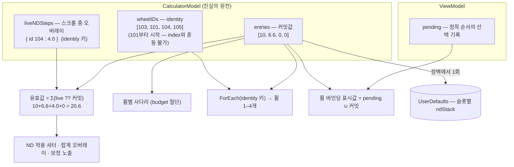

- `entries`(커밋값)와 `wheelIDs`(identity)는 항상 같은 길이의
  평행 배열. identity는 이동 애니메이션의 키이자 모든 transient
  입력·이벤트의 귀속 기준이다 (계약 3). 계산·저장에는 쓰이지
  않는다.
- **ID 규칙**: 101부터의 단조 증가 정수 (101 이상은 index와의
  사람-눈 혼동을 막는 가독성 규칙이고, 안전성은 아래 규칙이
  만든다). ID는 배열 위치에서 생성되지 않고, 정렬 후에도 같은
  휠이 같은 ID를 유지하며, 삭제된 ID는 같은 세대에서 재사용되지
  않는다(단조 카운터로 자연 보장). 콜백은 ID와 세대 토큰을 함께
  검증한다. restore는 새 ID를 발급한다.
- `liveNDSteps`는 스크롤 동안만 존재하는 휠별 오버레이. 값이
  커밋값과 같아지는 방출이 오면 항목이 스스로 지워진다(등가
  소거). **키는 wheel identity다** — live·pending·터치·과회전
  이벤트 전부 동일하며, index는 적용 시점에만 파생한다 (계약 3).
- `pending`은 "선택은 끝났지만 아직 스택에 반영되지 않은" 값 —
  세트 커밋의 대기열이다.
- 등가 소거는 **표시**를 위한 규칙일 뿐 정착 판단에 쓰이지
  않는다. 정착은 §3.1의 미결 휠 추적이 판단한다 (계약 1).
- **슬롯 전환/복원은 진행 중 선택을 폐기한다** (명시적 의미):
  SCROLLING 중의 미커밋 선택과 pending은 커밋되지 않고 버려진다
  — 떠나는 슬롯의 transient UI 상태이며, §9의 "SCROLLING 중 앱
  종료 시 유실"과 같은 규칙이다.

---

## 3. 상태 기계 — 판단의 단일 수렴점

```
IDLE        정온. 구조 변이(추가·삭제·정리·정렬)가 허용되는 유일한 상태.
SCROLLING   사용자가 휠을 조작 중 (하나 이상). 값 선택이 진행된다.
RESHAPING   구조 전환 중: 세트 커밋(정렬)·추가·삭제·정리의
            애니메이션 + ladder reload가 일어나는 짧은 창 (~0.35s).
```

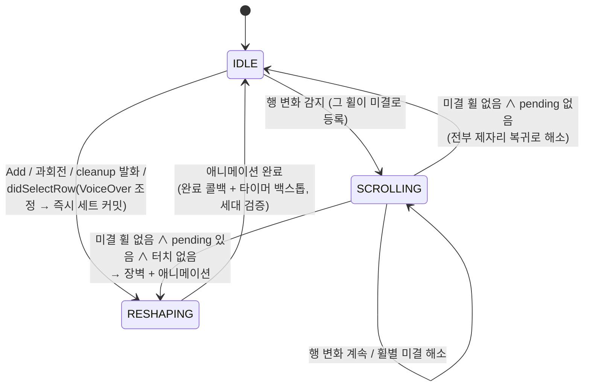

상태의 실체는 파생값이다: `SCROLLING` = 미결 휠 집합이 비어 있지
않음. 미결 추적이 §3.1의 핵심이다.

**상태별 규칙표** — 시스템의 모든 판단이 이 표다:

| 이벤트 | IDLE | SCROLLING | RESHAPING |
|---|---|---|---|
| 사용자 터치 | 허용 | 허용 | **차단** — 휠이 입력을 받지 않음 (계약 2) |
| 행 변화 방출 | 미결 등록 + SCROLLING 진입 | 기록 (표시 갱신) | 프로그램적 부산물만 존재 → 폐기 |
| didSelectRow (커밋) | pending 기록 → 즉시 장벽 | pending 기록 + 미결 해소 → 장벽 조건 평가 | 프로그램적 부산물만 존재 → 폐기 |
| Add / Remove 명령 | 터치 0일 때만 허용 → RESHAPING | 거부 (컨트롤 dim) | 거부 |
| cleanup 타이머 발화 | 터치 0이면 실행 → RESHAPING, 아니면 재무장 | 재무장 | 재무장 |
| persist | 구조 변이 직후 1회 | 안 함 | 장벽에서 1회 |
| 슬롯 전환 / 복원 | 초기화 + 세대 증가 | 강제 IDLE + 초기화 + 세대 증가 | 강제 IDLE + 초기화 + 세대 증가 |

- **RESHAPING은 입력을 "버리는" 상태가 아니라 "받지 않는"
  상태다** (계약 2): 상태가 RESHAPING인 동안 소유 picker들의
  `isUserInteractionEnabled`를 끈다. 휠이 화면에서 아예 반응하지
  않으므로 "움직였는데 무시되는" 일이 없고, 이 창에서 도착하는
  picker 이벤트는 정의상 프로그램적 부산물(reload·재배치)뿐이라
  폐기가 안전하다. 개별 phantom을 식별하려 들지 않는다.
- RESHAPING 탈출: `withAnimation` 완료 콜백 1차, 고정 타이머
  (0.35s + ε) 백스톱 — 양쪽 모두 세대 검증(계약 4)을 거친다.
  완료 신호가 유실돼도 백스톱이 IDLE 복귀를 보장하며, 두 신호
  모두 상태 전이만 하고 데이터를 건드리지 않으므로 잠김이
  영구화되거나 데이터가 손상되는 경로가 없다.

### 3.1 미결(unresolved) 휠 추적 — 정착 판단의 유일한 근거 (계약 1)

`liveNDSteps`는 표시용이라 정착 판단에 쓸 수 없다: 커밋값 0에서
위로 튕겼다가 0으로 감속해 돌아오는 휠은, 아직 도는 중에도 등가
소거로 live 항목이 사라진다. 그래서 VM은 **미결 휠 집합**
(`unresolvedWheelIDs`, identity 키)을 별도로 유지한다.

```
미결 등록:  그 휠의 첫 행 변화 (움직임 시작)
미결 해소:  ① 그 휠의 didSelectRow 도착 (선택 결론)
           ② 행이 S ms 동안 불변 ∧ 그 행 == 커밋 행
              (제자리 복귀 — didSelectRow가 오지 않는 경우)
           ③ 슬롯 전환/복원 (강제 초기화, 세대 증가)
```

②의 조건 "그 행 == 커밋 행"이 중요하다: 실측상 `selectedRow`는
감속 초기에 목표 행으로 먼저 점프하므로, 행이 안정됐다는 사실만
으로 해소하면 didSelectRow가 오기 전에 미결이 풀린다. 커밋 행과
다른 행에 안정된 휠은 didSelectRow가 예정된 것이므로 그것을
기다린다. (didSelectRow가 끝내 오지 않는 비정상 경로는 장기
백스톱 W초 후 해소 + 표시 재동기화 — 안전망이지 체감 경로가
아니다.)

**수용된 불완전 (단순화 우선, 사용자 결정 2026-07-17)**: ②도
`selectedRow` 기준이므로 제자리 복귀의 긴 감속 꼬리에서는 물리적
정지 이전에 해소될 수 있다. 물리적 스크롤 종료의 증명(내부
스크롤 관측)은 관측 신뢰성 문제로 되돌아가는 길이라 채택하지
않는다. 대신 S를 넉넉히(초안 1s) 잡아 창을 줄인다. 잔여 위험은 주로
감속 꼬리와 구조 변이가 겹치는 **시각적·조작상 불완전**(감속 중
정리·리사이즈, 입력 차단에 의한 제스처 중단 체감)이다: 휠은
커밋값으로 돌아가는 중이고 pending이 없으며, 늦은 didSelectRow는
identity·세대 검증이 버리고, 다른 wheel identity의 값은 변경되지
않는다 — 현재 설계상 committed 값 손상으로 이어지는 경로는
확인되지 않았지만, 단정하지 않고 **필드 검증 대상으로 남긴다**.

### 3.2 장벽 트리거 — 디바운스가 아니라 조건 평가

장벽(세트 커밋)의 1차 트리거는 시간이 아니라 **조건**이며, 미결
집합·pending·터치가 바뀔 때마다 평가된다:

```
장벽 조건 = pending 비어 있지 않음
          ∧ 미결 휠 집합 비어 있음      ← 모든 휠의 움직임이 결론남
          ∧ 자체 pan 터치 활성 없음     ← 보조 신호 (아래)
```

- 단일 휠 조작: 감속 종료 → didSelectRow → 그 휠 미결 해소 →
  집합이 비므로 즉시 장벽. 디바운스 지연이 없다.
- 다중 휠: 먼저 결론난 휠의 시점엔 다른 휠이 아직 미결이므로
  자연히 대기하고, 마지막 휠이 결론나면 한 번의 장벽으로 세트가
  적용된다.
- 제자리 복귀만 있었던 조작: 미결이 ②로 해소되고 pending이
  없으므로 장벽 없이 IDLE로 돌아간다.

### 3.3 보조 신호 — 정지 홀드

데이터 감지의 맹점이 하나 있다: **커밋 행 위에 손가락을 얹고
가만히 있는 휠**은 행 변화가 없어 데이터로는 보이지 않는다
(상태는 IDLE일 수 있다). 이 동안 구조 변이가 실행되면 홀드 중인
휠이 발밑에서 이동·정리될 수 있다.

소유 picker에는 과회전 감지용 **자체 pan recognizer**(우리가
만들어 단, 훔쳐 듣지 않는 신호)가 이미 있으므로, 그 터치 활성
카운트를 **모든 구조 변이의 공통 전제**로 삼는다: 장벽, cleanup
발화, Add/Remove 명령, 과회전 삭제 전부 "활성 터치 0"을
요구한다 (상태가 IDLE이어도 터치가 있으면 거부/재무장).

- 이 신호는 **차단 전용**이다 — 수용 판단(어떤 입력을 커밋으로
  인정할지)에는 절대 쓰지 않는다. 옛 begin과의 본질적 차이.
- 신호 누락의 실패 등급 (정직하게): 누락되면 구조 변이가
  손가락 아래에서 실행될 수 있고, RESHAPING의 입력 차단이 진행
  중 제스처를 **중단**시킬 수 있다 — 사용자가 재조작해야 한다.
  다만 committed 값이 손상되는 경로는 아니다(중단된 제스처는
  커밋되지 않았을 뿐이고, 지연 콜백은 세대 검증이 버린다).
  소유 recognizer 구조에서는 이전의 내부 recognizer 탐색
  방식보다 위험이 낮을 것으로 **예상**한다 (R2는 정상 공존을
  관찰했을 뿐 누락 확률을 정량화하지 않았다). 추가 방어 계층은
  비용 대비 가치가 낮다고 판단해 도입하지 않으며, 신호 누락 시
  진행 중 제스처가 중단될 수 있는 **조작상 잔여 위험을
  수용한다** (단순화 우선, 사용자 결정).

### 3.4 과회전 릴리스의 경계

과회전(0에 정착한 휠을 아래로 당겨 릴리스)은 rubber-band 동안
행이 바뀌지 않으므로 통상 상태가 IDLE로 유지된다 → 릴리스가
IDLE에서 수용되어 RESHAPING(삭제 애니메이션)으로 전이한다.
당기는 중 행이 튀어 SCROLLING에 진입한 경우, 릴리스는 거부되고
미결 해소 후 IDLE 복귀 뒤 다시 당기면 된다 (보수적 단순화; 그
휠은 어차피 4초 자동 정리 대상이다). 릴리스 수용에는 다른 모든
구조 변이와 같은 전제 — 자기 손가락을 제외한 **활성 터치 0** —
가 적용된다 (다른 휠을 홀드 중이면 거부).

### 3.5 세대 토큰 — 지연 콜백의 무해화 (계약 4)

VM은 **세대 카운터**를 유지하며 다음 시점에 증가시킨다: 슬롯
전환/복원, 매 RESHAPING 진입. 타이머와 명시적 비동기 작업 —
애니메이션 완료, RESHAPING 백스톱, 4초 cleanup 발화, 미결 해소
타이머(S/W) — 은 **발행 시점의 세대를 캡처**해 돌아오며, 도착 시
현재 세대와 다르면 폐기된다. picker delegate 이벤트는 **도착
시점의 세대**로 검증된다 (아래 한계 참조).

**세대 스탬프의 한계 (수용된 잔여 위험, 단순화 원칙)**: 타이머류는
발행 시점 세대를 캡처하지만, delegate 콜백은 별도의 발행 이벤트가
없어 **도착 시점의 Coordinator 세대**가 스탬프된다. 따라서 극단적
으로 지연된 프로그램성 delegate 콜백이 새 세대로 재분류될 이론적
여지가 남는다. 프로그램적 `selectRow`는 delegate를 부르지 않고
(UIKit 규약), R2 스파이크에서 reload 부산물 콜백이 관찰되지 않은
관찰 증거 위에서 수용한다 — "세대 토큰이 모든 지연 delegate
콜백을 차단한다"고 주장하지 않는다.

- "IDLE/SCROLLING에서 도착한 didSelectRow = 사용자 선택"이라는
  결론은 세대 검증을 전제로만 성립한다: 정확히는 (현재 세대 ∧
  현재 등록된 소유 picker ∧ reload 잠금 밖)에서 도착한
  didSelectRow가 사용자 선택이다. 이전 세대로 스탬프된 도착분은
  폐기된다 — 단, delegate 스탬프는 도착 시점 기준이므로 이
  방어의 강도는 위 한계 문단이 정의한 수준까지다.
- picker 쪽에도 같은 규칙이 있다: Coordinator는 자신이 소속된
  wheel identity와 구성 세대를 알고, 이벤트에 스탬프해 보낸다.

---

## 4. 소유 picker — NDWheelPickerView

SwiftUI `Picker`를 쓰지 않고, `UIViewRepresentable`로
UIPickerView를 **우리가 생성·보유**한다. 휠 하나당 하나.

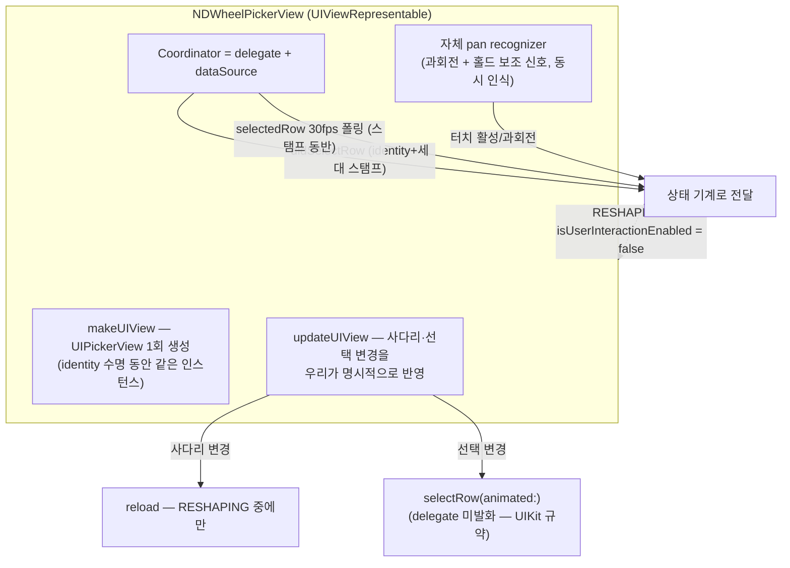

핵심 성질:

- **역할 경계**: Coordinator는 저수준 입력 측정만 한다 — 행
  변화, 터치 상태, 과회전 거리·햅틱 임계. 측정된 이벤트는 wheel
  identity와 구성 세대를 스탬프해 VM으로 보내고, 수용·거부·상태
  전이는 전부 VM이 판단한다 (§1 원칙 1).
- **didSelectRow의 의미 회복**: 프로그램적 `selectRow`는
  delegate를 부르지 않고(UIKit 규약), reload는 RESHAPING
  창에서만 일어나며 그 창에서는 사용자 입력 자체가 차단된다.
  따라서 (현재 세대 ∧ 등록된 소유 picker ∧ 잠금 밖)에서 도착한
  `didSelectRow`는 **사용자 선택**이다 (§3.5의 세대 검증 전제).
  VoiceOver adjustable 조작도 같은 delegate로 들어오므로 별도
  예외 경로가 없다.
- **인스턴스 안정성**: ForEach가 wheel id로 키잉되어 재정렬 이동
  중에도 같은 UIPickerView가 뷰와 함께 움직인다. 참조를 직접
  보유하므로 탐색·감시·소생 로직이 존재하지 않는다.
- **초기 구성도 RESHAPING 규칙**: 휠 생성(추가·복원) 시의 최초
  dataSource 구성과 초기 선택 적용은 RESHAPING 창 안에서
  수행한다 — attach 부산물 이벤트가 정의상 폐기된다.
- **행 변화 방출**: UIPickerView는 스크롤 중 콜백이 없으므로
  30fps `selectedRow` 폴링은 유지한다 — 직접 보유한 참조 폴링.

---

## 5. 흐름 1 — 휠이 화면에 생기는 방법

뷰는 배열을 그대로 그린다. 휠 개수 = `entries.count`.

```mermaid
flowchart TB
    M["entries [10, 6.6, 0, 0]<br/>wheelIDs [103, 101, 104, 105]"]
    M -->|"(값, id) 쌍"| FE["ForEach — id로 키잉"]
    FE --> W1["소유 picker<br/>id 103 · 값 10"]
    FE --> W2["소유 picker<br/>id 101 · 값 6.6"]
    FE --> W3["소유 picker<br/>id 104 · 값 0"]
    FE --> W4["소유 picker<br/>id 105 · 값 0"]
    FE -.->|배치: 커밋값(C1) 기준<br/>활성: IDLE에서만| ADD["+ Add 컨트롤"]
```

**Add(+) 탭:**

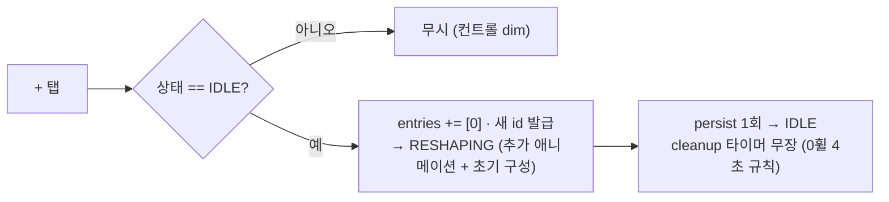

- Add 컨트롤의 **배치**는 C1(새 휠 사다리에 0보다 큰 값이
  있는가 — 커밋값에서만 파생) 기준이라 SCROLLING 중 변하지
  않는다. **활성**만 상태를 따라 dim된다. C1이 거짓이면 컨트롤
  자체가 없다.
- **휠별 사다리**: 각 휠의 선택지는 "30 − 나머지 휠 커밋값
  합"까지 위에서 절단. 커밋값에서만 파생되므로 SCROLLING 동안
  불변이고, 재계산·reload는 RESHAPING에서만 일어난다.

---

## 6. 흐름 2 — 스크롤 중 실시간 계산 (SCROLLING)

3번째 휠(id 104)을 돌려 4를 지나는 순간:

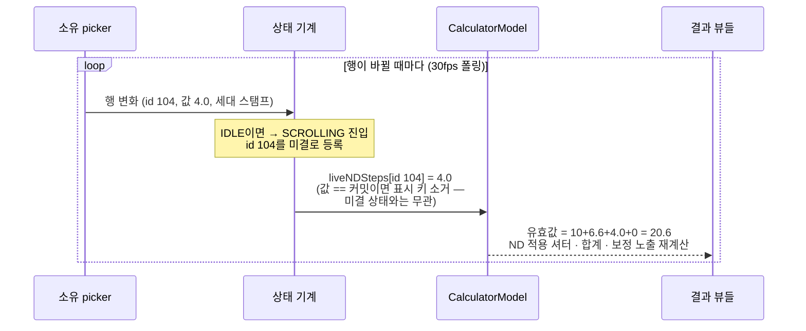

- 커밋 스택은 이 동안 불변. 라이브 오버레이만 움직인다.
- `selectedRow`가 목표 행으로 선점프하는 특성상, 라이브 프리뷰는
  화면 중앙을 지나는 행보다 약간 앞설 수 있다 — 현행 구현도 같은
  폴링 방식이라 동일한 특성이며, 데이터가 아닌 프리뷰 체감의
  문제로 수용한다.
- 여러 휠이 동시에 돌면 항목이 여러 개 생기고, 합산은 휠별로
  (live ?? 커밋) — 프리뷰가 휠 사이에서 깜빡이지 않는다.
- 결과 행의 파생 동작(타이머 시작 등)은 이 표시 유효값을 읽는다.

---

## 7. 흐름 3 — 커밋, 세트 적용, 순서 변경

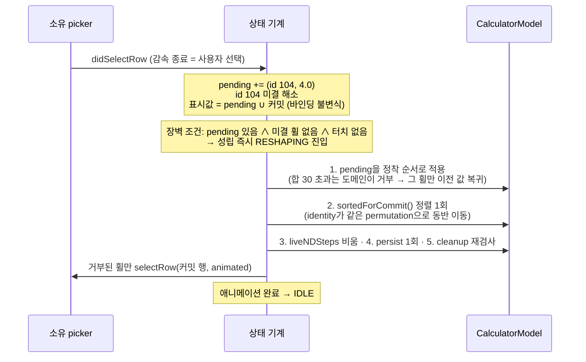

**정렬이 "이동 애니메이션"이 되는 원리** — 값과 identity가 같은
permutation으로 함께 움직인다. 4번째 휠에 13을 커밋한 예:

```text
정렬 전   entries  [ 10, 6.6,   0,  13]    정렬 후  [ 13,  10, 6.6,   0]
          wheelIDs [103, 101, 104, 105]             [105, 103, 101, 104]
                                    └── id 105(값 13)가 맨 앞으로
```

순서의 **결정**은 전적으로 도메인/VM의 것이다(`sortedForCommit`
+ identity permutation). UI는 배열의 순수 함수로서 결정된 순서를
렌더링할 뿐이고, ForEach가 id로 키잉되어 있으므로 이동
애니메이션은 identity-키 diffing의 부수 효과로 도출된다. 장벽이
VM에서 자가 발화하므로 `withAnimation` 래핑과 완료 콜백 수신도
VM의 장벽 실행 지점이 소유한다 — UI에는 표현 파라미터(0.35s,
easeInOut) 외에 어떤 판단도 없다. 소유 picker 인스턴스도 뷰와
함께 이동하며, RESHAPING이 끝나면 화면·합계·결과·커밋 스택이
전부 일치한다.

---

## 8. 흐름 4 — 4초 self-cleaning과 과회전 삭제

원시 상호작용은 타이머에 취소 신호를 보내지 않는다 — disarm과
re-arm은 구조 전환(RESHAPING 진입·세대 갱신) 경로에서만 일어난다.
타이머는 무장 후 **발화 시점의 상태**로 실행 여부를 정한다.

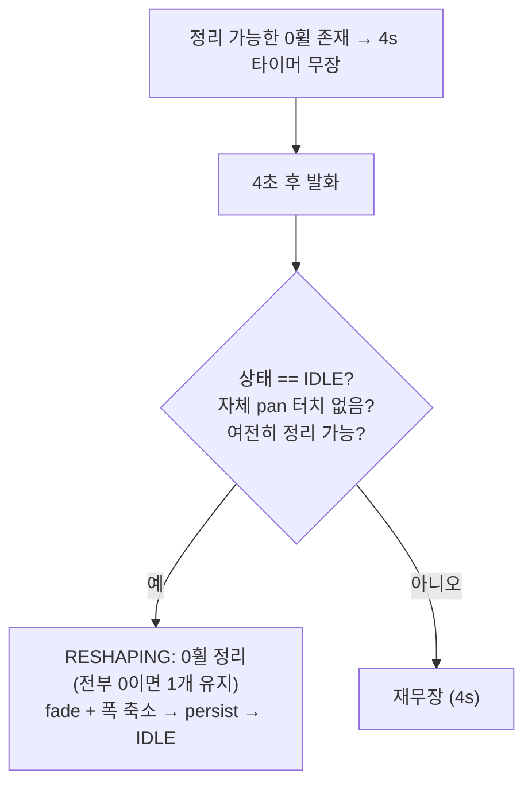

- 스크롤 중이면 SCROLLING이므로 자연히 연기된다. 정지 홀드는
  보조 신호(§3.3)가 막는다 — 어떤 손가락 아래에서도 휠이
  사라지지 않는다.
- **과회전 삭제**: 자체 pan이 감지(0 정착 휠에서 아래로 1행 이상
  + 릴리스, 임계 햅틱). IDLE에서 수용되어 당긴 그 휠(identity)만
  즉시 제거하고 RESHAPING으로 전이한다 (§3.4의 경계 규칙).

---

## 9. 흐름 5 — 저장과 복원

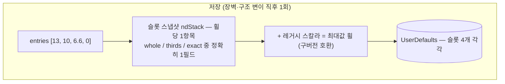

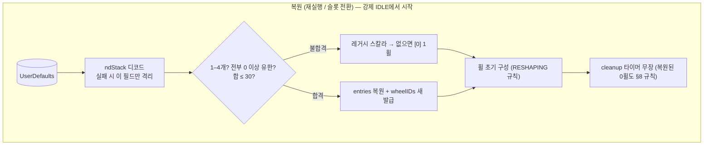

- identity·live·pending은 **저장하지 않는다** — 디스크에는
  커밋값 배열만 간다. SCROLLING 중 앱이 종료되면 그 스크롤의
  선택은 유실된다 (정의된 동작).

---

## 10. R2 스파이크 결과와 남은 리스크

### 10.1 스파이크 결과 (2026-07-17, iPhone 17 시뮬레이터 / iOS 26)

throwaway 코드로 세 가정을 검증했다 (코드는 원복):

1. **인스턴스 보존 — GO.** identity-키 ForEach 안의
   UIViewRepresentable: 생성 시 `makeUIView` 3회, `withAnimation`
   재정렬(연속 셔플 포함) 동안 재호출 0회. 셔플 후 같은 화면
   위치의 제스처가 **이동해 온 휠의 id로** 귀속됐다 — picker와
   recognizer가 identity를 따라 움직인다.
2. **reload 부산물 — 관찰상 GO.** 소유 picker의
   `reloadAllComponents()`는 잠금 창 안팎 어디서도 spurious
   `didSelectRow`를 발화하지 않았다. 단, 이는 **해당 환경의 관찰
   증거**이지 모든 OS 버전·지연 콜백의 부재 보장이 아니다 —
   그래서 reload 잠금과 세대 검증(§3.5)을 이중 안전망으로
   유지한다.
3. **자체 pan 공존 — GO.** 우리가 단 pan이 picker 스크롤과 동시
   인식으로 깨끗한 began/changed/ended를 냈고, 같은 제스처로
   picker도 정상 정착했다.

미확인으로 남는 것: RESHAPING 중 `isUserInteractionEnabled`
차단의 체감, 지연 delegate 콜백의 실제 발생 여부(세대 검증이
방어), 실기기 두 손가락 동시 조작.

### 10.2 리스크

- 미결 해소 창 S(300–500ms)와 장기 백스톱 W(수 초): 값 결정 필요,
  테스트 심 제공. S는 "제자리 복귀" 케이스의 IDLE 복귀 지연에만
  영향 — 커밋이 있는 통상 조작의 체감과 무관.
- RESHAPING 중 입력 차단(~0.35s): 휠이 반응하지 않는 구간의 체감
  확인 대상 (무시가 아니라 차단이므로 데이터 경로 리스크는 아님).
- 홀드 보조 신호가 실패하면 장벽이 조기 실행될 수 있다 — 차단
  전용이라 입력·데이터 손실 경로는 아니며, 실기기 확인 항목.
- 두 손가락 동시 조작 검증은 실기기 항목.

### 10.3 검증 시나리오

필드 레시피 2건(추가 직후 flick, 다휠 상태에서 0휠 flick) 반복
0건, **0→1→0 제자리 복귀 감속 중 Add 탭(계약 1 검증)**, 겹침
fling 세트 커밋, 재정렬 프레임 검사(합계 일관), 정지 홀드 중 타
휠 커밋(홀드 휠 불이동), **RESHAPING 중 터치(휠 무반응 확인, 계약
2)**, 슬롯 전환 직후 지연 콜백 시뮬레이션(계약 4), **프로그램적
reload/select에서 시작된 작업의 지연 콜백이 세대 갱신 후
사용자 이벤트로 재분류되지 않음(계약 4 세부)**, 복원·과회전·
유휴 정리 회귀, VoiceOver adjustable로 값 변경.
