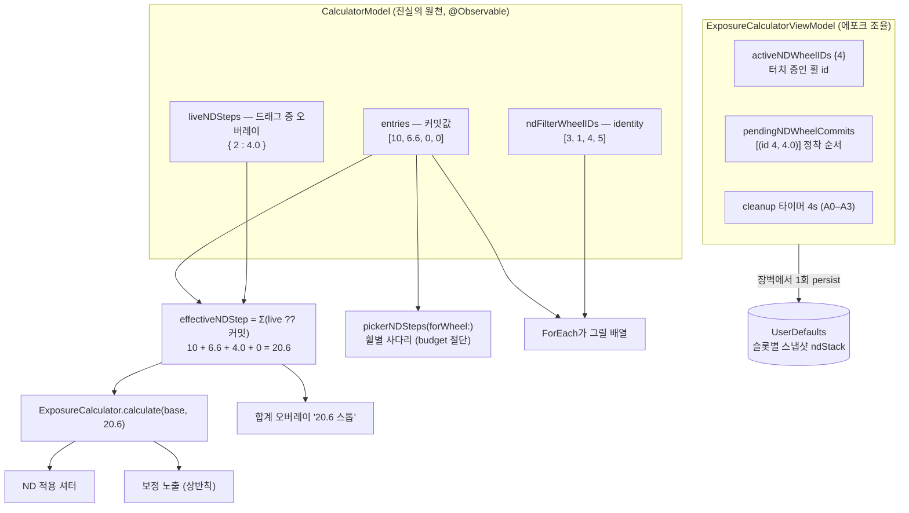
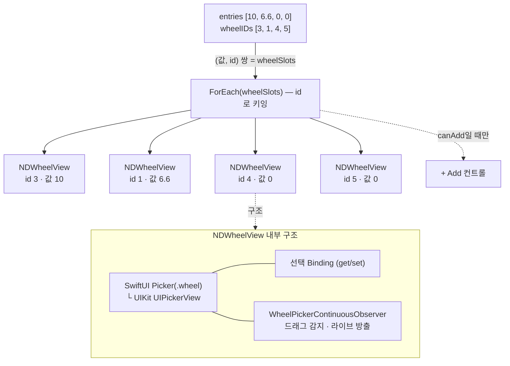
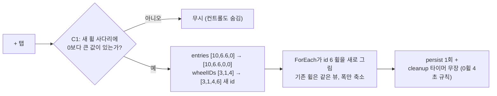
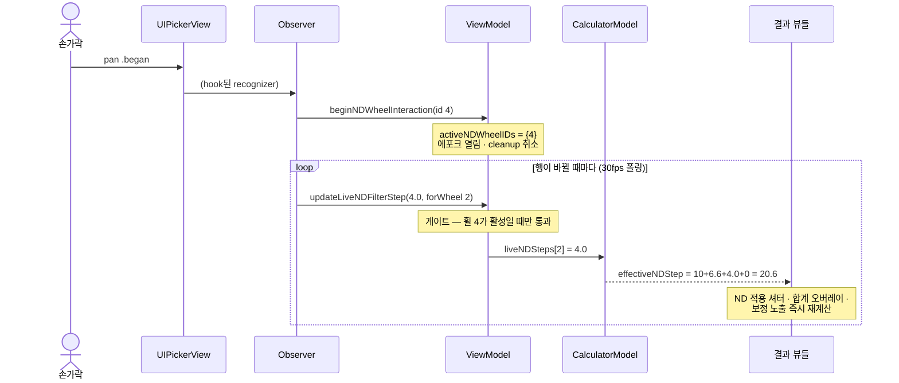
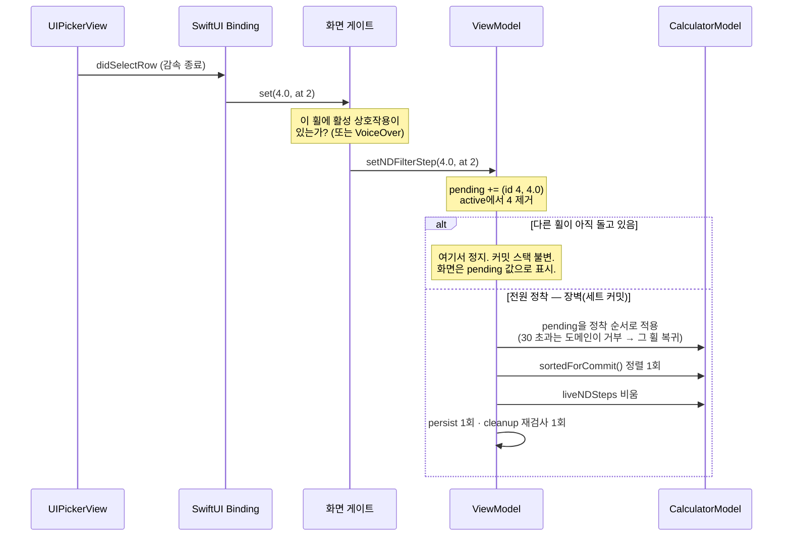
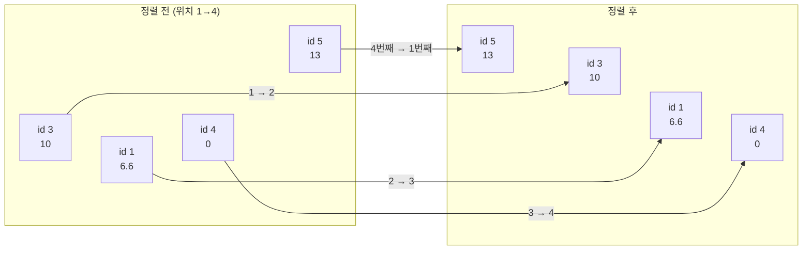
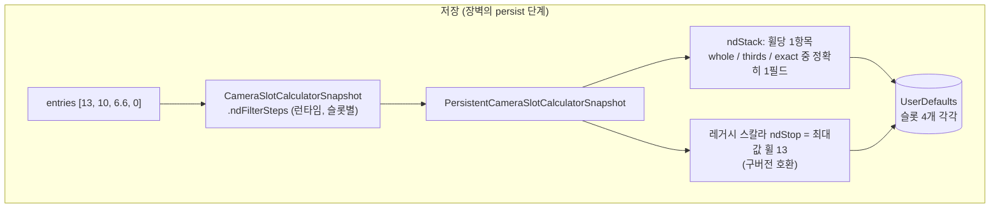
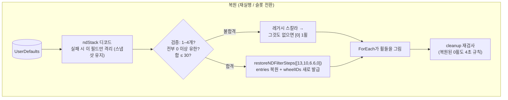
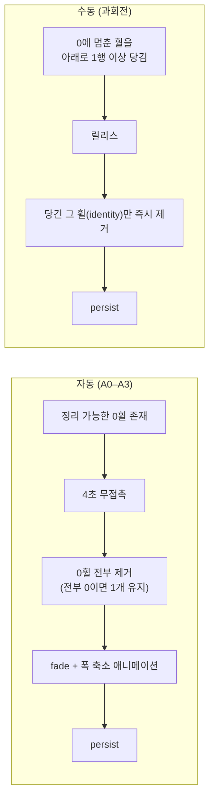

# ND Wheel Architecture v1 — 동작 설명 (record)

PTIMER-199 ticket-scoped 기록. 4개의 ND 휠이 어떻게 생성되고,
값이 실시간으로 계산·표시되고, 커밋 시 순서가 바뀌고,
저장·복원되는지를 — v2 재설계 이전의 현행 구현 기준으로 —
흐름별로 설명한다. 재설계 근거가 히스토리에 남도록
`PTIMER-199-nd-wheel-architecture-ios-v2.md`와 함께 커밋되며, 병합 전
최종 정리 커밋에서 함께 삭제된다.

기준 커밋: `1f92989b` (에포크 모델 v3). 2026-07-17.

---

## 0. 전체 그림 — 데이터가 사는 곳



- 커밋값(`entries`)과 identity(`ndFilterWheelIDs`)는 항상 같은
  길이의 평행 배열. i번째 휠의 값은 `entries[i]`, 그 휠이
  "누구인지"는 `ndFilterWheelIDs[i]`.
- identity는 화면 애니메이션 전용 — 계산·저장에는 쓰이지 않는다.
- `liveNDSteps`는 손가락이 돌리는 동안만 존재하는 오버레이.

---

## 1. 휠 4개가 화면에 생기는 방법

뷰는 배열을 그대로 그린다. 휠 개수 = `entries.count`.



**Add(+) 탭:**



**휠별 사다리** — 각 휠의 선택지는 "30 − 나머지 휠 합"까지 위에서
절단된다. 커밋값에서만 파생되므로 다른 휠이 드래그 중이어도
변하지 않는다.

```text
entries [10, 6.6, 0, 0]에서 3번째 휠(index 2)의 사다리:
budget = 30 − (10 + 6.6 + 0) = 13.4
사다리 = [0, 1, 2, …, 13, 6.6*, 7.6*]   (* 13.4 이하 프리셋)
```

---

## 2. 값을 돌리는 동안 — 실시간 계산과 표시

3번째 휠(id 4)을 돌려 4를 지나는 순간:



- 커밋 스택은 이 동안 **한 글자도 안 변한다.** 라이브 오버레이만
  손가락을 따라 움직인다.
- 여러 휠이 동시에 돌면 `liveNDSteps`에 항목이 여러 개 생기고
  합산은 휠별로 (live ?? 커밋).

---

## 3. 손을 뗀 뒤 — 커밋, 그리고 순서가 바뀌는 방법



**정렬이 "이동 애니메이션"이 되는 원리** — 값과 identity가 같은
permutation으로 함께 움직인다. 4번째 휠에 13을 커밋한 예:

```text
정렬 전   entries  [10, 6.6, 0, 13]      정렬 후  [13, 10, 6.6, 0]
          wheelIDs [ 3,  1,  4,  5]               [ 5,  3,  1,  4]
                                └── id 5(값 13)가 맨 앞으로
```



ForEach가 id로 키잉되어 있고 커밋이 `withAnimation(0.35s)` 안에서
실행되므로, SwiftUI가 각 id의 프레임 이동을 애니메이션한다 =
휠들이 미끄러져 교차한다. 정착 후 사다리(budget)가 새 커밋값
기준으로 재계산되고, 화면·합계·결과·커밋 스택이 전부 일치한다.

---

## 4. 저장과 복원





- identity와 라이브/pending 상태는 **저장하지 않는다** — 디스크에는
  커밋값 배열만 간다.
- 저장 시점: 장벽, Add/삭제, 슬롯 전환 등 커밋 상태가 실제로 바뀐
  직후 1회.

---

## 5. 삭제 흐름 (개수가 줄어드는 두 경로)



수동 삭제는 다른 휠이 돌고 있는 동안엔 무시된다 (자동 정리에
맡김).

---

## 6. 파일 맵

| 역할 | 파일 |
|---|---|
| 스택 도메인 (합/정렬/불변식) | `PTimerCore/Exposure/NDFilterStack.swift` |
| 커밋값·identity·라이브 맵·사다리 | `PTimerKit/Calculator/CalculatorModel.swift` |
| 에포크·장벽·cleanup·persist 조율 | `PTimerKit/Calculator/ExposureCalculatorViewModel.swift` |
| 휠 행 조립·바인딩·Add·합계 오버레이 | `PTimer/ExposureCalculator/ExposureWorkspaceMainLayoutStyle.swift` |
| 화면 배선·커밋 게이트 | `PTimer/ExposureCalculator/ExposureCalculatorScreen.swift` |
| 드래그 감지·라이브 방출·정착 감지 | `PTimer/ExposureCalculator/WheelPickerContinuousObserver.swift` |
| 슬롯 스냅샷 직렬화 | `PTimerKit/Persistence/PersistentCameraSlotSession.swift` 외 |
