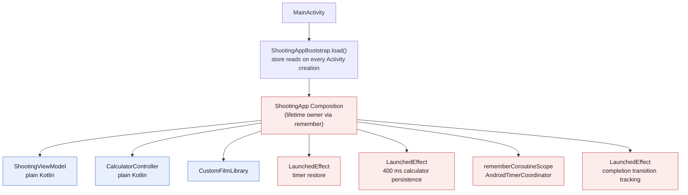
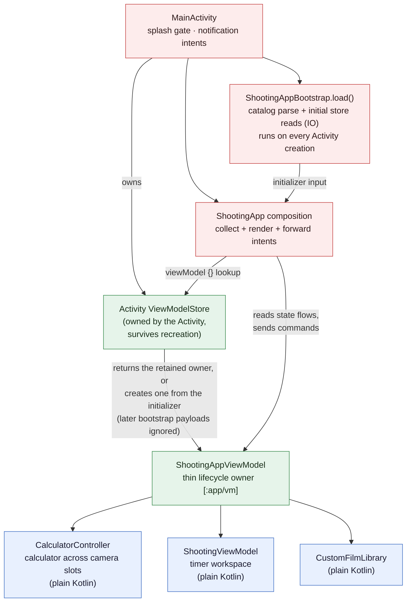
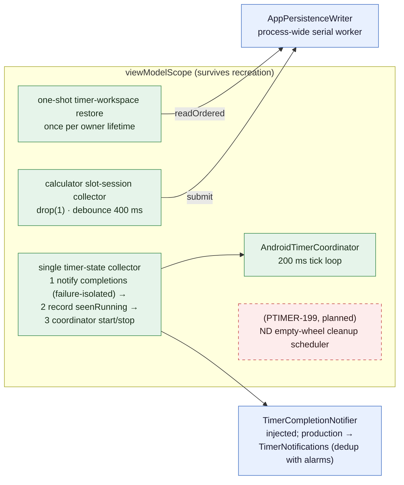
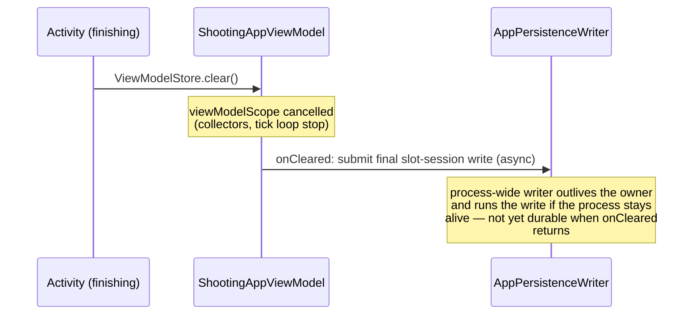

# PTIMER-223 — Android ViewModel Ownership Architecture

## 1. Purpose and lifetime of this document

Ticket-scoped migration and architecture note for the AndroidX
lifecycle ViewModel adoption (PTIMER-223): what the ownership model
was before, which concrete problems that model caused in this
codebase, what the model is now, and how each problem maps to a
change. Kept until PTIMER-199 lands its ND cleanup scheduler
migration on top of this structure; after that, either fold the
durable parts into the standing architecture documents or retire this
file with the ticket. The summary view lives in
[`../architecture/CrossPlatformArchitectureReview.md`](../architecture/CrossPlatformArchitectureReview.md)
§4.1; this note is the detailed contract.

## 2. Before: Composition-owned lifetime

A view-model role layer already existed: `ShootingViewModel` (timer
workspace) and `CalculatorController` (calculator across camera
slots) were plain Kotlin state holders. What was missing was an
AndroidX lifecycle ViewModel **owner** — the Composition effectively
owned the lifetime of the state holders and of every long-running
coroutine attached to them:



A configuration change destroyed the Composition, and with it every
box in the red band: new state-holder generations were constructed
and state was rebuilt from persistence.

## 3. Problems in the previous model

These are problems that actually existed in this codebase (or, for
the last item, were about to), not generic ViewModel talking points:

- Every Activity recreation constructed new `CalculatorController`
  and `ShootingViewModel` generations; committed calculator state
  depended on persistence reconstruction, not memory retention.
- The 400 ms calculator persistence debounce collector was cancelled
  with the Composition — a change committed just before a recreation
  could still be inside the window and get lost.
- The timer restore re-ran for every Composition generation.
- The tick loop was tied to the Composition scope: it stopped during
  a recreation and restarted with the new generation.
- The completion-alert transition tracking (`seenRunning`/`notified`)
  was `LaunchedEffect`-local and reset on every recreation — and on
  the inexact-alarm fallback that collector is the delivery path.
- Configuration change and process death shared the same
  reconstruction path even though they have different preservation
  requirements.
- PTIMER-199's ND interaction and cleanup jobs were about to inherit
  the same Composition lifetime, multiplying the exposure.

## 4. Architecture decision

- **One thin screen-level owner** (`ShootingAppViewModel`) rather
  than two owners or direct subclassing: the two state holders share
  the same screen lifetime, the bootstrap dependencies are consumed
  once, and timer start needs the calculator's captured identity —
  one owner wires this without duplicate reads or cross-owner
  choreography. Direct AndroidX subclassing of the existing types was
  rejected because it spreads the framework dependency into the pure
  layer and complicates the JVM tests.
- **Existing state holders stay plain Kotlin.** All state logic
  remains in `ShootingViewModel` and `CalculatorController`; the
  owner only wires lifecycle and hosts their asynchronous work.

## 5. After: ViewModel-owned committed state



- The first bootstrap payload constructs the owner via the
  `viewModel {}` initializer. The bootstrap itself still runs on
  every Activity creation (it gates the splash), but when the
  ViewModelStore already holds the owner, the lookup returns the
  retained instance and the new payload is ignored. The composable
  must read `library` (and the state holders) from the owner, never
  from the current bootstrap.
- The state holders stay framework-free: only `ShootingAppViewModel`
  touches AndroidX.

The owner hosts the asynchronous work in `viewModelScope`:



The timer-state collector is deliberately a single collector: within
each emission it delivers completion alerts, records the running ids
into the transition tracking, and only then starts/stops the tick
loop. A separate tick collector could complete a just-restored,
nearly expired timer before the tracking ever saw it running, and the
alert would be skipped. A notifier failure is isolated
(`runCatching`) so it cannot kill the collector that also drives the
tick loop; a failed id is not marked notified and is retried on the
next state emission.

### 5.1 Authoritative state sources

The committed calculator and timer domains each have exactly one
authoritative runtime source, and UI never mutates those directly —
the mutation path is
`UI command → controller/workspace → snapshot mutation → derived
display state → rendering`.

Two domains do NOT fit that single-path description: the custom film
library and the ND notation display mode keep an authoritative source
plus a controller-held mirror, and the composable coordinates the two
(see their rows below). They are recorded as-is rather than papered
over.

| State domain | Authoritative runtime source | Derived / mirror | Persistence role |
| --- | --- | --- | --- |
| Base shutter, ND, film/profile selection, Target Shutter, custom slot names, active slot | `CameraSlotSession` slot snapshots inside `CalculatorController` | `CalculatorUiState`, recomputed on every publish (read-only) | `PersistentSlotSession` snapshot written after the debounce (and on `onCleared`); read once at owner construction |
| ND value, specifically | the active slot snapshot's canonical ND stops — an exact commercial-preset `ndStops` takes precedence over the legacy whole-stop `ndIndex` | wheel position and labels in `CalculatorUiState` (read-only) | same snapshot fields |
| Timer workspace | `TimerWorkspace` inside `ShootingViewModel` | `ShootingUiState` cards (read-only) | `PersistentWorkspaceSnapshot` written at each change; read once per owner lifetime |
| Custom film library | `CustomFilmLibrary` in-memory list | the controller's film list is a mirror: the composable calls `library.add`/`remove` and then `controller.setFilms(...)` itself — UI-coordinated synchronization, not a single path | library snapshot store (async write-behind) |
| ND notation display mode | display-settings DataStore, observed as a flow | controller-held mirror driving the wheel labels: the composable writes the store and nudges the mirror (`setNotationMode`), and the observed flow re-applies it (idempotent on equal values) | display-settings store |
| Alarms, ongoing notification, foreground service | not sources — external surfaces reconciled from `ShootingUiState` | — | — |
| DataStore payloads (calculator/timer) | never a runtime source: read once into the holders when an owner is constructed; afterwards they only receive snapshots | — | — |

## 6. Before/after comparison

| Concern | Before | After |
| --- | --- | --- |
| Committed calculator state lifetime | Composition generation | Activity `ViewModelStore` |
| Timer workspace lifetime | Rebuilt after recreation | Retained in `ShootingAppViewModel` |
| Timer restore | Every new Composition generation | Once per owner lifetime |
| Calculator persistence debounce | Composition `LaunchedEffect`; recreation cancels the window | `viewModelScope`; recreation does not cancel |
| Tick loop | Composition-owned scope | `viewModelScope` |
| Completion transition tracking | Composition-local sets | ViewModel-owned ordered collector |
| Configuration change | Reconstruct from persistence | Reuse committed in-memory state |
| Process death | Restore from durable data | Same durable restore contract, explicitly distinct from recreation |
| Persistence ordering | Slot writes bypassed the shared ordered surface (plain IO) | Slot writes and ordered reads share the process-wide writer |
| Normal Activity finish | Debounce window could end with the owner | `onCleared` submits a final snapshot |
| ND cleanup — planned, PTIMER-199, not part of this PR | Composition-hosted `LaunchedEffect` on the 199 branch | Planned: state-owner-scoped hosting after the rebase |

## 7. Problem → change → result

| Previous problem | Architectural change | Result |
| --- | --- | --- |
| Recreation rebuilt committed state | Retain the state holders in `ShootingAppViewModel` | Calculator, active slot, per-slot state, and timer workspace remain in memory |
| Debounce job was cancelled with the Composition | Move the collector to `viewModelScope` | Changes inside the 400 ms window survive recreation |
| Restore ran for every UI generation | The owner performs one restore | No repeated timer reconstruction on configuration change |
| Completion transition tracking was composition-local and reset on every recreation (baseline problem); moving only the tick loop to the owner would additionally have split the two lifetimes (migration hazard, avoided) | Single ViewModel-owned ordered timer-state collector for completions, tracking, and tick control | Completion transitions survive UI absence and the intra-emission ordering is explicit |
| Slot persistence bypassed the ordered writer | Inject `OrderedPersistenceWriter` | Same-process submitted writes precede ordered reads |
| Normal owner destruction could drop the latest calculator state | Final write in `onCleared` | The normal-teardown loss window is reduced |
| ND cleanup would inherit the Composition lifetime problem — planned, PTIMER-199 | Define only the lifecycle boundary here (§13); the behavior contract stays with the 199 spec | PTIMER-199 rebases onto the final lifecycle boundary |

## 8. Changed, unchanged, and remaining

Changed — implemented in PTIMER-223 (this PR): lifetime ownership,
async-work hosting (restore, debounce collector, single ordered
timer-state collector, tick loop), persistence ordering for the slot
session, and the clear-time flush.

Planned — PTIMER-199, deliberately NOT implemented here: the ND
empty-wheel cleanup scheduler migration. The ND rows in §6/§7 are
marked accordingly; nothing in this PR changes ND cleanup behavior.

Unchanged (deliberate boundaries):

- `CalculatorController` and `ShootingViewModel` remain plain Kotlin.
- Calculation, reciprocity, shutter ladder, ND ladder, and
  timer-state-machine policies are untouched.
- Persistence schemas and keys are untouched.
- Foreground service, AlarmManager alarms, and process-level
  notification/audio lifetimes did not move into the ViewModel.
- UI-only interaction-transient state stays composition-owned (§12).

Remaining (not solved by this ticket):

- The bootstrap read itself still runs on every Activity creation
  (it gates the splash; the retained owner ignores its payload).
- Abrupt process death does not preserve pending in-memory jobs; only
  durably committed writes survive.
- Task-retained process death has not been field-verified (§14).
- The PTIMER-199 ND cleanup scheduler migration is planned, not done.

## 9. Persistence boundary

- `AppPersistenceWriter` is process-wide (one serial IO worker), not
  owner-scoped. Writes submitted by any generation commit in order;
  `readOrdered` reads (bootstrap, restore) run behind writes already
  submitted **in the same process**.
- The slot-session debounce write and the timer-workspace snapshot
  writes both go through this writer. Schemas and keys are unchanged
  by PTIMER-223.
- `onCleared` submits a final slot-session write to the process-wide
  writer. The guarantee is narrow: the write is not discarded with
  the cancelled `viewModelScope`, and the writer — which outlives the
  owner — runs it as long as the process stays alive. It is NOT
  durable by the time `onCleared` returns, and it is not guaranteed
  to commit if the process is killed right after the Activity
  finishes. It narrows the normal-teardown loss window; nothing more.

## 10. Lifecycle sequences

### Configuration change

```mermaid
sequenceDiagram
    participant OS
    participant A1 as Activity gen 1
    participant VM as ShootingAppViewModel
    participant A2 as Activity gen 2
    OS->>A1: destroy (config change)
    Note over VM: retained by ViewModelStore<br/>collectors, debounce window,<br/>tick loop keep running
    OS->>A2: create
    A2->>A2: bootstrap reload (splash gate)
    A2->>VM: viewModel {} → same instance,<br/>initializer ignored
    A2->>VM: new UI collectors attach
    Note over VM: committed calculator/slot/timer state<br/>never left memory; no persistence<br/>round trip required
```

### Activity finish (onCleared)



### Process death and cold launch

```mermaid
sequenceDiagram
    participant P1 as Process 1 (dies)
    participant D as DataStore (durable)
    participant P2 as Process 2 (cold launch)
    Note over P1: owner, scope, pending in-memory<br/>jobs all gone — only writes that<br/>committed before death survive
    P2->>D: bootstrap ordered reads
    P2->>P2: new owner built from bootstrap
    P2->>D: timer snapshot read (once)
    Note over P2: timers reconciled against wall clock;<br/>restored completed entries are not<br/>retroactively re-notified
```

## 11. Compose vs ViewModel responsibility

| Responsibility | Owner |
| --- | --- |
| State-holder lifetime | ShootingAppViewModel (ViewModelStore) |
| Timer restore, calculator persistence, tick loop, completion transition tracking | viewModelScope |
| Rendering, gesture → command forwarding, lifecycle-aware flow collection | Composition |
| Alarm-plan and ongoing-notification sync, exact-alarm permission state refresh | Composition (idempotent reconcilers) |
| POST_NOTIFICATIONS request, notification-tap navigation, dialog/sheet presentation | Composition (one-shot effects / UI event handling) |
| Foreground service, AlarmManager alarms, completion audio | Process-level (notify stack); never tied to owner lifetime |
| ND empty-wheel cleanup scheduling | PTIMER-199: moves from Compose `LaunchedEffect` to the state-owner scope (§13) |

Composition-side effects fall into two groups, neither of which owns
long-lived state work:

- Idempotent OS-surface reconciliation — alarm-plan and
  ongoing-notification sync, exact-alarm permission state refresh.
  These reconcile an external surface against the current state and
  are safe to restart per composition generation.
- One-shot effects and UI event handling — the POST_NOTIFICATIONS
  permission request (a `permissionLauncher.launch()` system
  interaction, fired once, not a state reconciler), notification-tap
  navigation (counter/intent driven), and dialog/sheet presentation.
  These consume a signal once rather than converging on state.

## 12. Committed vs interaction-transient state

Committed state — retained across recreation by owner retention:
active camera slot, per-slot base shutter / ND / film / profile /
target, timer workspace (running, paused, completed, ordering), and
any committed change still inside the persistence debounce window.

Interaction-transient state — reset with the composition today:
dialog visibility flags, custom-film editor draft, sheet expansion,
scroll/focus positions. These are pre-existing composition-owned
values (a known gap is tracked in the review document §13.2); none of
them can leave a wheel, a pending commit, or a structural control
permanently busy, because the controllers recompute availability from
committed state on every emission.

When PTIMER-199 lands, its wheel-interaction transients (active wheel
ids, pending commits, busy flags, cleanup deadline) must be given an
explicit place in this table; the default expectation is that they
live with the state owner, not the composition.

## 13. PTIMER-199 ND cleanup — lifecycle boundary only

The empty-wheel cleanup delay job is currently hosted by a Compose
`LaunchedEffect` on the PTIMER-199 branch. PTIMER-223 defines only
the lifecycle boundary that the rebase must satisfy:

- the delay job's host moves from the Composition into the
  state-owner scope, so a recreation can neither duplicate it nor
  silently drop it,
- deterministic tests drive it with the test scheduler (no real 4 s
  waits) across the lifecycle events (recreation, slot switch, reset,
  restoration).

The cleanup behavior contract itself — arming, fire-time judgment,
re-arm rules, and what each interaction does to the timer — is owned
by the PTIMER-199 task spec and its architecture notes, not by this
document. This note deliberately does not restate it; treat the 199
spec as the sole source when migrating the scheduler.

## 14. Verification matrix and not-verified items

| Contract | Verified by |
| --- | --- |
| Same owner across two Activity generations, per-slot + active slot state, one workspace read | JVM: `secondActivityGenerationReceivesTheRetainedOwnerAndSlotState` |
| Debounce window open across a recreation still lands the latest state | same test, plus emulator uimode-toggle within 400 ms |
| Restore once per owner lifetime | JVM: `initRestoresPersistedTimersExactlyOnce` |
| Debounce timing / coalescing / no initial write | JVM: three focused tests |
| Tick loop advances and auto-completes | JVM: `tickLoopAdvancesAndAutoCompletesRunningTimers` |
| Completion with no UI attached notifies exactly once; later emissions do not repeat | JVM: `completionWhileNoUiIsAttachedNotifiesExactlyOnce` |
| Near-expiry restored timer notifies on its first tick | JVM: `nearExpiryRestoredTimerStillNotifiesOnItsFirstTickCompletion` |
| Notifier failure does not kill the collector; failed id retries on the next emission | JVM: `notifierFailureDoesNotKillTheCollectorAndRetriesOnTheNextEmission` |
| Restored completed entries stay silent | JVM: `restoredCompletedTimersDoNotNotifyOnLaunch` |
| New owner restores from a handed persisted session only | JVM: `aNewOwnerRestoresFromTheHandedPersistedSessionOnly` |
| onCleared flushes a pending debounced write | JVM: `clearingTheOwnerFlushesAPendingDebouncedSlotSessionWrite` |
| Live recreation with running timer, multi-slot | manual emulator procedure (uimode toggle) |
| force-stop + cold relaunch restoration | manual emulator procedure |

Not verified:

- OS-initiated process death with the task retained (force-stop has
  additional side effects, including task and alarm removal, and does
  not verify task-retained process restoration),
- the bootstrap/DataStore read path end-to-end under automation (the
  stores have their own round-trip tests; the composed path is
  manual),
- ND stack cleanup across lifecycle events (code not on main yet;
  PTIMER-199 scope).
